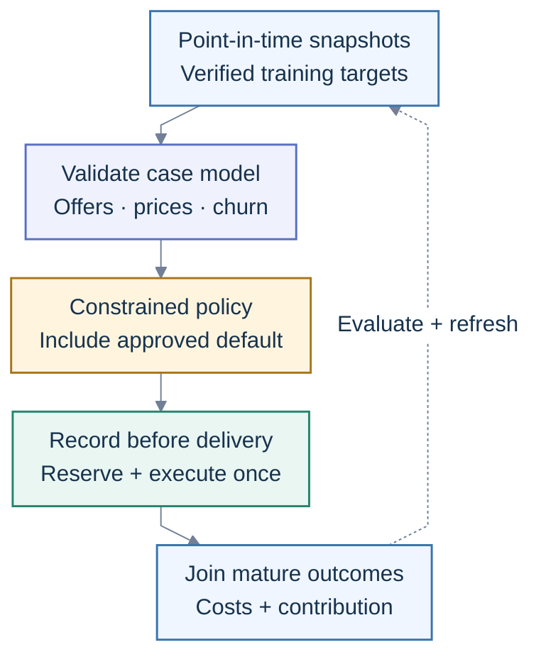

# Chapter 9: Business machine learning — offers, prices and churn

**Applied track after Chapters 3 and 6 &nbsp;·&nbsp; about 40 hours for one case, 90 for all
three.**

[Book index](../README.md) &nbsp;·&nbsp; [Chapter resources](resources/README.md)

**The short version.** Build a system that chooses a useful business action and measures its effect.
Offer recommendation, price recommendation and churn share data and operations, but ask different
statistical questions. Start with a transparent baseline, test a stronger model on a realistic
split, and require evidence before turning predictions into interventions.

The examples use retail and subscriptions. Adapt the outcome, permitted actions, customer policies
and economics to your domain. This is an engineering recommendation based on the research below, not
a claim that one model wins in every company.

**In this chapter:** [Plan](#your-applied-plan) &nbsp;·&nbsp;
[Decision trees](#choose-your-ml-approach) &nbsp;·&nbsp;
[Model choices](#suggested-models-and-approach) &nbsp;·&nbsp;
[Architecture](#one-architecture-three-decision-paths) &nbsp;·&nbsp; [Build](#what-to-build)
&nbsp;·&nbsp; [Completion](#before-you-move-on)

## Your applied plan

Read the shared delivery plan, then choose a guide. You can use one case for the
[Chapter 7 capstone](../07-specialisation/README.md), or finish all three as a connected business
project. The hours are for a bounded learner prototype using public or synthetic data. Collecting
real longitudinal data and running a powered business experiment take additional calendar time.

| Block                                           | Hours | Work                                                                        | Deliverable                                                |
| ----------------------------------------------- | ----- | --------------------------------------------------------------------------- | ---------------------------------------------------------- |
| Shared setup                                    | 5     | Decision brief, economics, data/label contract, experiment assumptions      | Written specification and snapshot checks                  |
| [Offer recommendation](offer-recommendation.md) | 25    | Response baseline, identified uplift, constrained offer selection           | Policy comparison and campaign delivery contract           |
| [Price recommendation](price-recommendation.md) | 25    | Demand/elasticity baseline, challenger, approved-price optimizer            | Demand backtest and price experiment proposal              |
| [Churn](churn.md)                               | 25    | Risk baseline, calibrated ranking, survival/retention extension             | Cohort evaluation and retention decision memo              |
| Shared delivery                                 | 10    | Feedback join, shadow run, budget/freshness checks, monitoring and rollback | Reproducible package and prototype launch-readiness review |

Doing one guide plus the two shared blocks costs about 40 hours. Doing every row costs 90. Complete
one baseline before adding a second model family. You do not need a GPU for the starting models. The
shared [delivery plan](delivery-plan.md) specifies the artifacts and completion gates.

## The questions are different

| Use case | Prediction question                                    | Decision question                                                                              | Main outcome                                                        |
| -------- | ------------------------------------------------------ | ---------------------------------------------------------------------------------------------- | ------------------------------------------------------------------- |
| Offers   | Will this customer respond to this offer?              | Which eligible action improves margin relative to no offer?                                    | Incremental net contribution per eligible customer                  |
| Prices   | How much demand is expected for this item and context? | Which supported, permitted price improves contribution under demand and inventory constraints? | Net contribution per market/item opportunity over a fixed horizon   |
| Churn    | Who will leave, and when?                              | Whose retention improves enough under an action to justify its cost?                           | Incremental retained contribution after contact and incentive costs |

Prediction estimates outcomes in the observed data. Intervention estimates what would change under
an action. A model can predict accurately using patterns that do not survive that change;
scikit-learn demonstrates this in its
[causal interpretation example](https://scikit-learn.org/stable/auto_examples/inspection/plot_causal_interpretation.html).
Randomization is the preferred starting point for actionable effects. Observational designs need
explicit identification assumptions and sensitivity analysis; a more complex learner cannot supply
missing identification.

## Choose your ML approach

Start with the business question and the evidence you have. Follow the decision tree in the relevant
guide, then read the matching recommendation: **which model to start with, why it fits, what data
and evidence it needs, and what to validate before adding complexity**.

| Use case             | Model-selection decision tree                                                      | The distinction to resolve first                                                        |
| -------------------- | ---------------------------------------------------------------------------------- | --------------------------------------------------------------------------------------- |
| Offer recommendation | [Choose an offer approach](offer-recommendation.md#model-selection-decision-tree)  | Product relevance, response prediction, or the incremental effect of an incentive       |
| Price recommendation | [Choose a pricing approach](price-recommendation.md#model-selection-decision-tree) | Forecast demand at observed prices, or estimate demand under a price change             |
| Churn and retention  | [Choose a churn approach](churn.md#model-selection-decision-tree)                  | Predict fixed-horizon risk, estimate event timing, or learn a retention action's effect |

Several branches can be used together. A recommender can retrieve candidates and estimate offer
effects; a churn system can estimate both risk and retention effects. The final business policy
still applies costs, eligibility, budget, capacity and the approved fallback.

Each model branch starts with a baseline and has an evidence gate for promotion. When required
timestamps, outcomes, costs or action support are missing, complete the data-collection step first.
Recent research challengers remain in the detailed model sections, with their reproduction and
evaluation conditions.

## Suggested models and approach

These are starting candidates. The final choice comes from your business metric, honest temporal
evaluation, inference cost, calibration and evidence about treatment effects. A model that does not
improve the decision stays out of the production path.

| Case and data regime                             | Start with                                                             | Strong practical candidate                                                                       | Add complexity when                                                                                                         | Avoid                                                                     |
| ------------------------------------------------ | ---------------------------------------------------------------------- | ------------------------------------------------------------------------------------------------ | --------------------------------------------------------------------------------------------------------------------------- | ------------------------------------------------------------------------- |
| Small offer set, tabular customer data           | Eligibility rules, no-offer control, logistic response baseline        | CatBoost or LightGBM response model; randomized T/S-learner uplift and incremental-profit policy | Compare X/DR learners or causal forests when arm sizes, heterogeneity and overlap support them                              | Ranking by response probability and calling it incrementality             |
| Large product/offer catalog, interaction history | Popularity/content candidates plus eligibility                         | Two-stage retrieval and ranking; LambdaMART/boosted ranker                                       | Two-tower retrieval when interaction volume and catalog scale justify learned embeddings                                    | Treating logged non-clicks as unbiased preference labels                  |
| Demand/pricing with adequate exposure data       | Seasonal/current-price policy; log-price Poisson/negative-binomial GLM | CatBoost or LightGBM demand challenger plus an approved-grid profit optimizer                    | Flexible elasticity or DML/causal forest after identification; limited bandit exploration after logging and policy approval | Regressing historical selling price and presenting it as an optimal price |
| Fixed-horizon churn with mature labels           | Recency rule and logistic regression                                   | Calibrated CatBoost or LightGBM, evaluated at contact capacity                                   | Better features or another learner only after realistic error analysis                                                      | Using accuracy or a universal 0.5 cutoff                                  |
| Churn timing with censored follow-up             | Kaplan–Meier cohort summary and Cox baseline                           | Random survival forest or survival boosting                                                      | Non-proportional hazards/time-varying approaches when diagnostics require them                                              | Labelling customers with unfinished follow-up as non-churners             |
| Retention intervention with randomized actions   | No-contact control and average treatment effect                        | Uplift/DR model plus expected incremental retained contribution                                  | Multi-arm treatment policy when there is enough support per action                                                          | Assuming highest churn risk means highest save probability                |

CatBoost's [categorical-feature support](https://catboost.ai/docs/en/features/categorical-features)
makes it convenient for many customer tables. LightGBM is another candidate when its training,
memory and serving characteristics suit the data. Neither is automatically superior; compare on the
same splits and cost budget. Current tabular results depend on model version and evaluation
protocol: compare [BeyondArena’s June 2026 benchmark](https://arxiv.org/abs/2606.30410) with the
[September TabPFN 3.5 report](https://arxiv.org/abs/2609.17895). The second reports aggregate gains
but not a universal lead across full grouped, temporal and large-data slices; its group-feature
protocol also differs. [Chapter 3](../03-core-machine-learning/README.md) explains how to make the
comparison match deployment.

The guides explain the specific conditions behind each row. Read them before choosing a library.

## How to use the newest research

The research review includes sources available through **9 October 2026**. The guides include
optional causal, generative recommendation, inventory-learning and survival foundation-model
challengers. Their publication dates do not make them the preferred starting models. Some are recent
preprints or workshop results, and industrial engagement results answer a different question from
incremental business contribution.

Promote a candidate only after it clears these comparisons:

1. **Task and evidence:** match the prediction, treatment, censoring and deployment setting to
   yours; write the identifying assumptions before fitting.
2. **Reproduction:** verify the release, licence, preprocessing, tuning budget and evaluation split.
   Compare on the same data, action support, hardware and allowed candidate count.
3. **Decision value:** measure calibrated risks or effect magnitudes, supported policy value and
   uncertainty, alongside ranking. Include no action and a simple nonpersonalized policy.
4. **Operation:** test cold start, missing inputs, drift, inference cost, latency, constraints and
   fallback. A research benchmark is not evidence of production reliability.

The practical starting recommendation remains a transparent baseline and a calibrated boosted-tree
challenger for tabular prediction, identified causal estimation for interventions, and an explicit
constrained decision policy. Optional research comparisons sit outside the prototype time budget.

## One architecture, three decision paths

Use the same lifecycle for all three cases. The model output changes: offer response/uplift,
price-dependent demand, or churn risk/survival/retention effects. The execution contract stays the
same.

_Blue: data and outcomes. Indigo: model validation. Amber: policy decisions. Teal: delivery. Labels
identify each role as well as color._

Training targets require mature fixed-horizon outcomes or properly recorded event/censoring
follow-up, as specified in the
[data contract](delivery-plan.md#2-create-the-data-and-label-contract). Persist the original
decision, assignment and relevant logging probabilities **before delivery**. Record delivery events
separately, including nondelivery and overrides. The
[delivery lifecycle](delivery-plan.md#6-deliver-and-log-the-decision) shows the ordering in detail.

The coordinator is application logic or an optimization step. An LLM can help explain approved
results or extract inputs from documents; predicted text is not the source of price, eligibility,
causal effect or budget enforcement.

Start with one pipeline, a SQL snapshot job, one fitted model artifact and one batch job or API. Add
a feature store, registry platform, embedding service or bandit only when a concrete requirement
justifies its operating cost. The important architecture is the feedback loop.

## Make the three systems cooperate

Offers change the effective paid price, and retention offers consume the same customer attention and
often the same subsidy budget. If each system independently maximizes its own score, a customer can
receive competing discounts, a pricing test can be contaminated by a campaign, and the same revenue
can be credited twice.

Log list price, recommended price, final paid price, subsidy source and all concurrent campaign
assignments. Start with mutually exclusive experiments or a common assignment plan. Give one
coordinator ownership of the final action, including **no change/no contact**. Cap total spend,
contact frequency and allowed price movement. Treat customer-level policy effects and inventory
spillovers as part of experiment design.

Only optimize combined actions after you have data supporting those combinations. Independent offer
and price models do not identify the effect of an untested discount-plus-price change. Use a
factorial design where appropriate or test the combined policy directly. Report total net
contribution once, with component metrics to diagnose the result.

For logged policy evaluation, record the coordinator's **joint assignment probability**, or its
stage-conditional mechanism, with pre-decision budget, stock and contact state. Separate marginal
probabilities do not generally describe a combined action. Changing the policy can also change
future inventory and eligibility; a one-decision evaluation does not establish the whole system's
long-term value. The
[shared policy evaluation protocol](delivery-plan.md#4-evaluate-an-action-policy-honestly) sets out
these limits and the controlled-test path.

## What to build

**A business decision system with an evidence report.** Choose one guide and follow the
[delivery plan](delivery-plan.md). Publish the decision brief, data contract, model comparison,
policy comparison, experiment protocol, batch/API contract, monitoring and rollback artifacts. For
private business data, publish code and synthetic examples rather than customer records.

Keep three evidence levels separate in the report:

| Evidence                               | What you may claim                                                                                              |
| -------------------------------------- | --------------------------------------------------------------------------------------------------------------- |
| Synthetic simulator with known effects | The pipeline and policy work under the simulator's assumptions                                                  |
| Retrospective public or business data  | Predictive performance on that held-out population; causal effects only when the design supports identification |
| Valid randomized policy experiment     | An estimated effect of that policy in the tested population, period and operating conditions                    |

A completed prototype can have an experiment **proposal** and a rehearsed rollout. It cannot claim
measured live profit lift without executed assignments and observed outcomes. Record this plainly.

## Before you move on

- You can state the decision, outcome horizon, baseline and unit of assignment in one minute.
- The feature query excludes unavailable events; fixed-horizon labels are mature, and survival
  evaluation uses recorded censoring and supported follow-up.
- You can defend your model choice against a simple baseline using the same data and budget.
- You know which effects are identified, and where the policy must abstain or fall back.
- You can trace one chosen action through execution, cost, outcome and experiment assignment.
- You can disable the policy and reproduce its last release from its recorded inputs.

## Resources

The [annotated source list](resources/README.md) separates official implementation documentation,
research papers and practice datasets. The three guides cite their supporting sources directly.

---

[Previous: Finding the work](../08-finding-the-work/README.md) &nbsp;·&nbsp;
[Delivery plan](delivery-plan.md) &nbsp;·&nbsp; [Back to the index](../README.md)
