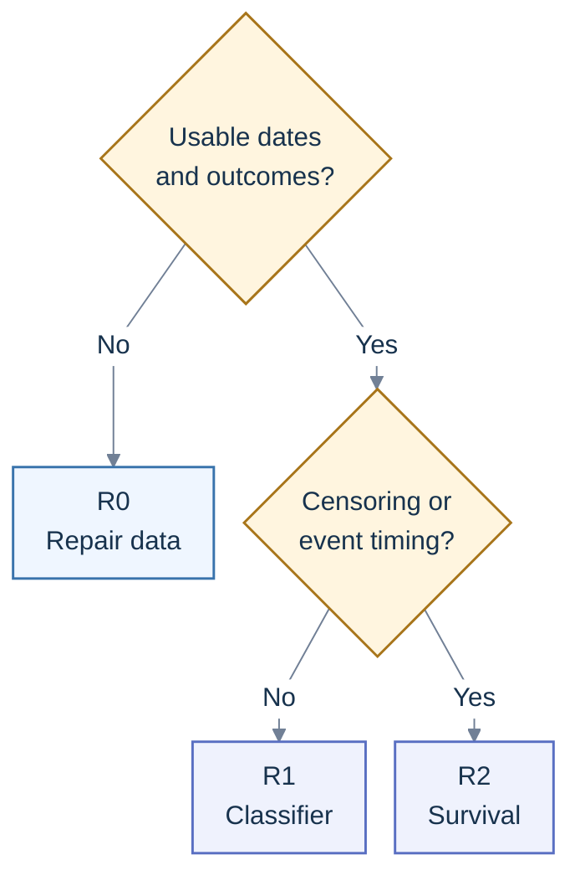
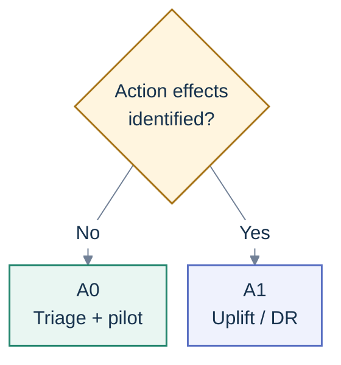
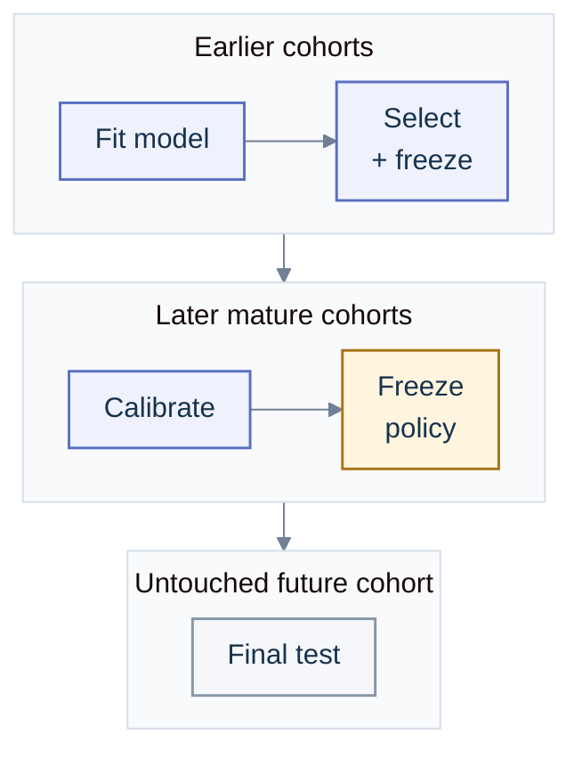
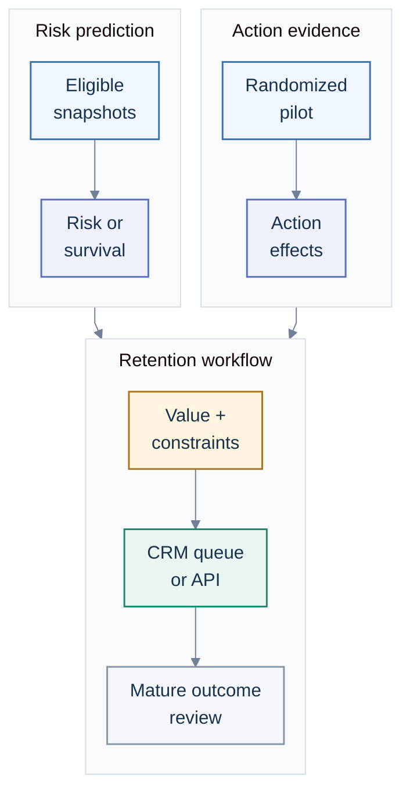

# Churn: predict the risk, then prove the retention action

**About 20–25 hours for the learning project.** &nbsp;·&nbsp; [Chapter 9](README.md) &nbsp;·&nbsp;
[Index](../README.md) &nbsp;·&nbsp; [Resources](resources/README.md)

**The short version.** Start with a documented churn definition, historical customer snapshots, a
time-based backtest and logistic regression. My suggested first serious challenger is **CatBoost for
mixed categorical customer data**, or **LightGBM when its training and serving profile suits the
workload**. Calibrate the chosen classifier on a later, untouched cohort. Use **survival analysis**
when follow-up is incomplete or the business needs several time horizons. Use **randomized retention
experiments and uplift modelling** to choose actions. A model that predicts who will leave cannot,
by itself, tell you who a discount will save.

Those are starting recommendations, not a universal winning model. Choose the simplest candidate
that improves the operational metric across future cohorts and can be maintained by the team. Read
[Chapter 3](../03-core-machine-learning/README.md) before training and
[Chapter 6](../06-production/README.md) before connecting the result to a customer workflow.

**In this guide:** [Decision and data](#1-define-the-decision-before-choosing-the-model) ·
[Model selection](#model-selection-decision-tree) · [Survival](#6-when-to-use-survival-analysis) ·
[Retention effects](#7-risk-is-not-the-expected-effect-of-an-offer) ·
[Workflow](#8-connect-the-decision-to-a-working-retention-workflow) ·
[Completion gates](#what-to-build-and-what-counts-as-complete)

---

## Your five-session plan

The hours cover a reproducible prototype and a written experiment plan. A retention trial needs real
customers, permission to operate the campaign, enough observations and time for outcomes to mature;
those cannot be completed by spending another afternoon on a public CSV.

| Session | Hours | Do this                                                                                           | Done when                                                                                                  |
| ------- | ----- | ------------------------------------------------------------------------------------------------- | ---------------------------------------------------------------------------------------------------------- |
| 1       | 3     | Define customer, eligibility, event, prediction horizon, action and economic objective            | Another person can label five example customers from your contract                                         |
| 2       | 7     | Build dated snapshots, feature availability checks and matured labels; create chronological folds | A future event cannot change an earlier feature row                                                        |
| 3       | 5     | Compare a simple rule, logistic regression and one boosted tree; calibrate the selected model     | A comparison table uses identical future cohorts and natural churn prevalence                              |
| 4       | 5     | Build capacity curves, a CRM export or API, and a retention experiment design                     | Every exported decision has an owner, timestamp, model version and expiry                                  |
| 5       | 5     | Exercise late labels, missing features and rollback; write results, limits and next gates         | One documented command reproduces the offline result; simulated campaign results are labelled as simulated |

If you only have a customer-level benchmark without dates, complete the model-comparison exercise
and report its limitations. Do not manufacture prediction dates or claim a temporal backtest. For
the stronger project, use transaction or subscription histories.

## 1. Define the decision before choosing the model

Churn has different meanings in different businesses. Subscription cancellation has an observed
event. A retailer usually observes absence of purchases and defines an inactivity proxy. These
targets need separate names, horizons and evaluation.

| Contract item      | Subscription example                                                                                      | Retail example                                                                                            |
| ------------------ | --------------------------------------------------------------------------------------------------------- | --------------------------------------------------------------------------------------------------------- |
| Decision unit      | One active account and subscription episode at a weekly scoring time                                      | One eligible customer at a monthly scoring time                                                           |
| Eligibility        | Service active at `as_of`; account has not already entered the separate cancellation or win-back workflow | At least one qualifying purchase in the previous 90 days; enough observable history for the chosen cohort |
| Label              | Effective service termination in `(as_of, as_of + 30 days]`                                               | No qualifying purchase in `(as_of, as_of + 60 days]`                                                      |
| Feature window     | Previous 7, 30 and 90 days, ending at `as_of`                                                             | Previous 30 and 90 days, ending at `as_of`                                                                |
| Label availability | Only after the horizon and the documented late-event allowance are complete                               | Same rule; a recent customer with no purchase yet is not a known positive                                 |
| Action             | Support investigation, payment recovery or an eligible retention offer                                    | A re-engagement offer or no incremental contact                                                           |
| Business outcome   | Incremental net contribution and retained accounts at a specified follow-up                               | Incremental net contribution and repeat purchases at a specified follow-up                                |

These are example definitions. Set inactivity windows from buying cadence, seasonality and the time
available to act. A 60-day gap can be normal for an annual gift buyer. Record whether churn means
voluntary cancellation, payment failure, non-renewal or any termination. Payment recovery often
deserves its own model and workflow. Define grace periods, refunds, pauses, account merges and
reactivation; preserve a new episode when a cancelled subscriber returns.

Keep the target **ahead of an actionable decision**. A cancellation reason entered after departure
is leakage. A notice already submitted before scoring can be a valid signal for an explicitly
defined cancellation-rescue workflow, but it changes the prediction problem. Do not mix that
workflow into a model claimed to predict unannounced churn.

Write down the comparator too: existing rules, random allocation at the same capacity, or the usual
retention policy. "Higher accuracy" is not a decision objective.

## 2. Build a table that represents what was known then

The primary key is `(customer_id, episode_id, as_of)`. This is a **landmark snapshot**: what you
knew about an eligible customer at one decision time. The same customer can have many rows; they are
correlated observations, not many independent customers.

Use two clocks when the source permits it. `event_time` records when an event happened;
`available_at` records when the scoring system could first use it. Features require both to be at or
before `as_of`. A payment dated Monday but ingested Thursday was unavailable to Tuesday's score.
Historical dimensions must also use the version available then, rather than today's plan or account
status copied backwards.

Your dataset should retain these fields alongside the features:

| Field                                                           | Purpose                                                                              |
| --------------------------------------------------------------- | ------------------------------------------------------------------------------------ |
| `customer_id`, `episode_id`, `as_of`                            | Join, deduplicate and replay the decision; keep identifiers out of the default model |
| `eligible`, `eligibility_version`                               | Reconstruct the population the policy could actually contact                         |
| `feature_version`, `feature_max_available_at`                   | Audit feature computation and late arrivals                                          |
| `horizon_days`, `label_end`                                     | Make the prediction question explicit                                                |
| `label_observed_through`, `label_available_at`, `label_version` | Distinguish a complete outcome from an immature or revised one                       |
| `churn_label` or `event_observed`, `duration`                   | Fixed-horizon classification or survival target                                      |
| `prior_campaign_id`, `prior_action`, `prior_action_time`        | Describe earlier interventions without importing a future action into features       |

**Build it in this order.** Reconstruct eligible accounts at each scoring time; join only the
historical events and dimensions available then; compute features; join future outcomes into a
separate label table; mark incomplete labels as unknown; split by decision time; fit all learned
transformations inside the training folds. Save the query, extraction date, source versions and
counts of excluded rows.

For fixed-horizon classification, use a uniformly matured cohort rather than mixing early known
positives with immature presumed negatives. If the outcome feed is complete through day 100, the
latest fully observed 30-day snapshot is day 70. A snapshot on day 85 with no cancellation yet has
an **unknown** label. An ingestion allowance can move the eligible cutoff further back; use the
actual completeness watermark as well as the calendar. A label from day 70 that only arrived on day
103 was unavailable to a model retrained on day 100.

Good initial features are simple aggregates whose provenance you can explain.

| Family          | Examples                                                                      | Availability check                                                                      |
| --------------- | ----------------------------------------------------------------------------- | --------------------------------------------------------------------------------------- |
| Usage           | Active days, sessions, minutes, recency, change between successive windows    | Exclude future sessions and distinguish missing telemetry from zero usage               |
| Relationship    | Tenure, plan, renewal date known then, acquisition channel                    | Read the historical dimension; do not substitute a later plan                           |
| Billing         | Failed payments already recorded, arrears, price changes already communicated | Do not use final debt or a future chargeback                                            |
| Experience      | Complaints, unresolved tickets, service outages, latency                      | Ticket resolution and survey responses after scoring are future information             |
| Purchases       | Recency, frequency, net historical margin, returns already known              | Apply return and cancellation rules; avoid treating invoice lines as independent orders |
| Trajectory      | 7-day versus 30-day activity, rolling variance, trend                         | Use fixed past windows with stable handling of low exposure                             |
| Earlier actions | Prior contact, earlier discount, time since campaign                          | Only earlier actions; keep the forthcoming treatment out of the risk feature table      |

Run feature ablations and inspect implausibly strong predictors. Drop post-churn status, churn
reason, a supplied churn score, future redemption and hindsight lifetime value. A supplied "customer
value" field needs an as-of definition before it is usable. Do not assign an arbitrary ordering to
plan names. CatBoost supports categorical inputs and advises against externally one-hot encoding
them; its encoding still does not repair an incorrect time split or a future-derived column.
[CatBoost categorical-feature documentation](https://catboost.ai/docs/en/features/categorical-features).

Earlier campaigns also change the interpretation of the target. A classifier trained on customers
who received assorted past campaigns estimates risk under that historical policy mixture. It does
not automatically estimate **untreated** risk. Preserve campaign records and report this limitation;
use a randomized control group when the decision requires a no-campaign comparator.

## 3. Use a model ladder that matches the available evidence

### Model-selection decision tree

Use the prediction tree to choose a risk formulation, then the action tree when the workflow will
recommend a retention intervention. **These stages compose:** an R1 classifier or R2 survival model
can supply risk for triage alongside an A1 action-effect model. Risk alone does not show who an
offer will save, and causal modelling does not require a separately trained risk classifier.

#### 1. Choose the prediction formulation

“Usable” means that eligibility, feature availability and outcome observation can be reconstructed
at a real decision time. Incomplete follow-up is usable for survival only when event/censoring times
and the observation limit are recorded. A missing date is not a censored duration.



#### 2. Add the retention-action stage

Apply this second tree when deciding whether to contact a customer or which offer to deliver. Action
effects need a randomized comparison, or a defensible identified design with its assumptions and
overlap checked. A contact-response history selected by the old policy is insufficient by itself.



Read each leaf as a starting recommendation with an evidence gate, not an automatic release.

| Key and recommended approach                                                                                                                                                                                  | Why this path                                                                      | Minimum data and evidence                                                                                                                                                    | Promotion check                                                                                                                         |
| ------------------------------------------------------------------------------------------------------------------------------------------------------------------------------------------------------------- | ---------------------------------------------------------------------------------- | ---------------------------------------------------------------------------------------------------------------------------------------------------------------------------- | --------------------------------------------------------------------------------------------------------------------------------------- |
| **R0 — Repair data; benchmark only if labels are documented.** [Data checks](#2-build-a-table-that-represents-what-was-known-then) · [Dataset limits](#9-choose-a-dataset-without-overstating-what-it-proves) | Missing dates or observation limits prevent a defensible future-cohort claim.      | Recover decision/availability timestamps and matured labels or event/censoring records. A static labelled table supports a predictive exercise only.                         | Reconstruct historical eligibility and feature state before R1/R2. Never invent scoring dates or survival durations.                    |
| **R1 — Logistic regression, then calibrated CatBoost or LightGBM.** [Classifier protocol](#fit-and-calibrate-the-classifier)                                                                                  | A cheap baseline tests whether nonlinear tabular modelling earns its complexity.   | Dated snapshots, uniformly matured horizon labels, natural validation prevalence, separate later calibration/policy cohorts and a future holdout.                            | Improve capture/precision at capacity and useful probability calibration within serving cost; freeze the release before the final test. |
| **R2 — Kaplan–Meier and penalized Cox, then survival forest or boosting; Aalen–Johansen for competing causes.** [Survival protocol](#6-when-to-use-survival-analysis)                                         | Preserve partial follow-up and estimate time-dependent risk for the defined event. | Defined origin, event/cause codes, durations, complete-observation watermark, supported horizons and defensible censoring assumptions.                                       | Check model assumptions and censor-aware horizon calibration; use metrics appropriate to the event definition on future cohorts.        |
| **A0 — Risk triage and a randomized pilot.** [Trial design](#7-risk-is-not-the-expected-effect-of-an-offer)                                                                                                   | High risk does not identify a saveable customer.                                   | Valid risk evidence for triage; a pilot plan with eligible accounts, no-contact control, assignment/delivery logs, outcomes and action costs.                                | Collect mature trial outcomes and independent policy-value evidence before recommending learned retention targeting.                    |
| **A1 — Arm-level effects, then a T-learner; compare cross-fitted DR when justified.** [Action-model protocol](#7-risk-is-not-the-expected-effect-of-an-offer)                                                 | Choose by incremental churn reduction and net contribution, including no contact.  | Randomized or explicitly identified treatment/control data, assignment probabilities or justified propensities, overlap, pretreatment covariates, mature outcomes and costs. | Evaluate the frozen policy independently; require credible incremental value, uncertainty and guardrails, then a controlled rollout.    |

### Model ladder

| Need and data                                                  | Baseline                                                    | Suggested next model                                               | Reason and qualification                                                                                    |
| -------------------------------------------------------------- | ----------------------------------------------------------- | ------------------------------------------------------------------ | ----------------------------------------------------------------------------------------------------------- |
| Operational triage with a complete fixed-horizon label         | Recent-usage or renewal rule; constant prevalence predictor | Regularized logistic regression                                    | Cheap, inspectable baseline; add sensible nonlinear terms if needed                                         |
| Mixed tabular customer data with nonlinear interactions        | Logistic regression                                         | CatBoost classifier                                                | Useful categorical handling; compare it on future cohorts and keep it only if the gain matters              |
| Larger tabular workloads or an existing LightGBM stack         | Logistic regression                                         | LightGBM classifier; XGBoost is a valid challenger                 | Measure training memory, scoring cost and operational gain; the library name does not establish superiority |
| Variable follow-up, censoring, or several time horizons        | Kaplan-Meier curve; penalized Cox model                     | Random survival forest or suitable survival boosting               | Model time to event and censoring rather than treating incomplete follow-up as no churn                     |
| Which retention action creates value? Randomized campaign data | No incremental contact and current policy                   | Simple uplift learner, then a doubly robust learner when justified | Estimate action effects; risk-only models cannot identify them                                              |

### Fit and calibrate the classifier

For the first classifier, begin with unweighted log loss and a small tuning budget. Compare class
weighting only if it improves the operational tradeoff. Tune tree depth or leaves, minimum leaf
size, learning rate, regularization and the number of trees on earlier validation cohorts. Run early
stopping there, never on the final test. Carry the same feature availability rules into every
challenger. Treat sequence models as an additional experiment when event histories contain
information your aggregates miss and there is enough data to validate the extra complexity.

For smaller tables, you can compare a released tabular foundation model using the
[Chapter 3 protocol](../03-core-machine-learning/README.md). Report calibration and contact-capacity
performance on the same future cohort, including sparse-history customers. Use a bounded tuning and
inference budget; aggregate leaderboard performance does not decide this queue's value.

**Handle imbalance inside the training process.** Never apply SMOTE or undersampling before
splitting. If you test resampling, apply it only inside each training fold and preserve the natural
class balance in validation, calibration and test data. This avoids both leakage and evaluation on
an invented prevalence.
[imbalanced-learn's resampling pitfalls](https://imbalanced-learn.org/stable/common_pitfalls.html).

Class weighting and sampling can change probability estimates even when ranking improves. LightGBM
explicitly cautions that `is_unbalance` and `scale_pos_weight` can produce poor individual
class-probability estimates. Treat those as alternatives, not parameters to enable together.
[LightGBM objective parameters](https://lightgbm.readthedocs.io/en/stable/Parameters.html#is_unbalance).

After choosing and freezing the classifier, fit a sigmoid calibrator on a later **matured** cohort
that the classifier did not train on. Isotonic calibration is a challenger when there are enough
examples to support a flexible fit. Assess reliability plots, log loss and Brier score on the
untouched final cohort. A Brier score combines calibration and discrimination; inspect the
reliability plot separately. Do not call a score a probability because the API returned a decimal.
Calibrators need out-of-sample predictions, and refitting the underlying classifier afterwards can
invalidate the fitted mapping.
[scikit-learn calibration guide](https://scikit-learn.org/stable/modules/calibration.html).

## 4. Validate the next campaign, with its real training cutoff

Use expanding or rolling chronological backtests. At each simulated retraining time, admit only
features and labels available by that cutoff. Then score a later cohort using that cohort's
historical feature state. A chronological row split alone is insufficient if training labels reach
into the validation period and were not known when that model would have been trained.

For a transparent first project, reserve successive time blocks for these purposes:



**Validation sequence.** Calibration and capacity/policy selection use separate later cohorts. The
final future cohort does not fit the classifier, calibrator or operating policy.

Leave enough space for outcome maturity before each fitting or policy-selection cutoff. Small
datasets may instead use carefully designed forward out-of-fold predictions for calibration and
policy selection; document exactly which earlier data each fitted component saw. Keep a final future
period untouched. If you have only enough events for two blocks, report the resulting uncertainty
and simplify the model rather than silently tuning on the final test.

**Match customer overlap to deployment.** Weekly scoring usually includes existing customers seen in
earlier training periods. Earlier history for those customers is legitimate if it was available at
the simulated training time. Forcing every customer into exactly one lifetime fold answers the
different question of performance on unseen customers. Report a customer-disjoint, time-respecting
test as well when onboarding or new-account generalization matters. A random row split across
monthly snapshots is unsuitable for the main deployment backtest; group-only cross-validation also
does not guarantee chronological validity.

Do not automatically discard overlapping historical feature windows: the past usage they share can
be legitimate. The danger is future labels, future information, near-duplicate decisions and
uncertainty estimates that treat repeated customers as independent. Use an embargo or purging where
label intervals and the actual retraining protocol require it, and justify its length from horizon,
ingestion delay and data dependencies.

Report by month, tenure, plan, acquisition channel and relevant operating segment. Check both the
repeat-customer and new-customer cohorts. Estimate uncertainty with customer-level resampling for
repeated snapshots; use time blocks or another dependence-aware method where common calendar shocks
matter. State the resampling unit. A narrow interval from bootstrapping individual rows is not
convincing when one customer appears twelve times.

Declare whether each result weights scoring opportunities or unique accounts. A single churn event
can label several earlier weekly snapshots; that is appropriate for a recurring scoring task, but it
does not create several independent churn events or saved accounts. Evaluate capacity on the actual
decision cadence after cooldowns and exclusions, and count realized contribution once in the
economic follow-up.

## 5. Measure the queue the team can actually work

Accuracy rarely helps when churn is uncommon. **Average precision (AP)** is a useful ranking
summary; if you report "PR-AUC", say whether it means AP or trapezoidal area under the
precision-recall curve, because they are different computations. The scikit-learn AP definition
weights precision by changes in recall.
[Average precision documentation](https://scikit-learn.org/stable/modules/generated/sklearn.metrics.average_precision_score.html).

ROC-AUC remains a valid discrimination measure; it does not tell you whether precision is usable at
the team's capacity. Precision depends on prevalence, so compare AP and precision-recall curves on
comparable populations and show each cohort's churn rate.

| Report                                    | Question it answers                                                               |
| ----------------------------------------- | --------------------------------------------------------------------------------- |
| Churn prevalence and eligible count       | What population and difficulty did this score describe?                           |
| AP and ROC-AUC                            | How well does the model order customers across thresholds?                        |
| `precision@k`                             | Of the `k` customers the team can investigate, how many later churn?              |
| `capture@k` / recall at capacity          | What fraction of all observed churners is in that queue?                          |
| `lift@k`                                  | How much more concentrated is churn in the queue than in the eligible population? |
| Reliability plot, log loss, Brier score   | Are the probabilities useful on future cohorts?                                   |
| Cost or value by capacity, with intervals | Does expanding the queue improve the stated objective?                            |

**An arithmetic example, not a benchmark result.** In a matured cohort of 10,000 accounts, 500
churn. A queue of 1,000 contains 200 of them. Precision is `200 / 1,000 = 20%`; capture is
`200 / 500 = 40%`; lift is `20% / 5% = 4`. This is good risk concentration. It says nothing about
how many of those customers a retention offer would save.

For a purely diagnostic alert with stated false-positive and false-negative losses, a probability
threshold can be derived from those losses. For a retention campaign, use expected **incremental
value**, action eligibility and capacity. Select its operating point on the policy-selection cohort,
freeze it and evaluate it on the final cohort. Choose at most `k` feasible actions with positive
expected benefit; do not fill a quota with negative-value contacts. When budgets or action costs
differ, use a constrained allocation rather than a single risk threshold.

## 6. When to use survival analysis

If you observe a subscriber for ten days without churn, you know only that they survived those ten
days. You do not know their 30-day outcome. Survival analysis stores an event indicator and the
observed time until churn or **right censoring**. It can use partial follow-up without inventing a
negative classification label.
[scikit-survival introduction](https://scikit-survival.readthedocs.io/en/stable/user_guide/00-introduction.html).

Choose the time origin explicitly: acquisition for a lifecycle model, or `as_of` for a landmark
model predicting remaining lifetime among customers still active then. If modelling lifetime from
acquisition but the data start later, handle delayed entry; do not pretend customers were observed
from signup. Historical tenure alone is not an event time. Censor at the last date the event feed is
known complete, not simply at the date a CSV was downloaded.

Estimation as well as evaluation needs defensible censoring assumptions. Record why observation
ended and whether censoring depends on measured customer history or unobserved risk. Administrative
study end differs from losing visibility after migration. A more flexible survival model cannot
recover unobserved outcomes by itself; document conditional modelling or sensitivity assumptions
when simple independent censoring is implausible.

Start with **Kaplan-Meier** for a population baseline and **penalized Cox** for a compact
conditional model. Cox proportional hazards assumes proportional relative hazards for the covariates
in its specified form; check that assumption and model fit. Nonlinear terms or stratification may
help, but a coefficient does not identify a causal reason to churn.
[lifelines survival regression](https://lifelines.readthedocs.io/en/latest/Survival%20Regression.html).

Compare a **random survival forest** when interactions or changing relative risk over time matter.
It estimates survival functions without imposing Cox proportional hazards. A forest's generic
`predict` output is a risk score, not a 30-day probability; obtain a survival function and compute
`1 - S(30)` for the chosen origin and defined all-cause event. For a particular cause with competing
events, use the cumulative-incidence approach below.
[Random survival forest guide](https://scikit-survival.readthedocs.io/en/stable/user_guide/random-survival-forest.html).

**Gradient boosting with a Cox loss** can learn nonlinear feature effects while retaining the
proportional-hazards structure; it does not automatically solve every violation of that assumption.
Other survival losses, including accelerated-failure-time approaches, have different assumptions.
Name the fitted loss, not just "XGBoost survival" or "survival boosting".
[Survival boosting guide](https://scikit-survival.readthedocs.io/en/stable/user_guide/boosting.html).

For changing usage, a practical first approach is to rebuild features at each scoring landmark and
predict the next horizon. More advanced models use start-stop intervals or a discrete-time hazard
with covariates known at the start of each interval. Do not insert the customer's later usage
trajectory into an earlier prediction. Time-varying Cox requires interval data, and future
prediction needs an explicit assumption about future covariates; the library cannot know them. Keep
repeated landmarks or intervals together for uncertainty calculations.
[lifelines time-varying survival guide](https://lifelines.readthedocs.io/en/latest/Time%20varying%20survival%20regression.html).

Evaluate survival on future cohorts using **IPCW concordance** for ranking, **time-dependent AUC**
at the decision horizons and **Brier score / integrated Brier score (IBS)** for predicted survival
probabilities. Harrell's concordance can be optimistic with substantial censoring. IPCW means
inverse probability of censoring weighting; it relies on an appropriate censoring mechanism and
adequate follow-up. Marginal censoring estimates need independence assumptions; if censoring depends
on customer characteristics, consider suitable conditional modelling and sensitivity checks. Choose
supported time ranges in advance, keep estimated censoring survival positive and estimate censoring
from the designated training/reference sample. IBS requires survival probabilities, rather than an
arbitrary risk score.
[Survival evaluation guide](https://scikit-survival.readthedocs.io/en/stable/user_guide/evaluating-survival-models.html),
[time-dependent AUC assumptions](https://scikit-survival.readthedocs.io/en/stable/api/generated/sksurv.metrics.cumulative_dynamic_auc.html),
[IBS documentation](https://scikit-survival.readthedocs.io/en/stable/api/generated/sksurv.metrics.integrated_brier_score.html).

**Competing events change the probability target.** If closure or a known service migration
precludes voluntary churn within the episode, retain separate event codes. Start with an
**Aalen–Johansen cumulative-incidence** baseline for the probability of voluntary churn before
competing events. With covariates, cause-specific hazard models for all causes can be combined into
that probability; a single cause-specific Cox survival complement is insufficient. Censoring
competing events and reporting `1 - Kaplan–Meier` instead produces a net-risk quantity, not the
observed probability of voluntary churn before another cause. Use cause-compatible evaluation and
calibration. Untracked disappearance with unknown cause is loss to follow-up, requiring censoring
assumptions; it is not automatically a known competing event.
[Competing-risk guide](https://scikit-survival.readthedocs.io/en/stable/user_guide/competing-risks.html),
[Aalen–Johansen implementation](https://lifelines.readthedocs.io/en/latest/fitters/univariate/AalenJohansenFitter.html).

**Check calibration at the operational horizon.** For a fitted lifelines regression model,
[`survival_probability_calibration`](https://lifelines.readthedocs.io/en/latest/lifelines.calibration.html)
provides a censor-aware out-of-sample calibration curve at `t0`, with ICI and E50 summaries. It is a
diagnostic, not a drop-in calibrator for every survival library or a competing-risk evaluator. Never
turn unfinished follow-up into negative labels or simply discard censored customers. If you fit a
recalibration mapping, use a separate cohort and preserve coherent survival probabilities across
horizons before testing on the final future cohort.

Survival handles observation limits; it does not turn observational customer histories into
retention experiments.

### A current survival foundation-model challenger

[SurvPFN](https://arxiv.org/abs/2606.04564), revised June 2026 and accepted to the ICML 2026
Foundation Models for Structured Data workshop, uses a NanoTabPFN-style architecture pretrained on
synthetic censored-survival tasks. Its evaluation uses cross-validation on 22 datasets with at most
1,000 rows and 10 features; its synthetic prior includes Weibull event times and noninformative
censoring. This does not establish a winner for large longitudinal CRM tables. The authors report
Cox as best in their evaluation and no statistically significant pairwise model differences.

For a small censored dataset, optionally compare it against Cox, survival forests and boosting on
the same landmarks and future cohorts. Report horizon calibration, IPCW metrics, IBS, uncertainty,
runtime and licence constraints. Test censoring and feature patterns unlike its prior. This is
optional depth after the 25-hour prototype; survival prediction still does not identify retention
treatment effects.

## 7. Risk is not the expected effect of an offer

This is the most consequential distinction in the use case. Two field experiments in Eva Ascarza's
_Retention Futility_ found that the customers at highest risk were not necessarily the best targets
for retention. It supports testing responsiveness rather than assuming risk ranking is a retention
policy; it does not promise the same treatment effects in your company.
[Ascarza, 2018](https://journals.sagepub.com/doi/10.1509/jmr.16.0163).

For a churn outcome `Y = 1`, define the action effect with a helpful sign:

```text
tau_a(x) = P(churn by H | do(no incremental contact), x)
           - P(churn by H | do(action a), x)
```

Positive `tau_a` means the action reduces churn. It is a **conditional average treatment effect**
among customers with similar observed information, not proof that one named individual will be
saved. Historical response rates among contacted customers cannot identify it: the earlier team may
have chosen whom to contact using risk, value or information absent from the dataset.

Design a randomized pilot among the eligible population. Include **no incremental retention
contact**, the current policy and the candidate actions you can operationally deliver. Randomize by
customer or account; use a household or other appropriate cluster when actions spill over. Avoid
assigning conflicting treatments to the same customer in simultaneous campaigns. Record assignment
probabilities, assignment, delivery, cost, redemption and matured outcomes separately. Evaluate the
main trial by assigned treatment, including failed deliveries, using intention to treat. Make churn
horizon, follow-up margin, minimum worthwhile effect, stopping rules and sample size assumptions
part of the plan before reading results. Measure complaints, unsubscribes, discount cost and
longer-term retention as well as the first renewal.

With randomized assignment as treatment, outcome learners estimate effects of **assignment with that
delivery process**, including nondelivery. They do not estimate effects only among recipients.
Changing the channel, delivery success, overrides or capacity can change those effects; evaluate the
revised workflow instead of transporting old numbers automatically. Follow the
[shared experiment protocol](delivery-plan.md#5-design-the-experiment-before-launch) for missing
outcomes and dependent assignment.

My suggested modelling sequence once a valid pilot exists:

1. Estimate average action effects with uncertainty and compare to no contact. A null average does
   not rule out useful heterogeneity, but a subgroup or targeting-policy claim needs its own
   prespecified or independent evaluation. Without credible benefit at either level, investigate the
   intervention and delivery before scaling personalized targeting.
2. Fit a simple **T-learner**: one regularized logistic or boosted-tree outcome model per arm, and
   subtract the predicted churn probabilities in the sign convention above. Compare to an S-learner
   and segment-level effects; a tiny treatment arm cannot support elaborate heterogeneity. The T/S/X
   learner framework offers different bias and variance tradeoffs, not a guaranteed winner.
   [Künzel et al., 2019](https://www.pnas.org/doi/10.1073/pnas.1804597116).
3. When sample size and overlap support it, compare a **cross-fitted doubly robust learner** or an
   appropriate causal forest. Use the known randomized propensities where supported, keep nuisance
   fitting and policy evaluation separate, and check effect stability. Doubly robust methods still
   require identification and overlap; they do not fix unrecorded confounding in a historical
   campaign. [EconML doubly robust learning](https://www.pywhy.org/EconML/spec/estimation/dr.html).
4. On an independent randomized evaluation cohort, compare the frozen targeting policy to current
   policy, equal-capacity risk targeting and no incremental contact. Report uplift or Qini curves
   with their sign and normalization, but make **incremental contribution at the actual budget**,
   with a confidence interval, the decision metric. For unequal assignment probabilities, use an
   appropriate propensity-weighted or doubly robust policy-value estimator and inspect overlap and
   weight variance. Repeat in a prospective controlled rollout.

**A margin example, using hypothetical known effects.** Assume avoiding a churn event creates ₹1,500
of incremental contribution over the chosen follow-up, and an assigned action costs ₹100 in total
regardless of response. This simplifying value assumption must itself be checked.

| Customer segment | No-contact churn risk | Churn risk under action | Absolute reduction   | Expected incremental contribution |
| ---------------- | --------------------- | ----------------------- | -------------------- | --------------------------------- |
| A                | 60%                   | 56%                     | 4 percentage points  | `0.04 × ₹1,500 - ₹100 = -₹40`     |
| B                | 25%                   | 13%                     | 12 percentage points | `0.12 × ₹1,500 - ₹100 = ₹80`      |

At a one-contact capacity, B creates the higher expected value despite lower churn risk. Include
discounts given to customers who would have stayed anyway. If the discount is paid only on
redemption, use expected redemption cost instead of subtracting a fixed assigned cost. If an offer
merely delays churn, a short-horizon rescue probability times a long-horizon value may be
misleading; evaluate incremental realized contribution over a suitable follow-up directly.

For value forecasts, use revenue **minus** fulfilment, service, incentive and relevant contact
costs, with a stated horizon and discounting assumption. Build those forecasts from information
available at `as_of`; handle incomplete future observation honestly. A total-spend or CLTV column
computed after departure is hindsight. Do not multiply current revenue by a risk score and call it
incremental lifetime value. Keep causal benefit estimation separate from model explanations: SHAP
can describe a classifier's score, but cannot establish that fixing a feature will retain the
customer.

## 8. Connect the decision to a working retention workflow

Most churn decisions tolerate batch scoring. Begin with a daily or weekly job that materializes
point-in-time features, scores eligible accounts and writes a versioned decision table. Add an API
only when a live workflow needs fresher information; an endpoint does not make the model more
actionable.



**Retention workflow.** Risk scores and intervention evidence serve different purposes. The pilot
includes a randomized no-contact comparator; the policy compares incremental value and feasible
actions before delivery. Assignment, delivery and cost logs join to matured outcomes for governed
model and policy review, including the option of no incremental contact.

Export `decision_id`, account, `as_of`, horizon, expiry, calibrated risk, model and feature
versions, assigned action, policy version and a workflow reason. If an effect estimate exists, store
its sign convention, action and expected incremental value too. Join the eventual outcome back to
the original decision. Make the write idempotent so a retry cannot generate duplicate contacts or
allocate the same budget twice.

Include the experiment/assignment key, actual assignment probability and relevant coordinator state
from the [shared decision record](delivery-plan.md#6-deliver-and-log-the-decision). Preserve the
assigned action after delivery overrides; log execution separately.

Recheck eligibility at execution: the account may have cancelled since scoring, lost contact
eligibility or already received an offer. Enforce suppression lists, cooldowns, budget, agent
capacity and mutually exclusive campaigns. Log the action actually delivered separately from the
proposed action. Label explanation text as a model explanation; agents should not read it as a
verified cause of churn. If an LLM drafts message copy, keep it downstream of the validated decision
and evaluate it as its own feature.

For stale or missing required data, use a documented fallback such as the existing service workflow
or no incremental campaign. Route payment issues to payment recovery rather than automatically
subsidizing every high-risk account. Keep a manual escalation path for account questions that the
score cannot resolve.

Monitor at three speeds:

| When                                    | Monitor                                                                                                                                           | Response                                                                                                             |
| --------------------------------------- | ------------------------------------------------------------------------------------------------------------------------------------------------- | -------------------------------------------------------------------------------------------------------------------- |
| Immediately                             | Pipeline freshness, missing fields, eligibility count, duplicate decisions, score distribution, suppressed contacts, budget and delivery failures | Stop or fall back on a broken batch; investigate the source before retraining                                        |
| After `H` plus observed reporting delay | AP, capture at capacity, calibration and churn by original scoring cohort                                                                         | Compare complete cohorts at the same horizon; do not compare mature training labels to last week's incomplete labels |
| After the economic follow-up            | Intention-to-treat churn reduction, incremental net contribution, complaints and fatigue; action effects by supported segment                     | Continue, revise or roll back the policy according to prespecified criteria                                          |

Document data and calibration triggers for retraining, the available-label cutoff, model owner,
rollback artefact and campaign stop owner. Shadow a challenger before it allocates contacts. Review
policy changes as well as model changes: a new discount or altered renewal terms changes the outcome
distribution. Preserve a randomized control group when measuring continuing impact; the model should
not be declared worse merely because successful interventions reduced churn among its high-risk
customers. A drifting input distribution is a signal to investigate, not proof that a replacement
model is better.

## 9. Choose a dataset without overstating what it proves

| Dataset route                                                                                                        | What you can honestly build                                                                      | What remains unproven                                                                                                                                                                                  |
| -------------------------------------------------------------------------------------------------------------------- | ------------------------------------------------------------------------------------------------ | ------------------------------------------------------------------------------------------------------------------------------------------------------------------------------------------------------ |
| [IBM Telco sample](https://community.ibm.com/community/user/blogs/steven-macko/2019/07/11/telco-customer-churn-1113) | A classification pipeline and leakage audit; inspect which version and fields you downloaded     | A single customer snapshot is not a historical scoring ledger. Supplied churn scores, reasons and post-outcome statuses must not become predictors. It cannot establish offer effects                  |
| [UCI Iranian Churn](https://archive.ics.uci.edu/dataset/563/iranian+churn+dataset)                                   | A small tabular comparison with documented target and feature provenance                         | Without reconstructable decision timestamps and follow-up, it does not prove future-cohort validity. Subscription length is not a recorded churn time; do not invent survival durations                |
| [UCI Online Retail](https://archive.ics.uci.edu/dataset/352/online+retail)                                           | Monthly transaction-based snapshots, RFM features, a stated inactivity proxy and a time backtest | Inactivity is not confirmed termination. Clean cancellation invoices and verify usable customer identifiers. The finite record limits matured cohorts and horizons; no campaign assignment is recorded |
| Your permissioned subscription and event history                                                                     | A realistic risk/survival backtest, CRM integration and delayed-outcome monitoring               | You still need an intervention study, or explicitly defensible causal assumptions, to claim retention benefit                                                                                          |
| Clearly marked synthetic campaigns                                                                                   | Exercising assignment logs, delayed-label logic, policy allocation and rollback                  | Synthetic effects come from your generator; they are not evidence of real model uplift or profitability                                                                                                |

IBM documents a **fictional-company sample** and distinguishes provided churn labels from supplied
churn scores and churn reasons, which makes it useful for a leakage exercise. Dataset variants have
different fields; audit the dictionary rather than copying a public notebook. UCI documents Iranian
Churn as first-nine-month feature aggregates with churn status at month twelve, a three-month
planning gap. That supports its stated customer-table task, without supplying per-customer event
dates.

Online Retail provides invoice generation times, with no ingestion/version history. A snapshot lab
that assumes immediate availability must state that assumption and test simulated late arrivals; it
cannot verify historical production availability from this release. Limit matured inactivity labels
to the documented observation window and the customers you can identify. These are practice
opportunities with different evidential limits. Keep dataset license, attribution, checksum and
provenance in the project README.

## What to build and what counts as complete

Build **a retention decision service with an evidence report**. These are project deliverables to
create in your own project, not artefacts supplied by this roadmap:

- `decision-contract.md`: population, episode rules, event, horizon, label maturity, capacity,
  comparator, costs and action owner.
- A versioned snapshot query and data dictionary; a saved example showing that a late event cannot
  alter features available to an earlier decision.
- A reproducible training and chronological backtest command, source hashes, dependency versions and
  a table comparing rules, logistic regression and the chosen challenger.
- A calibration report and capacity curve with future-cohort results, segment counts and
  dependence-aware uncertainty. Use survival diagnostics too if that is your target formulation.
- A batch CRM export or validated API, idempotent decision writes, eligibility rechecks and action
  logs linked to decision IDs.
- A randomized pilot plan; an uplift and margin report **only when valid intervention data exist**.
  Mark a simulated campaign as a simulation and a historical association as an association.
- Monitoring and rollback instructions, plus checks for feature availability, label maturity,
  duplicate decisions, exhausted budgets and contact cooldowns.

| Gate                  | Required evidence                                                                                                                                       | Honest completion claim                                                                                   |
| --------------------- | ------------------------------------------------------------------------------------------------------------------------------------------------------- | --------------------------------------------------------------------------------------------------------- |
| Offline prototype     | Reproducible snapshots, mature horizon labels or valid event/censoring records, future-cohort comparison, appropriate calibration and capacity analysis | "The model prioritizes observed future risk under the documented data and policy"                         |
| Operational readiness | Successful shadow run, execution-time eligibility, idempotency, logging, fallback, ownership and rollback                                               | "The workflow can deliver and audit decisions"                                                            |
| Retention effect      | A completed controlled trial with matured outcomes, uncertainty, incremental net contribution and guardrails                                            | "Estimated the tested policy’s effect in this population and period"; state its direction and uncertainty |
| Sustained operation   | Repeated outcome review, control comparison, model and policy governance, documented maintenance                                                        | "The service has evidence and an owner for continuing use"                                                |

A learner can finish the first gate and demonstrate the second with a local integration. Do not
claim the last two from a public benchmark. If the data do not support a gate, name the missing
evidence and provide the concrete collection plan.

## Before you move on

- You can explain why an immature non-event is not a negative label.
- You can replay an old decision using only the information available then.
- You can justify customer overlap and the training-label cutoff in your validation design.
- You can distinguish discrimination, calibration, risk concentration and incremental action
  benefit.
- You can say when survival changes the target formulation and what censoring assumptions you used.
- You can show the actual queue capacity, its expected costs and the no-contact option.
- You can identify which claimed result requires a live trial and who owns that trial and rollback.

---

[Previous: Price recommendation](price-recommendation.md) &nbsp;·&nbsp;
[Back to Chapter 9](README.md) &nbsp;·&nbsp; [Resources](resources/README.md)
