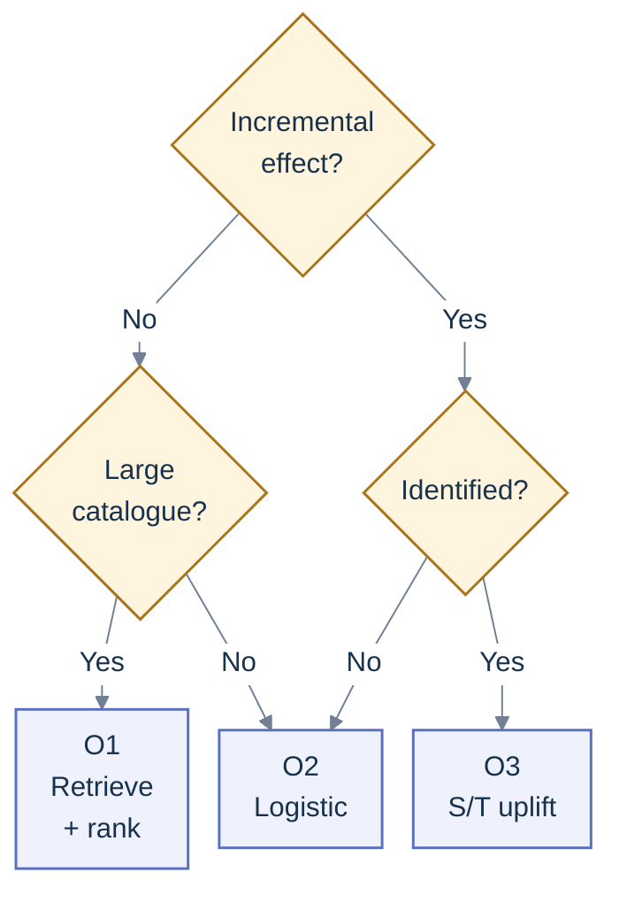
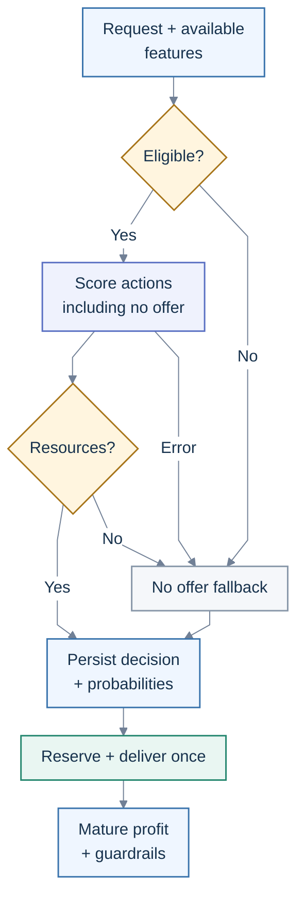

# Offer recommendation: choose the action that changes the outcome

**About 25 hours for the learning project.** &nbsp;·&nbsp; [Chapter 9](README.md) &nbsp;·&nbsp;
[Index](../README.md) &nbsp;·&nbsp; [Resources](resources/README.md)

**The short version.** Start with eligibility rules and a measurable baseline. For a small offer
catalogue and customer data in tables, compare logistic regression with CatBoost or LightGBM. When
the offer spends money or changes customer behaviour, the stronger approach is to learn
**incremental contribution profit against a no-offer control** from randomized assignments. Use
retrieval and ranking for a large catalogue, and consider contextual bandits only after you can log
action probabilities and measure outcomes reliably. These solve different problems; none is a
universally best model.

You finish with a decision service, a reproducible evaluation, and an experiment plan. A learning
project can prepare those in about 25 hours. Collecting a powered experiment and observing its full
outcome window takes additional calendar time.

**In this guide:** [Decision contract](#1-decide-what-offer-means) ·
[Data](#3-build-the-data-around-decision-opportunities) ·
[Model decision tree](#model-selection-decision-tree) ·
[Evaluation](#6-evaluate-the-policy-honestly) · [Serving](#9-serve-log-reconcile-and-roll-back) ·
[Completion gates](#before-you-call-it-complete)

## Your learning plan

Build this after the validation work in [Chapter 3](../03-core-machine-learning/README.md) and the
serving work in [Chapter 6](../06-production/README.md). Deep learning is optional here.

| Session | Hours | Do this                                                                                             | Done when                                                                         |
| ------- | ----: | --------------------------------------------------------------------------------------------------- | --------------------------------------------------------------------------------- |
| 1       |     3 | Define action, no-offer control, profit, decision time, and measurement window                      | A one-page decision contract has an owner and examples                            |
| 2       |     5 | Audit data, implement features available at decision time, and build rules                          | You can replay one decision and trace every input                                 |
| 3       |     5 | Compare logistic regression and one boosted tree; build a treatment-effect baseline if data permits | Validation table separates predictive quality from policy value                   |
| 4       |     5 | Evaluate profit, uncertainty, overlap, fatigue, and important customer segments                     | The proposed policy beats the appropriate baseline or you explain why it does not |
| 5       |     4 | Serve the policy, implement logs, budget reservation, and fallback                                  | Invalid, repeated, stale, and timeout requests behave correctly                   |
| 6       |     3 | Write the experiment and rollout memo; rehearse the project story                                   | Someone else can reproduce the result and decide what evidence is missing         |

## 1. Decide what “offer” means

Two business requests often arrive under the same name.

| Request                               | Example                                                                       | Learning problem                                          | Evidence you need                                                                                            |
| ------------------------------------- | ----------------------------------------------------------------------------- | --------------------------------------------------------- | ------------------------------------------------------------------------------------------------------------ |
| Recommend a relevant product or plan  | Which of 50,000 products should appear on the homepage?                       | Candidate retrieval and ranking                           | Customer–item interactions, item metadata, exposure and position logs                                        |
| Recommend an incentive or next action | Should this customer receive free shipping, a coupon, a reminder, or nothing? | Treatment-effect estimation and constrained policy choice | Eligible decision opportunities, assigned actions, a control group, action probabilities, outcomes and costs |

A product can be relevant without needing a discount. A customer can be likely to redeem a coupon
while being equally likely to buy at full price. A model trained to predict redemption will often
prefer such customers, because redemption is an easier target than **behaviour changed by the
offer**. Attribution reports and conversion probabilities alone do not establish incrementality.
[Microsoft's incrementality documentation](https://learn.microsoft.com/en-us/xandr/data-science-toolkit/incrementality)
makes the same distinction between attributed conversions and causal impact.

For this guide, use a retailer or subscription service with a small, explicit action set:
`no_offer`, `reminder`, `free_shipping`, and `coupon_10`. A reminder is an active treatment if it
sends a message. A no-offer control receives the defined usual experience; document whether that
includes other campaigns. For a retention use case, connect this policy to the
[churn guide](churn.md). For an offer that changes the selling price, use the demand and margin
discipline in the [pricing guide](price-recommendation.md).

Write the contract before choosing the model:

- **Decision:** one action for an eligible customer or account at a stated time, through a stated
  channel. If the decision is an entire ranked slate, say so; its logging and evaluation differ.
- **Outcome:** contribution profit over, for example, the next 30 days, with returns allowed to
  mature. Count transactions regardless of coupon redemption or click attribution.
- **Comparison:** a no-offer policy and the existing business policy. A replacement must justify
  itself against both, using the same eligible population and accounting rules.
- **Constraints:** consent, eligibility, stock, minimum margin, contact limits, total spend,
  concurrent campaigns, and any restrictions supplied by the business.
- **Guardrails:** complaints, unsubscribes, returns, service load, and longer-term purchase or
  renewal behaviour. Choose material thresholds before seeing the result.

## 2. Turn the target into a decision

Let `x` contain information known at decision time, `a` be an eligible action, and `0` be no offer.
Define:

```text
Q(x, a) = E[contribution profit over the window if assigned action a | x]
delta(x, a) = Q(x, a) - Q(x, 0)
chosen action = argmax delta(x, a), among feasible actions including 0
delta(x, 0) = 0
```

This is a conditional average effect: the expected difference for customers with similar observed
context. You cannot observe both potential outcomes for one individual and directly label that
person's true uplift. Define the logged reward from the same accounting contract: contribution over
the window minus incentive, fulfilment and contact costs as specified, including costs of failed
delivery attempts. If any component is already subtracted in net contribution, do not subtract it
again. Use that net reward for both `Q` and policy evaluation, including the no-offer arm.

**A worked example.** Suppose an order contributes ₹500 before the incentive; the incentive is
charged on every completed order in its assigned arm; sending the offer costs ₹2. Assume no returns
or additional effects for this illustration. Suppose randomized data and a validated model produced
these hypothetical purchase-probability estimates for one customer context:

| Assigned action | Purchase probability | Contribution per purchase |            Expected profit | Increment against no offer |
| --------------- | -------------------: | ------------------------: | -------------------------: | -------------------------: |
| No offer        |                 0.20 |                      ₹500 |        `0.20 × 500 = ₹100` |                         ₹0 |
| ₹50 benefit     |                 0.25 |                      ₹450 | `0.25 × 450 − 2 = ₹110.50` |                     ₹10.50 |
| ₹100 benefit    |                 0.30 |                      ₹400 |    `0.30 × 400 − 2 = ₹118` |                        ₹18 |
| ₹200 benefit    |                 0.35 |                      ₹300 |    `0.35 × 300 − 2 = ₹103` |                         ₹3 |

The largest benefit wins on conversion and loses to the ₹100 benefit on incremental profit. If the
₹100 benefit were infeasible, the policy would consider the remaining feasible actions. If every
active action had negative incremental profit, choose no offer. In a real campaign, discounts may
apply only on redemption, baskets can change, and returns create delayed costs. Measure those
components or model net profit directly rather than forcing this simple formula onto the business.

The discount paid to customers who would already have purchased is a real cost. Also measure whether
the offer merely moves a future purchase into the current window, shifts revenue away from a
higher-margin product, or displaces an existing offer. This is why a short-term redemption metric
can produce an expensive policy.

## 3. Build the data around decision opportunities

The unit of training data is an **eligible opportunity at a decision time**, including opportunities
assigned no offer. A table containing only redeemed offers cannot estimate the comparison above. For
each opportunity, join all relevant purchases, returns, and costs over the fixed outcome window.
Keep delivered, seen, clicked, and redeemed as separate events.

Use at least these tables. This is a recommended schema, not a requirement from one library.

| Table               | Required fields                                                                                                                                                                                                             | Why it exists                                            |
| ------------------- | --------------------------------------------------------------------------------------------------------------------------------------------------------------------------------------------------------------------------- | -------------------------------------------------------- |
| `customer_features` | `customer_id`, `feature_time`, `available_at`, feature values, feature version                                                                                                                                              | Recreate what the service could know at the decision     |
| `offer_catalog`     | `offer_id`, version, active interval, eligibility, channel, cost rule, margin rule, stock dependency                                                                                                                        | Reproduce the feasible action set and accounting         |
| `decisions`         | `decision_id`, customer/account ID, `decision_at`, eligible action IDs, selected action, policy/model version, experiment ID and arm, action probabilities, feature snapshot reference, budget reservation, fallback reason | Audit and evaluate the policy                            |
| `delivery_events`   | `decision_id`, event type, event time, status, position if applicable                                                                                                                                                       | Distinguish assignment from actual delivery and exposure |
| `transactions`      | customer/account ID, transaction time, recorded time, gross revenue, product cost, incentive cost, return/refund, channel                                                                                                   | Compute comparable outcomes for every arm                |
| `outcomes`          | `decision_id`, horizon, cutoff, label maturity, label availability, outcome coverage/status, net contribution, contact cost, conversion, guardrails                                                                         | Store a reproducible training label                      |

For a feature window ending at `decision_at`, use only events with both event time and availability
time at or before that decision. A purchase dated Monday but first ingested Wednesday was not
available to Tuesday's service. Historical joins to today's customer profile, today's stock, or a
backfilled lifetime-spend field can all leak future information. Fit encoders, imputers and other
learned transforms only on training data.

Useful inputs include purchase recency and frequency, historical contribution, category affinity,
tenure, prior eligible contacts, time since last offer, pre-decision complaints, channel preference,
offer/product attributes, calendar context, and available stock. Include missingness and history
length so sparse customer histories are visible. Exclude post-assignment opens, coupon redemption,
and future spend from the features used for that decision.

**Do not fabricate labels for unchosen actions.** When the customer receives free shipping, you
observe their outcome under that assignment. You do not also observe the outcome under a coupon or
no offer. Unshown products are not confirmed dislikes either; they are unobserved interactions.
Negative sampling can make retrieval training manageable, but changes the training distribution and
does not turn missing interactions into causal negatives.

Make overlapping decisions explicit. One customer's purchase cannot silently become an independent
positive label for five competing offers. Start with one decision per account per non-overlapping
measurement window, or use a documented design that represents sequences and concurrent campaigns.

**Mature does not mean observed.** A completed window with a reconciled transaction/return ledger
can produce a zero-purchase outcome. An expired window with lost identifiers, an incomplete channel
feed or an unresolved refund cannot. Keep observation status and label availability separately;
report missing outcomes by assigned arm and pre-decision cohort. Preserve all assigned accounts in
the experiment accounting. Dropping missing outcomes can select customers after assignment;
randomization and correct propensities do not repair that missingness. Reconcile coverage and state
the assumptions and sensitivity analysis needed for any remaining exclusions, as the
[experiment inclusion guidance](https://www.microsoft.com/en-us/research/articles/diagnosing-sample-ratio-mismatch-in-a-b-testing/)
illustrates.

## 4. Choose a model according to the evidence

### Model-selection decision tree

Choose the question before the model. The incremental-effect branch asks whether an action changes
profit against no offer; the relevance branch asks which product or offer is likely to interest the
customer. “Identified” means randomized assignment with action support, or a defended observational
identification design. Redemption or targeted-campaign history alone does not satisfy that gate.

**Check data readiness first.** If the required pre-decision features, exposure logs or mature
labels are unavailable, use eligibility rules, popularity where supported, and the no-offer baseline
before fitting a model. Collect decision, exposure and outcome logs using the
[data contract](#3-build-the-data-around-decision-opportunities), then follow the tree.



If a retrieved product carries an incentive, use O1 for relevance and separately follow the
incremental-effect branch for that incentive. A better product rank does not establish discount
lift.

#### O1 — Large catalogue: retrieve, then rank

- **Model and why:** Start with eligible popularity/content candidates. Compare retrieval plus
  LightGBM LambdaRank when scoring the whole catalogue is too costly; use two-tower retrieval only
  when interaction volume and measured serving needs justify learned embeddings.
- **Minimum data:** For learned models, customer–item interactions, item metadata, candidate and
  exposure/position logs, and meaningful relevance labels with query/session groups.
- **Promotion check:** Improve retrieval recall, ranking quality and latency against the same
  eligible candidate budget. Check cold-start coverage. Continue with
  [retrieval and ranking](#large-catalogue-retrieve-rank-then-apply-the-policy).

#### O2 — Small table or unidentified effects: predict response

- **Model and why:** Fit logistic regression, then compare one CatBoost or LightGBM response model.
  This provides an inspectable baseline and a nonlinear challenger; neither identifies an
  intervention's effect by comparing predicted response scores.
- **Minimum data:** Pre-decision customer/offer/context features, observed assignments or exposures,
  and mature response labels including nonresponses, with a deployment-matched holdout.
- **Promotion check:** Compare log loss, rare-event PR metrics, calibration and serving cost on the
  same split. If effect identification is missing, keep claims predictive and collect randomized
  offer/no-offer data; never call redemption prediction uplift. Follow the
  [predictive workflow](#predictive-baseline-logistic-regression-then-one-boosted-tree) and
  [collection design](#incentive-selection-randomized-uplift-and-profit-policy).

#### O3 — Identified effects: estimate uplift and choose a profit policy

- **Model and why:** For randomized data, compare arm profit with a regularized S-learner or
  T-learner, respecting assignment probabilities and strata. For observational data, these learners
  need a defensible confounder-adjustment set and overlap; use effect or value estimates justified
  by that identification design. Unadjusted historical arm averages do not establish uplift. The
  target is an action-versus-control difference for a supported finite action set, including no
  offer.
- **Minimum evidence:** Mature net outcomes and supported action/control assignments with known
  randomized probabilities, or a defended observational design addressing confounding, overlap,
  treatment definition and interference.
- **Promotion check:** Require held-out incremental contribution, support and uncertainty checks,
  then a policy experiment. Compare a cross-fitted DR-learner or causal forest only when arm sizes
  and heterogeneity support the added complexity. Continue with
  [uplift and profit policy](#incentive-selection-randomized-uplift-and-profit-policy) and
  [policy evaluation](#6-evaluate-the-policy-honestly).

**Bandit promotion is separate.** Consider it only after post-constraint assignment probabilities,
action support, mature reward joins, safe exploration and a randomized holdout work. It does not
supply missing causal identification. Use the
[bandit prerequisites](#8-add-bandits-only-when-the-foundation-is-ready) after the fixed-policy
baseline.

### Model comparison ladder

The table below is the recommended order of work. Model selection still happens on your own held-out
data, with your costs and latency budget.

| Data and operating conditions                                          | Start with                                                                          | Consider next                                                                | Main limit                                                                            |
| ---------------------------------------------------------------------- | ----------------------------------------------------------------------------------- | ---------------------------------------------------------------------------- | ------------------------------------------------------------------------------------- |
| Little history; no randomized campaigns                                | Eligibility + recent popularity/category rules + no-offer option                    | Logistic regression and CatBoost/LightGBM response model                     | Prediction under the historical policy does not identify causal uplift                |
| A small offer catalogue and reliable tables                            | Logistic regression; CatBoost or LightGBM with customer, offer and context features | Calibrated response/value models; randomized multi-arm collection            | Optimizing predicted response can spend on customers who would buy anyway             |
| Randomized offer/control assignments with mature outcomes              | Arm means; regularized S-learner or T-learner                                       | Cross-fitted DR-learner; compare X-learner or causal forest when appropriate | Noisy effects, insufficient arm samples, and unsupported action/customer combinations |
| A large product catalogue and many interactions                        | Popularity/content rules, item similarity or matrix factorization                   | Two-tower candidate retrieval + a supervised ranker                          | Relevance is not discount incrementality; exposure and position bias remain           |
| Reliable propensity logs, stable reward, and enough traffic to explore | A fixed policy + randomized holdout                                                 | Contextual bandit with controlled exploration                                | Delayed rewards, unsupported actions, adaptive inference and feedback loops           |

### Predictive baseline: logistic regression, then one boosted tree

Fit response as a function of pre-decision context and offer attributes. Compare against rules and
offer-level historical rates. CatBoost is a useful candidate when the table contains categorical
customer, product and offer attributes; it supports categorical features directly. LightGBM is
another useful candidate with explicit categorical handling. Choose using validation quality,
memory, training cost, serving latency, and operational familiarity, not a blanket winner claim.
[CatBoost's categorical-feature documentation](https://catboost.ai/docs/en/features/categorical-features)
and [LightGBM's advanced topics](https://lightgbm.readthedocs.io/en/stable/Advanced-Topics.html)
describe their supported mechanisms.

Measure log loss, PR-AUC for rare conversions, and reliability curves by action and customer
segment. Calibrate probabilities on a separate, later validation sample or with a split design that
respects time and account identity. Evaluate on the original deployment prevalence after any
negative sampling or class weighting. Calibration matters because a profit calculation uses
probability magnitude, not just ranking.
[The scikit-learn calibration guide](https://scikit-learn.org/stable/modules/calibration.html)
explains why the calibration data must be separate from model fitting.

For a compact table, an optional tabular foundation-model comparison can be worthwhile; use the
version-specific guidance in [Chapter 3](../03-core-machine-learning/README.md). Compare on the same
future opportunities, action-conditional calibration and serving budget. Strong outcome prediction
does not turn that model into a causal learner.

This model is a good predictive baseline. Comparing its predictions for two historically targeted
offers does not by itself remove the reason those offers were targeted to different customers. Label
a profit simulation based on these predictions as **model-based and unvalidated causally**. Feature
importance or SHAP can help inspect the prediction; it does not establish which features cause
customers to respond.

### Incentive selection: randomized uplift and profit policy

Run a multi-arm campaign with no offer and the candidate actions. Randomize at a stable account or
customer level after applying the common eligibility rules. Record the known probability of every
feasible action at each assignment. Stratifying by a few pre-decision segments can improve balance,
but the logged probabilities must reflect that design. Every action the new policy might take needs
sufficient support in the relevant context.

Start with average arm profit and its uncertainty. A segment or no-offer policy can outperform a
personalized model when the treatment-effect signal is weak. Then compare:

- **S-learner:** one outcome model with the assigned action as an input. It shares information
  across arms, but can learn little treatment variation if the main outcome signal dominates.
- **T-learner:** one outcome model per arm, using regularized CatBoost/LightGBM or another suitable
  learner. Subtract the no-offer estimate. It is easy to inspect but can be noisy in small arms.
- **X-learner:** a useful comparison for a binary treatment/control problem with unequal arm sizes.
  Its advantages depend on the data-generating structure; it is not an automatic upgrade.
  [Künzel and colleagues' meta-learner paper](https://arxiv.org/abs/1706.03461) explicitly finds
  that no meta-learner is uniformly best.
- **DR-learner:** combines outcome and assignment models with cross-fitting. It can support multiple
  categorical treatments; choose and validate nuisance and final models separately. On a properly
  randomized design, use the known assignment probabilities in estimators that accept them.
  [EconML's DR guide](https://www.pywhy.org/EconML/spec/estimation/dr.html) documents
  multi-treatment estimation and its assumptions.
- **Causal forest:** an optional comparison when there is enough data to investigate nonlinear
  heterogeneity and uncertainty. Use an estimator and inference method suited to the treatment
  representation. [Wager and Athey's causal-forest paper](https://arxiv.org/abs/1510.04342) develops
  inference under stated assumptions; those guarantees do not apply to arbitrary forests trained on
  a CRM export.

Cross-fitting means predicting auxiliary quantities for a row using models that did not fit that
row. Keep related account records together, and keep the final future test period untouched. For
observational data, a defensible causal analysis additionally needs no unmeasured confounding,
overlap, a well-defined treatment, and a suitable interference assumption. A rich CRM table does not
prove these conditions. An agent's unlogged judgement about which customers need a discount can
confound the data even if the response model has excellent AUC. Double robustness cannot repair an
unobserved confounder or an action that was never assigned in a customer context.

### Optional research challengers: learn the effect or the policy?

A treatment-effect model is one component of a decision. You can also learn a restricted policy,
such as a shallow decision tree, from cross-fitted estimates of each action's value. This can make a
campaign easier to review while enforcing a contact budget.
[Athey and Wager's policy-learning paper](https://arxiv.org/abs/1702.02896), published in
_Econometrica_ in 2021, develops binary decisions under explicit identification and estimation
assumptions, including binary treatment allocation and small continuous-treatment nudges. It is not
a ready-made multi-arm budget allocator. For several offers, estimate each supported action's net
value and cost and use an allocation method that enforces the actual constraints. A simple policy
with reliable value can be preferable to a more accurate effect model whose downstream threshold is
unstable.

[CausalPFN](https://arxiv.org/abs/2506.07918), published at
[NeurIPS 2025](https://proceedings.neurips.cc/paper_files/paper/2025/hash/e3d3db07c1bfb63e1d0b998996de1d12-Abstract-Conference.html)
and revised on arXiv in October, is an optional pretrained causal-model challenger. Its released
implementation covers **binary treatment/control**; a finite-action theoretical framework does not
make it a ready multi-arm selector. Its synthetic structural-model prior enables in-context effect
estimation; it still assumes unconfoundedness and treatment overlap. Prior-based uncertainty does
not establish that those assumptions hold in a campaign. Compare it with the S/T/DR baselines on a
supported binary comparison, held-out policy value, runtime and sensitivity to its prior. Check the
actual weights, licence, context limits and inference implementation before planning a deployment.
Ordinary TabPFN outcome prediction and CausalPFN effect estimation are different tasks.

This extension is outside the 25-hour starting project. Add it only after the randomized baseline
and held-out evaluation work; a recent paper is a reason to test a candidate, not to replace them.

### Large catalogue: retrieve, rank, then apply the policy

If scoring every product is too expensive, first retrieve a manageable candidate set. A two-tower
model embeds the customer/context and the item separately; precomputed item vectors allow fast
nearest-neighbour retrieval. Then use a richer ranker with customer–item interactions. The
[TensorFlow Recommenders retrieval tutorial](https://www.tensorflow.org/recommenders/examples/basic_retrieval)
demonstrates this structure, and
[Google's YouTube paper](https://research.google/pubs/deep-neural-networks-for-youtube-recommendations/)
describes candidate generation followed by ranking at large scale.

Train retrieval on observed customer–item interactions with features available for those examples.
State how negatives are sampled; another row's positive can become an accidental negative when item
IDs repeat. The
[retrieval task API](https://www.tensorflow.org/recommenders/api_docs/python/tfrs/tasks/Retrieval)
supports removing these duplicate-positive hits with `remove_accidental_hits=True` and
`candidate_ids`, and correcting logits using negative-candidate sampling probabilities. Those
probabilities describe the training sampler, not campaign assignment or causal exposure. Report
retrieval over the eligible catalogue, or disclose the sampled-candidate protocol; an in-batch
metric is not full-catalogue Recall@K.

LightGBM LambdaRank is a reasonable candidate when you have grouped recommendation opportunities and
meaningful relevance labels. Keep every query/session group intact during training and evaluation.
Log what appeared, where it appeared, and what candidates were available: a click near the top of
the screen differs from a product that was never shown. Position-bias correction needs an
appropriate exposure model or experiment; adding position as an ordinary feature does not
automatically give a causal relevance estimate.

For a new customer, use declared preferences and context with recent eligible popularity. For a new
product or offer, use metadata and carefully budgeted exploration rather than expecting an ID-only
embedding to work. Metadata must enter a tower trained to use it; adding descriptions to an ID-only
model at serving does not create content-based retrieval. The
[side-feature tutorial](https://www.tensorflow.org/recommenders/examples/featurization) shows
train/serve feature representations. Test users and items first introduced after the training
cutoff, using only metadata available at their introduction. Version the model and compatible
candidate index together, and measure index refresh lag. Evaluate retrieval recall before ranking: a
ranker cannot select a product that retrieval omitted. Apply eligibility during retrieval where
possible and again before the final decision, especially when stock changes.

If incentives are attached to retrieved products, there are two decisions: product relevance and
whether its incentive adds profit. Candidate quality does not replace randomized incentive evidence.

**A boundary for deterministic ranking logs.** The March 2026
[CIPS/CDR preprint](https://arxiv.org/abs/2603.21485) studies ranking evaluation using stochastic
clicks despite deterministic slates. Its identification requires click-wise support and expected
post-click reward independent of the slate. Estimated click-probability ratios control bias; Theorem
4.2 gives CDR the same bias as CIPS regardless of reward-model accuracy, so its name does not supply
the usual “one of two models is correct” robustness. This is an optional ranking-specific research
direction. It does not identify coupon/no-offer effects or excuse unsupported campaign actions.

**A current research direction.** [UNIQUE](https://arxiv.org/abs/2609.23718), a September 2026
preprint, unifies generative candidate retrieval and target-aware ranking using shared semantic
codes. Its reported industrial feed experiment concerns engagement and serving performance, not
coupon incrementality or retail margin. Consider this architecture only when a measured
retrieval/ranking bottleneck warrants it. Generated codes must resolve to existing eligible items;
measure invalid IDs, collisions, duplicates, refresh lag, cold-start coverage and p95/p99 latency.
Compare against the same two-tower/ranker candidate budget and an eventual business experiment.

## 5. Treat constraints as part of the policy

Filter out expired, ineligible, unavailable, non-consented, or below-margin actions before ranking.
Apply contact-frequency rules across channels and across offer, price, and retention workflows.
Recheck rapidly changing constraints immediately before fulfilment. A model score cannot override
those rules.

For a campaign across customers `i`, a simplified allocation problem is:

```text
maximize sum_i delta(x_i, a_i)
subject to sum_i expected_incentive_cost(x_i, a_i) <= campaign_budget
           a_i is eligible for customer i
           at most one selected action per opportunity
```

When costs and values differ, independently choosing each customer's best offer can exceed the
budget. Sorting by benefit/cost is a useful heuristic in some settings, not a general exact solution
to a multi-action allocation problem. Compare a feasible heuristic with a small integer-programming
solution on a representative batch if this matters. Expected spending also does not cap realized
spending: use reservations and redemption limits for hard financial commitments.

For synchronous serving, reserve budget atomically before returning an offer; otherwise concurrent
requests can promise the same remaining money. Use a shared contact ledger to stop duplicate sends.
Apply eligibility and resource constraints before the final randomized assignment, and log the
probabilities of that actual assignment mechanism. If a later reservation or delivery fails,
preserve the original assignment and record the executed action and failure separately. Do not
invent a propensity for the replacement or relabel the original probability as its probability. The
intention-to-treat comparison then evaluates assignment under the implemented delivery process; a
delivered-only comparison needs additional identification. The
[serving flow](#9-serve-log-reconcile-and-roll-back) implements this distinction.

## 6. Evaluate the policy honestly

Use a chronological train, validation and final test design when decision dates are available. Leave
a gap or explicitly filter training rows so their outcome windows and return windows are fully
observed before the training cutoff. Tune models, calibration, policy thresholds and budget rules on
validation; make the final test a single evaluation of the frozen policy.

For response probabilities, keep class weighting and any sampling inside training folds; calibrate
and evaluate on deployment-representative arm data or documented design weights. A balanced
conversion sample changes the probability question. Calibration folds must respect the same time and
account boundaries as model selection, as described in
[Chapter 3](../03-core-machine-learning/README.md#what-to-learn). Report positives and observation
coverage by arm: a pooled reliability plot can hide an unsupported offer arm.

Repeated existing customers across periods can reflect the deployment task, provided features are
available at the correct time and labels do not overlap. Also report a separate account holdout for
cold start when new customers matter. Do not mechanically require all customers to be unique across
a temporal test if production repeatedly serves existing customers.

| Layer                          | Useful metrics                                                                        | What they establish                                                         |
| ------------------------------ | ------------------------------------------------------------------------------------- | --------------------------------------------------------------------------- |
| Retrieval                      | Recall@K, eligible candidate coverage, new-item coverage                              | Whether relevant items reach the ranker                                     |
| Ranking                        | NDCG@K, precision/recall with a stated candidate protocol                             | Ordering quality under the chosen relevance benchmark                       |
| Response                       | Log loss, PR-AUC, Brier score, reliability by arm                                     | Prediction and probability quality                                          |
| Causal targeting               | Uplift curve, AUUC/Qini with the estimator and normalization stated                   | Group-level treatment targeting on suitable held-out treatment/control data |
| Business policy                | Incremental contribution per eligible account, total value, cost, uncertainty         | Whether the chosen actions improve the decision objective                   |
| Operations and customer impact | Latency, fallback rate, delivery failure, budget violations, complaints, unsubscribes | Whether the system works within its constraints                             |

AUUC or Qini is a diagnostic rather than the final campaign objective. State whether it evaluates a
binary treatment, one arm against control, or a multi-action policy; these are not interchangeable.
Do not tune an uplift curve on the final test and then report its selected contact depth as an
independent result. For public data without margins, report conversion/visit policy estimates and
clearly labelled cost sensitivity, not verified incremental profit.

**Why ranking alone can select a losing campaign.** In this invented example, two accounts have true
incremental contribution before contact costs of ₹12 and ₹6. Contacting either costs ₹10; capacity
allows **at most** two contacts. One model estimates effects of ₹12 and ₹6 and contacts only the
first account: actual net value is ₹2. Another estimates ₹24 and ₹12 and contacts both: actual net
value is ₹2 − ₹4 = **−₹2**. Both have the same ranking. The error is in effect magnitude and the
cost-based threshold, which a ranking curve cannot resolve.

The August 2026 [UpliftBench preprint](https://arxiv.org/abs/2608.00915) investigates this
distinction and metric sensitivity across outcome regimes. Its results are dataset-specific; some
threshold comparisons reuse the evaluation observations and its intervals measure split variability.
Treat it as a motivation for independent threshold selection, not a universal model ranking. On a
validation experiment, inspect arm differences or DR estimates within predeclared effect-score bins,
with counts and uncertainty. This checks group-level effect magnitudes; it does not reveal
individual counterfactual truth. Select the threshold there, then evaluate the frozen policy on a
separate experiment/test sample. Repeatedly choosing the best of many policies on the same test set
creates selection optimism even when each value estimator is otherwise valid.

For a **fixed target policy** `pi` and net reward `r` from the accounting contract,
inverse-propensity scoring estimates policy value with a weight `pi(a|x) / p_logged(a|x)`. Here
`a_i` is the recorded assignment, including assignments whose delivery failed; `r_i` is its eventual
observed outcome. The target policy must act within the logged feasible set and action/context
support. In a held-out randomized sample, a doubly robust estimator combines reweighting with an
outcome model:

```text
V_DR(pi) = mean_i [sum_a pi(a|x_i) * Q_hat(x_i, a)
                  + pi(a_i|x_i) / p_logged(a_i|x_i)
                    * (r_i - Q_hat(x_i, a_i))]
incremental value = V_DR(pi) - V_DR(no_offer)
```

Use nuisance predictions from an appropriate separate fit or cross-fitting procedure. Inspect
weights, action/context support, and effective sample size. For nonnegative weights `w`, the
diagnostic effective sample size is `(sum w)^2 / sum(w^2)`. Large weights can make an estimate too
unstable to use. Weight clipping trades variance for bias; report the threshold and sensitivity. A
target action with zero support remains unidentified by this estimate without added assumptions.
[Dudík, Langford and Li's policy-evaluation paper](https://arxiv.org/abs/1103.4601) explains the
direct-model and importance-weighting tradeoff behind doubly robust evaluation.

This is a one-decision estimate over the logged opportunity distribution. Include pre-decision
history, feasible actions and resource state when they affect assignment. If a new policy changes
future contact eligibility, budget depletion, stock or customer behaviour, those future states can
differ from the log; this formula does not establish the value of the entire adaptive campaign.
Evaluate the complete policy in a controlled experiment or justify a sequential design separately.
Coordinate simultaneous price/offer/retention actions through the
[shared delivery plan](delivery-plan.md); separate marginal action probabilities are not generally
the probability of their joint assignment.

Compute confidence intervals at the assignment unit, such as the account, and preserve cluster or
stratum structure. Use an inference method suited to adaptive data if the logging policy changed
through online learning. Ordinary independent-row intervals can be misleading with repeated
customers, shared campaign shocks, or adaptive assignment. Use paired uncertainty for the policy
minus baseline comparison rather than subtracting two unrelated interval endpoints.

Evaluate profit and contact rate by action, tenure, sparse history, channel, region where relevant,
and other pre-decision business segments. Show support counts as well as scores. If the apparent
winner changes with a modest accounting assumption, a slightly later time period, or reasonable
weight clipping, the result needs more evidence.

## 7. Use experiments to establish business impact

There are two separate experiments. The first collects randomized arm data to learn which offers
work. The second evaluates the **complete proposed policy**, including eligibility, delivery,
budgets and no-offer choices, against the incumbent. An offline-selected policy is still a proposal
until the second experiment supports its value.

Before running either, specify population, assignment unit, outcome horizon, primary metric, minimum
useful effect, sample-size/power assumptions, guardrails, duration and stopping rule. For several
arm comparisons, specify the multiplicity treatment. For sequential monitoring, use a valid
sequential method rather than repeatedly stopping on an ordinary p-value. Large profit outliers and
cluster assignment affect power; use historical outcome distributions and the actual assignment
design rather than an arbitrary “run it for two weeks” rule.

Analyze by randomized **assignment** as the primary intention-to-treat analysis. Comparing only
delivered, opened, exposed, or redeemed offers selects behaviour after assignment and can break
randomization. Keep delivery failure as a diagnostic. Check assignment counts, missing outcomes, and
sample-ratio mismatch before accepting the lift estimate.
[Microsoft's SRM guide](https://www.microsoft.com/en-us/research/articles/diagnosing-sample-ratio-mismatch-in-a-b-testing/)
shows how biased inclusion can reverse an experiment's conclusion.

Shared household coupons, limited stock, contact-centre queues, and marketplaces can create
interference between customers. Decide whether account, household, store, geographic cluster, or a
carefully designed time-block experiment fits the mechanism, then adjust inference and power for
that unit. A time-block design may need washout for carryover.
[Microsoft's pre-experiment guidance](https://www.microsoft.com/en-us/research/group/experimentation-platform-exp/articles/patterns-of-trustworthy-experimentation-pre-experiment-stage/)
discusses stable identifiers and network effects; cluster assignment also changes precision and the
effect being estimated.

## 8. Add bandits only when the foundation is ready

A contextual bandit learns which action to select while deliberately exploring alternatives. It can
be useful for frequent decisions with a manageable action space and reliably observed rewards. It is
an advanced extension of this project, not a prerequisite for a good offer system.

Before considering it, demonstrate:

- A feasible action set, including no offer, and a bounded or suitably modeled reward aligned to net
  contribution rather than clicks alone.
- An exploration budget, a durable randomized holdout, and the exact probability of the selected
  assignment recorded after pre-assignment eligibility and budget rules, preserving it if execution
  subsequently fails.
- Correct delayed-reward joins, complete follow-up for mature zeros, returns, and a policy for late
  or missing feedback. “Not received yet” is different from zero reward.
- Offline support and uncertainty diagnostics, plus a valid method for evaluating adaptive logs.
- A kill switch and deterministic fallback with working cost, consent and fatigue controls.

For changing action sets,
[Vowpal Wabbit's contextual-bandit tutorial](https://vowpalwabbit.org/docs/vowpal_wabbit/python/latest/tutorials/python_Contextual_bandits_and_Vowpal_Wabbit.html)
documents action-dependent features and action/cost/probability logging. Exploration methods such as
epsilon-greedy or Thompson sampling must remain within feasible actions; the appropriate choice
depends on the reward model, traffic, and permissible cost.

A bandit sees only the selected action's reward. Historical deterministic assignments do not provide
overlap for alternatives. A fixed reward horizon also matters: a click-optimized bandit can learn to
buy clicks while losing money. With long delays, changing price/stock, or substantial effects on
future customer state, a fixed randomized experiment and periodic policy refresh may be easier to
trust. If you move to reinforcement learning for long sequences, justify the state, reward,
transition evidence, and evaluation design separately.

## 9. Serve, log, reconcile, and roll back

Start with a batch decision job for a scheduled campaign if that meets the business need. Use an
online API when context, stock, or eligibility changes during the customer journey. Both should
share the same accounting, rule evaluation and logging logic.

The flow covers a new decision. Retries replay the persisted decision and reuse or complete its
idempotent reservation.



The eligibility gate checks eligibility, contact rules and input freshness. The resource gate checks
budget and stock feasibility; apply these constraints before the final action draw. Either gate
failing, or a model error, selects no offer. Persist the original assignment, chosen action and
actual post-constraint assignment probabilities on both paths. Then recheck resources and reserve
budget atomically and idempotently before delivery. This ordering leaves a durable decision to
recover if a reservation or delivery attempt crashes.

If the execution recheck fails, append the no-offer execution result and reason, preserving the
original assignment. Record assignment and execution separately; do not relabel assignment
probabilities as the propensity of an overridden action. Mature outcomes feed review and controlled
policy updates.

An example `POST /recommend-offer` request contains a customer/account ID, channel, decision time
and idempotency key. The response contains `decision_id`, action ID and catalogue version, expiry,
reason code, and policy version. Keep debug estimates in restricted logs; internal causal or model
terminology need not appear in the customer's offer copy. Repeated requests with the same key must
return the same decision without reserving budget or sending a message twice.

Persist the decision before delivery, and use a durable outbox or equivalent retry design. Record
the candidate set, scores, actual selection probabilities, assignment, and any fallback. A sample
log record might be:

```json
{
  "decision_id": "d_123",
  "customer_id": "c_456",
  "decision_at": "2026-10-08T06:00:00Z",
  "feature_snapshot": "snapshot_abc",
  "eligible_actions": ["no_offer", "reminder", "coupon_10"],
  "selected_action": "coupon_10",
  "action_probabilities": {"no_offer": 0.25, "reminder": 0.25, "coupon_10": 0.5},
  "policy_version": "offer_policy_v3",
  "catalog_version": "catalog_v7",
  "experiment_id": "offer_collection_01",
  "budget_reservation_id": "reservation_789",
  "fallback_reason": null
}
```

These probabilities illustrate one collection policy; they are not a suggested universal split. Use
the actual probabilities from the implemented selection mechanism. For a deterministic policy, the
chosen action has probability one and alternatives have zero, which limits later evaluation. For a
multi-item slate, log the relevant joint or sequential selection probabilities required by the
evaluation method; independent-looking item scores are not a slate propensity.

On timeout, stale features, invalid output, exhausted budget, or failed stock checks, return the
defined safe rule-based decision or no offer. Do not reuse an expired coupon. Log the cause, and
preserve retry semantics. Monitor input freshness, delivery, p95 latency, contact-limit and budget
violations, action mix, observed costs, outcome maturity, calibration, complaints, and experimental
incremental value. Drift alone is a reason to investigate, not an automatic reason to retrain.

Roll out through log replay, shadow scoring, an A/A logging check where feasible, and a limited
randomized policy test. Increase traffic only after the predeclared criteria and outcome maturity
are met. Rollback restores the previous **policy and rules**, not just the model binary. Keep a
versioned training cutoff, feature definition, catalogue, calibration, constraints and policy so a
decision can be reconstructed.

## 10. Choose practice data without overstating the result

| Data                                                                                            | Good exercise                                                                     | What it cannot establish                                                                                               |
| ----------------------------------------------------------------------------------------------- | --------------------------------------------------------------------------------- | ---------------------------------------------------------------------------------------------------------------------- |
| Your own appropriately governed randomized campaign                                             | Multi-arm incremental-profit policy with realistic constraints                    | Effects outside the supported population, actions and horizon                                                          |
| [Criteo's corrected uplift dataset](https://ailab.criteo.com/criteo-uplift-prediction-dataset/) | Binary uplift benchmarking; policy evaluation under explicit sampling assumptions | Coupon amount effects, real contribution margin, temporal production validation, or original advertiser incrementality |
| [MovieLens](https://grouplens.org/datasets/movielens/) or another interaction dataset           | Popularity, similarity, retrieval and ranking                                     | The causal effect or profitability of financial incentives                                                             |
| A clearly labelled simulator with known potential outcomes and logged probabilities             | Check policy logic, budget allocation, overlap failures, and estimator behaviour  | Evidence that the learned policy improves a real business                                                              |
| An ordinary CRM/campaign snapshot                                                               | Response baselines, feature audits, and a design for collecting better evidence   | Causal uplift without additional identification assumptions and evidence                                               |

Criteo's official page documents an advertiser leakage problem in the original release and links the
corrected release. Use the corrected version, preserve assignment proportions when sampling, record
the file checksum, and retain enough examples in both arms. Treat `treatment` as assignment;
`exposure` is post-assignment and should not be used to filter the causal sample or as a baseline
feature. The public features are anonymized, and non-uniform sampling obscures the original
incrementality. Do not translate benchmark estimates into the original advertiser's business lift.
The original assignment/sampling logs are unavailable. Released arm proportions are not the original
logging propensities. State the assignment and sampling assumptions behind any benchmark policy
estimate, test sensitivity, and use known-propensity simulations to validate the estimator. The
release does not provide the dated campaign history, multiple coupon actions, or profit accounting
needed for the full retail decision contract.

For an undated benchmark, use an appropriate held-out split and disclose that it cannot test
future-period performance. Add a dated simulator to exercise feature availability and deployment
logic if desired, but keep its evidence separate. Check each dataset's stated terms before use;
publish code, a manifest and download instructions rather than casually bundling source data.

## What to build

**An offer decision system with an honest evidence boundary.** Extend your existing project where
the data fits, or use the corrected uplift benchmark plus a clearly labelled operational simulator.
Keep the 25-hour scope to a few actions and one main boosted-tree comparison. Two-tower retrieval,
causal forests, and bandits are optional extensions after the core system works.

Deliver these artifacts:

1. A decision contract and accounting example, with no-offer, constraints, horizon and guardrails.
2. A data manifest and feature/label builder with decision-time availability, maturity and outcome
   coverage checks, plus one versioned net-reward definition.
3. Rules and arm-mean baselines; logistic regression and one boosted tree; a supported uplift or
   value-policy comparison where the data permits it.
4. An evaluation report with split dates or benchmark limitation, support counts, calibration,
   policy value and uncertainty, cost sensitivity, and results for sparse-history customers.
5. A batch job or API with an offer catalogue, idempotency, shared contact controls, budget
   reservations, decision/outcome logs and a demonstrated fallback.
6. A policy experiment memo and rollout/rollback runbook, including the evidence still needed.

Useful correctness checks exercise real failure modes: a late-arriving event is excluded from an old
feature snapshot; an immature or mature-but-missing outcome is not called negative; an ineligible or
negative-value offer is not sent; concurrent requests cannot overspend a hard budget; retries cannot
double-send; and changing the profit formula changes the chosen action in the worked example. Check
propensity normalization over the actual feasible set and reject impossible zero-probability logged
assignments. Simulate a failed reservation after assignment: retain the original action and
probabilities, log no-offer execution separately, and include the account in the assignment
analysis.

## Before you call it complete

- You can distinguish relevance, response probability and incremental profit with one example.
- Every input and outcome can be traced to its decision and availability time; missing outcome
  coverage is disclosed rather than silently converted to zero.
- You have an explicit no-offer option, an incumbent comparison, and reproducible eligibility.
- You state whether effects are identified by randomization, by defended observational assumptions,
  or are only predictive/simulated. You do not claim observed individual treatment effects.
- Your frozen policy has a held-out evaluation, uncertainty, action support, and accounting
  sensitivity. A result without adequate support stays a proposal.
- Delivery, budget, fatigue, retries and fallbacks work together, and one decision can be replayed.
- You can explain how a policy experiment establishes impact and what would stop or reverse rollout.

A project can be complete as a portfolio exercise while its deployment hypothesis remains untested.
A business rollout is complete only after sufficient experiment evidence, operational controls, and
ongoing monitoring support it. Keep that distinction visible in the README.

---

[Back to Chapter 9](README.md) &nbsp;·&nbsp; [Next: Price recommendation](price-recommendation.md)
