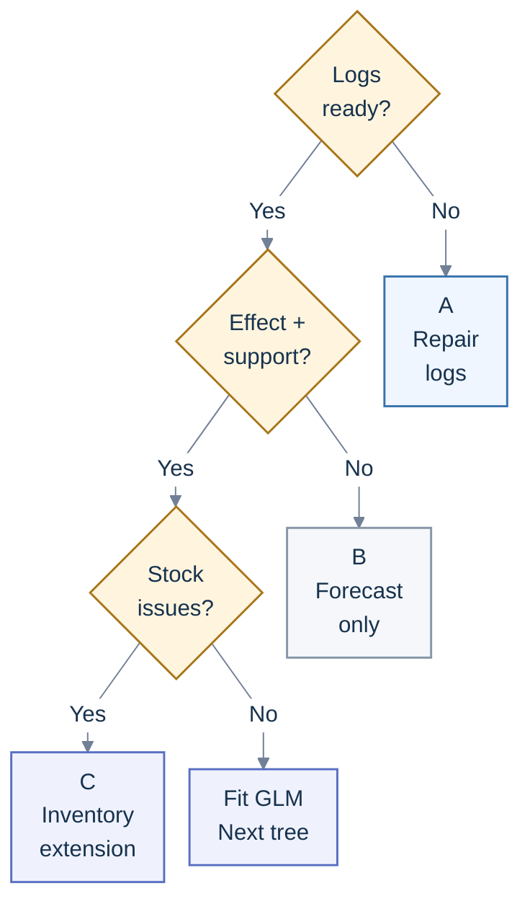
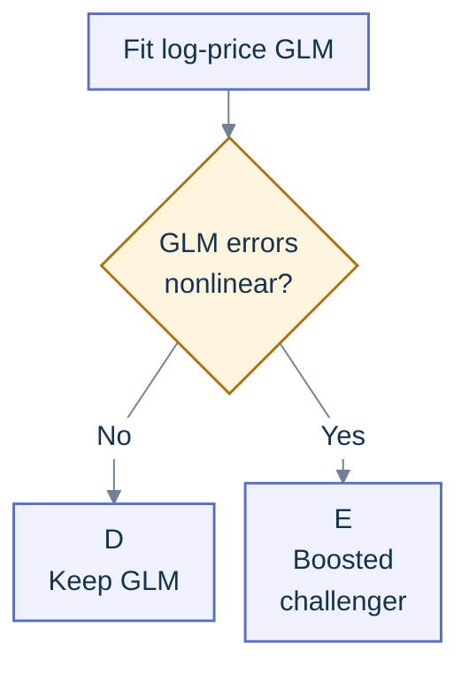
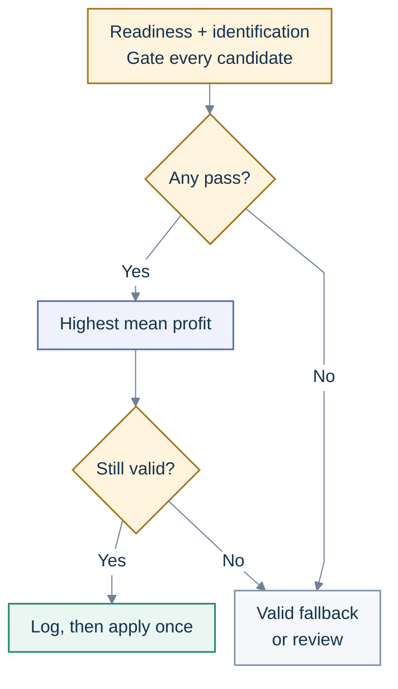

# Price recommendation: learn demand, then choose a price

**About 20–25 hours for the learning project.** &nbsp;·&nbsp; [Chapter 9](README.md) &nbsp;·&nbsp;
[Index](../README.md) &nbsp;·&nbsp; [Resources](resources/README.md)

**The short version.** Start with an interpretable demand model, compare it with a boosted tree, and
choose among prices the business has approved. The difficult part is estimating what demand would be
**if you changed the price**. A model that accurately predicts historical prices or sales does not,
by itself, answer that question.

The recommended first approach is a **log-price Poisson or negative-binomial GLM**, followed by a
**CatBoost or LightGBM demand challenger**, with a separate **constrained profit optimizer**. This
is a practical starting recommendation, not a universal model ranking. The evidence for price
effects, available price variation, demand volume and operational constraints decide which model you
can safely use.

**In this guide:** [Data contract](#2-build-a-table-of-opportunities-including-non-purchases) ·
[Model choice](#model-selection-decision-tree) ·
[Causal evidence](#4-identify-the-price-effect-before-optimizing-it) ·
[Price policy](#6-optimize-a-constrained-grid-with-an-explicit-abstain-path) ·
[Delivery](#7-serve-recommendations-that-can-be-replayed) ·
[Practice lab](#9-build-a-bounded-lab-before-proposing-production)

---

## Your project plan

Use the splitting and API discipline from [Chapter 3](../03-core-machine-learning/README.md) and the
serving and monitoring discipline from [Chapter 6](../06-production/README.md). Real pricing
experiments, approval processes and waiting for returns take additional calendar time.

| Time      | Focus                      | Build                                                               | Done when                                                             |
| --------- | -------------------------- | ------------------------------------------------------------------- | --------------------------------------------------------------------- |
| 3 hours   | Decision and data          | Price unit, horizon, cost definition, exposure and inventory checks | A data contract distinguishes zero demand, no exposure and stockout   |
| 5 hours   | Baselines                  | Current-price policy, seasonal demand baseline, log-price GLM       | Rolling validation and elasticity assumptions are documented          |
| 4 hours   | Challenger and uncertainty | One boosted demand model; demand calibration and intervals          | Accuracy and calibration compared by SKU, price and period            |
| 4 hours   | Recommendation             | Enumerate an approved price grid; enforce constraints and fallback  | Unsupported prices and unsafe inputs cannot become recommendations    |
| 4 hours   | Serve and evaluate         | Recommendation API, decision log, simulated experiment              | Request can be replayed and matched to a matured outcome              |
| 0–5 hours | Buffer and write-up        | Failure exercise, experiment memo, model and policy cards           | Claims clearly distinguish simulation, prediction and causal evidence |

## 1. Define the decision before the model

Choose one unit, such as **SKU × store × next day**, and a fixed decision horizon. Specify whether
the system recommends a posted price, a markdown, a subscription tier, a quote or a negotiated
price. These create different actions, exposures and outcomes. This guide's default is a common
posted price for a product and market during a stated interval.

Separate three questions:

| Question                                                  | Appropriate output                                                   | What it does not establish                             |
| --------------------------------------------------------- | -------------------------------------------------------------------- | ------------------------------------------------------ |
| What price was historically charged for similar products? | Observed-price regression, useful for a benchmark or review queue    | A price that improves demand or profit                 |
| How much would customers buy under candidate price `p`?   | A demand or conversion response under a specified price intervention | The best price without costs, capacity and constraints |
| Which allowed price maximizes the business objective?     | A policy combining a response estimate with optimization             | That the response estimate is causally valid           |

Write the intervention as `do(price = p)`: set the price while holding the specified offer,
placement and availability policy fixed. Decide whether the objective is contribution profit,
clearance sell-through, revenue under a margin floor, or a longer-horizon customer objective. Define
the currency, tax treatment and horizon with the business owner. There is no single correct
objective across those cases.

For a one-period SKU decision, a useful simplified objective is:

```text
profit(p, x) = (net_unit_receipt(p, x) - variable_unit_cost(x))
              × E[min(D(p, x), available_inventory) | do(price = p)]
              - expected_return_cost(p, x)
              - price_change_cost(p, x)

p* = argmax profit(p, x), over approved and supported prices only
```

Here `D` is latent customer demand and `x` contains information known at the decision time. Count
refund losses only once: either within net receipts or in a separate return term. Include
fulfillment, payment fees and other variable costs consistently. Fixed costs may cancel between
prices, but state that assumption. With scarce inventory, `E[min(D, inventory)]` generally differs
from `min(E[D], inventory)`; estimating the mean alone can misprice a capacity-constrained product.

A daily optimizer can also sell stock too cheaply today that would be more valuable tomorrow. Start
with products for which a one-period approximation is credible. Add a multi-period inventory model
only when replenishment, perishability or strategic customer waiting requires it;
[dynamic pricing with limited supply](https://arxiv.org/abs/1108.4142) illustrates why capacity
changes the decision problem.

## 2. Build a table of opportunities, including non-purchases

Transactions alone omit people who saw the price and chose not to buy. Build rows for every eligible
product-market-period, using posted-price and availability logs to create zero-sales rows. Missing
rows are not automatically zero demand.

| Field                                                                   | Required meaning                                                                         |
| ----------------------------------------------------------------------- | ---------------------------------------------------------------------------------------- |
| `sku_id`, `market_id`, `decision_at`, `horizon_end`                     | The decision unit and the interval governed by the price                                 |
| `posted_price`, `effective_paid_price`, `currency`                      | Price shown, price paid after promotions, and consistent monetary units                  |
| `price_valid_from`, `price_valid_to`                                    | Actual duration of exposure to each price; split a day when price changes                |
| `eligible_exposure`, `exposure_definition`                              | Eligible visits, offers shown, or hours of availability; state the denominator           |
| `units_sold`, `orders`, `returns`                                       | Distinct outcome definitions, with arrival and maturity timestamps                       |
| `inventory_start`, `replenishment`, `stockout_at`                       | Capacity and evidence that observed sales were censored                                  |
| `unit_cost_snapshot`, `fulfillment_cost`, `fee_rules`                   | Costs known at decision time; reconcile realized costs afterwards                        |
| `promotion`, `placement`, `campaign_assignment`                         | Discounts, visibility and concurrent interventions                                       |
| `competitor_snapshot_at`, `competitor_price`, `competitor_availability` | Comparable product, collection time and missing/stale indicators                         |
| `policy_version`, `experiment_id`, `assignment_probability`             | How assignment was selected; retain the full available action set and any later override |
| `event_at`, `available_at`, `snapshot_version`                          | When a fact occurred, when the service could know it, and which revision was used        |

Measure exposure carefully. For visit-level conversion, a customer who does not buy is a valid
negative example. For aggregate counts with unequal exposure, a GLM can use a log-exposure offset;
the
[scikit-learn Poisson example](https://scikit-learn.org/stable/auto_examples/linear_model/plot_poisson_regression_non_normal_loss.html)
shows the related rate-target and exposure-weight formulation. An exposure of zero means no
opportunity to observe demand, and cannot be passed through `log(0)`.

**Exposure can itself respond to price.** Search placement, traffic or customer visits may change
after a price change. Conditioning on that realized exposure can remove part of the total price
effect. State whether you estimate conversion conditional on exposure or total period sales; use
pre-treatment exposure forecasts or jointly model traffic when estimating a total effect.

**Sales are not demand during a stockout.** Selling the last ten units tells you demand was at least
ten, not exactly ten. Keep censored periods, mark them, and use a censored likelihood or an
availability-aware choice/demand model when those periods matter. An initial uncensored subset is
acceptable for a narrow baseline, with explicit selection limitations. Dropping stockouts can select
low-demand periods. Availability also changes substitution across products, as shown by
[Conlon and Mortimer](https://www.nber.org/papers/w14315).

Check support for the inventory levels too. If comparable observations were always capped at ten
units, they do not reveal the demand tail needed to value an inventory of twenty without additional
assumptions. Lower-stock decisions may need only the tail up to their own cap. Mark model-based
extrapolation explicitly and abstain when the required tail or censoring assumptions are
unvalidated.

Include day of week, holidays, seasonality, item age, category, store and lagged demand, using only
information available before the recommendation. Compute rolling features separately inside each
validation history. A future realized competitor price, end-of-day inventory, post-change page views
or future return flag is not a pre-decision feature. Require both event time and availability time
to precede the decision: a backfilled Monday transaction first ingested Wednesday was not available
to Tuesday's recommendation.

Promotions, loyalty benefits and offer recommendations change effective price. Track them together,
including who funds a discount. Optimizing posted price and discount independently can spend the
same margin twice. Cross-item prices and availability matter when products substitute or complement
one another; begin with an isolated category and test the assumption.

## 3. Use a model ladder with clear promotion conditions

### Model-selection decision tree

Choose a **demand estimator** first; a separate constrained optimizer chooses among approved prices.
“Logs ready?” means usable demand, price exposure, cost and inventory histories. “Effect + support?”
requires defensible identification and observations supporting the candidate prices, not a good
forecasting score. For identified, uncensored demand, fit the GLM baseline before judging whether
its remaining errors justify a more flexible challenger.

#### 1. Check data, evidence and inventory readiness



The letters link each outcome to its requirements below. “Stock issues?” includes sales censored by
stockouts or decisions coupled to future inventory/replenishment; these require a separate
extension. An available model does not authorize a new price, and additional rows do not repair
missing identification or price support. The “Fit GLM” path continues in
[the promotion tree below](#2-decide-whether-the-glm-needs-a-challenger).

#### 2. Decide whether the GLM needs a challenger

Follow this tree after the readiness checks above. Fit the GLM first, then use forward error
analysis to decide whether a boosted demand comparison is useful; choosing a challenger does not
establish that it improves on the baseline.



- **A · Repair the logs; keep the current approved policy.** Model: no new price-response model yet.
  Missing exposures, costs or inventory make the decision target unreliable. Required: posted
  prices, exposed opportunities including non-purchases, timestamped costs and stock/availability.
  Proceed when reconciliation and readiness checks pass; forecast only targets the records support.
  See the [data contract](#2-build-a-table-of-opportunities-including-non-purchases).
- **B · Forecast only; gather intervention evidence.** Model: a seasonal/count demand forecast,
  while retaining the current approved pricing policy. Historical forecasting does not identify
  demand under a price change. Required for promotion: a bounded approved price experiment, or
  another defensible identification design, with local support for the proposed grid. Promote only
  within that identified, supported price region. See
  [price-effect identification](#4-identify-the-price-effect-before-optimizing-it) and the
  [experiment design](#8-design-an-experiment-around-the-market).
- **C · Add a censored-demand/inventory extension only when supported.** Model: a justified
  latent-demand distribution, using censor-aware estimation when sales are censored, plus a separate
  inventory optimization model when decisions interact over time. Realized sales alone cannot reveal
  demand above available stock. Required: stock and availability histories, exposure, price/cost
  state, identifiable price effects and a validated observation/censoring model; dynamic decisions
  also need replenishment and transition evidence. Promote after validating the observation model
  and demand-distribution calibration under the inventory rules; otherwise abstain from the
  unsupported price change. See the
  [stock-censored research and simulator extension](#what-the-2026-research-adds).
- **D · Start with a regularized log-price Poisson or negative-binomial GLM.** It provides an
  interpretable count-demand baseline, handles zero counts and can model exposure explicitly.
  Required: repeated product-market observations, valid exposure denominators, uncensored demand for
  this baseline, credible supported price variation and documented identification assumptions. Check
  forward performance, dispersion and uncertainty. See the
  [elasticity baseline](#the-elasticity-baseline).
- **E · Compare CatBoost or LightGBM with that GLM.** Rich features and nonlinear seasonal/product
  interactions can justify a flexible demand challenger. Required: the same identified price
  evidence and support, features available at decision time, and a held-out forward comparison of
  accuracy, calibration, response curves and operating cost. Keep the GLM if the challenger adds no
  useful benefit. See the [boosted demand challenger](#the-boosted-demand-challenger).

Only a supported demand response advances to the
[constrained price policy](#6-optimize-a-constrained-grid-with-an-explicit-abstain-path), where
feasibility, predictive risk and selection-adjusted improvement gate **every** candidate before
selection. This tree organizes the existing project work; inventory and other advanced extensions
remain outside its 20–25-hour practice budget.

| Evidence and data regime                                           | Suggested model or approach                                                                | Gate before using it for decisions                                                        |
| ------------------------------------------------------------------ | ------------------------------------------------------------------------------------------ | ----------------------------------------------------------------------------------------- |
| Little price variation or incomplete logs                          | Current approved price; category rules; forecasting only                                   | Instrument the missing exposures and assignment process                                   |
| Repeated product-market observations with credible price variation | Regularized log-price Poisson/negative-binomial GLM, with SKU/store/calendar effects       | Plausible elasticity, adequate support and defensible identification                      |
| Rich tabular features and nonlinear seasonal/product interactions  | CatBoost or LightGBM demand model                                                          | Beats GLM on forward data; response curves and uncertainty remain credible                |
| Sparse products or new SKUs                                        | Hierarchical/partially pooled category elasticity plus item attributes                     | Category transfer validated on held-out products; conservative fallback                   |
| Identified heterogeneous price effects                             | DML or causal forest with a specified treatment-response model                             | Identification, residual price variation, cross-fitting and inference assumptions checked |
| Strong substitutions and assortment changes                        | Discrete-choice model, such as multinomial/nested logit, or a justified joint demand model | Choice set, outside option, availability and cross-price effects observed                 |
| Repeated decisions with approved exploration                       | Contextual bandit on a finite approved price grid                                          | Correct propensities, matured reward, limited loss budget and operational stop rules      |

These promotion gates are engineering recommendations. Model documentation establishes supported
losses and estimator assumptions; it does not establish which model wins on your data.

### The elasticity baseline

For counts, fit the conditional mean rather than taking the log of observed zero sales:

```text
log E[units | p, x] = log(exposure)
                     + item_effect + store_effect + calendar_effect
                     + beta × log(p) + other_pre_decision_features
```

With this specification, `beta` is the elasticity of the conditional mean: a 1% price increase
corresponds approximately to a `beta`% demand change, holding modeled features fixed. An estimate of
`-1.4` suggests approximately a 1.4% decrease. It becomes a **causal elasticity** only under the
identification assumptions in the next section.

A Poisson log-link naturally accommodates zero counts. Examine overdispersion; a negative-binomial
model may better represent the variance. Use partial pooling or regularization when there are many
products with little price variation. If you instead fit ordinary log-log regression on positive
sales, state the exclusion of zeros and address retransformation bias; `log1p(units)` does not
preserve the ordinary elasticity interpretation.
[statsmodels documents the GLM families and links](https://www.statsmodels.org/stable/glm.html).

Check how the selected implementation handles dispersion. In statsmodels' negative-binomial GLM
family, `alpha` is a supplied, non-estimated parameter; selecting the family does not automatically
fit it. Estimate or tune dispersion using training data with an appropriate count model, then check
the resulting tails on held-out data. The
[family documentation](https://www.statsmodels.org/stable/generated/statsmodels.genmod.families.family.NegativeBinomial.html)
states this contract.

### The boosted demand challenger

CatBoost is a useful challenger when product, store and category identifiers are prominent; LightGBM
is a useful challenger for larger tabular panels. Both support Poisson and quantile objectives in
their
[CatBoost loss documentation](https://github.com/catboost/catboost/blob/master/catboost/docs/en/concepts/loss-functions-regression.md)
and [LightGBM parameters](https://lightgbm.readthedocs.io/en/latest/Parameters.html). Choose by
honest validation and operating requirements, not a generic leaderboard.

Use a count-oriented loss for units; for zero-heavy nonnegative continuous spending, compare a
Tweedie or two-part model where appropriate. A hurdle model can separate buying at all from units
given purchase, but extra complexity needs validation. Keep the response scale explicit: a library
may return a raw log score or a transformed mean depending on prediction settings.

Inspect demand curves across the supported price grid within actual customer-market contexts. A
decreasing-price monotonic constraint can encode a reasonable own-price assumption, but it cannot
fix confounding. Check your selected objective's compatibility with that constraint in the pinned
library version. Flexible trees also extrapolate poorly beyond observed prices, and a smooth-looking
curve is not evidence that a price intervention will work.

A boosted Poisson-loss model estimates a conditional mean; that objective alone does not validate a
Poisson demand distribution. A few fitted quantiles are not a complete distribution either. For
inventory or downside-risk calculations, supply a coherent nonnegative demand distribution or a
justified tail estimator, and validate dispersion, tail calibration and interval ordering. Keep
uncertainty in the fitted mean separate from future demand variation.

### When advanced models earn their place

For strong substitutes, estimate category demand and the no-purchase outside option, rather than
maximizing each SKU's apparent profit separately. The assumptions and feasibility of a choice model
matter as much as its fit. Personalized individual pricing is a separate product-policy decision; a
pooled product-market demand model does not require that additional scope.

Use a bandit only when learning through exploration has been approved for the defined market and
price grid. Start with a randomized fixed-grid experiment. Later, a contextual bandit can allocate
more exposure to promising allowed prices while preserving exploration. Log the actual chosen
action's probability after all filters, inventory checks and policy constraints. The
[Vowpal Wabbit tutorial](https://vowpalwabbit.org/tutorials/contextual_bandits.html) explains the
context/action/reward/probability contract. A bandit optimizing immediate purchases can lose money
after discounts, returns or longer-term effects; define a matured contribution reward.

**Delayed feedback changes the learning contract.** Declare a fixed return/settlement horizon and
ingestion allowance. Keep recent decisions pending rather than assigning zero reward or updating
only the outcomes that arrived quickly. A whole decision cohort becomes mature under the same rule;
its reward may still exclude later returns, so state that limit. Delays or missing outcomes can
depend on price and reward. The peer-reviewed
[ICML study of unrestricted delay distributions](https://proceedings.mlr.press/v139/lancewicki21a.html)
distinguishes reward-independent and reward-dependent delays; ordinary bandit updates are not
automatically valid in both settings. Start with scheduled updates on mature cohorts and an
incumbent fallback. More elaborate delay-aware learning is an optional extension.

For a faster purchase or revenue proxy, individual-level correlation with settled profit is
insufficient. Check whether the **randomized price effects** on the proxy point in the same
direction as effects on matured contribution, with uncertainty. The
[August 2026 delayed-feedback workshop paper by Lee and colleagues](https://arxiv.org/abs/2608.11560)
examines reward alignment and learning efficiency separately. Its marketplace illustration is
underpowered, later overall lift is null, and positive subgroup findings are exploratory; it does
not validate a retail pricing reward. Compare against an approved fixed-price policy and confirm any
proxy-driven policy with settled-profit experimental outcomes.

### What the 2026 research adds

**Pretrained continuous-treatment models.** The May 2026
[CCPFN preprint, revised in July](https://arxiv.org/abs/2605.15133), studies in-context
dose-response estimation using synthetic causal-model priors. This is an optional challenger for an
identified price-response task, not a method for extracting causal elasticity from arbitrary sales
history. It requires the relevant confounders and local treatment support; benchmark evidence is
largely synthetic/semi-synthetic. Compare against the GLM and a cross-fitted causal baseline on the
same supported price region, future cohorts, response uncertainty and inference cost. Explicitly
test prior mismatch. A continuous-treatment model cannot learn the effect of prices absent from the
experiment merely because it returns a smooth curve.

**Learning with stock-censored demand.**
[Zhang, Wang and Luo's September 2026 preprint](https://arxiv.org/abs/2609.32949) develops
Double-Grid-UCB and Threshold-UCB for stationary bounded demand, nonincreasing expected sales with
price at each inventory cap, and inventory revealed before pricing. Threshold-UCB shares demand-tail
information across inventory levels. The evidence is theory and simulations; seasonal drift,
substitution, replenishment decisions and live profit gains need separate work.

Adaptive prices and inventory can also invalidate ordinary i.i.d. Kaplan–Meier confidence arguments;
the paper develops estimates for its own observation process. A censoring flag alone is insufficient
to justify a survival estimator's uncertainty.

The practical implication is useful even with a GLM: log available stock, distinguish sales from
latent demand, and estimate a demand distribution when stock constrains the decision. Two invented
demand processes both have mean 10: one always sells 10 if available; another has demand 0 or 20,
each with probability one half. With inventory 10, expected served demand is respectively **10 and
5**. A mean-only forecast cannot distinguish their stock-constrained contribution.

For nonnegative integer demand and integer inventory, the identity is:

```text
E[min(D, I) | price, context] = sum from q=1 to I of P(D >= q | price, context)
```

A finite-inventory extension can compare a naive sales-as-demand fit, a justified censored-demand
model and an inventory-aware exploration policy in a simulator. Vary stockouts and demand drift.
Adapting its revenue objective to contribution is new work; the regret guarantee does not transfer
automatically. These optional extensions need an exploration and loss budget before live use.

## 4. Identify the price effect before optimizing it

Managers often lower prices when they expect weak sales and raise prices when demand is strong. The
historical price then encodes information about demand that the model may not observe. A positive
price-sales correlation can arise even when raising price reduces demand. Fixed effects, SHAP and
better forecast scores do not solve this automatically.

Prefer a **randomized price experiment** within a small approved grid, stratified by product, market
and relevant calendar blocks. Maintain a concurrent current-policy control. Record assignment,
realized exposure, overrides and outcomes. Define the primary effect as assignment to the pricing
policy, so overrides cannot silently change the population being compared. A controlled retail
example, [Fisher, Gallino and Li](https://pubsonline.informs.org/doi/10.1287/mnsc.2017.2753), uses
randomized prices to address this endogeneity problem. Its reported improvement concerns that
setting and is not a forecast for your project.

For observational estimation, document an identification argument before choosing the estimator:

- **Adjustment/DML:** all common causes of price assignment and demand are recorded, sufficient
  price variation remains within comparable contexts, and treatment and outcome definitions are
  consistent. Do not condition on effects of the price change. DML cross-fitting reduces certain
  estimation biases; it does not reveal missing confounders. The
  [EconML DML documentation](https://www.pywhy.org/EconML/spec/estimation/dml.html) also specifies
  structural assumptions. A continuous-treatment causal forest estimates effects within those
  assumptions; a local marginal effect is not automatically a complete nonlinear demand curve.
- **Instrumental variables:** the proposed instrument changes price, is independent of unobserved
  demand shocks conditional on stated controls, and affects demand only through price. Report
  first-stage strength and the population/variation identified, with any additional functional-form
  or monotonicity assumptions. A competitor's price or your cost is not automatically a valid
  instrument: common shocks, advertising and availability can create other demand paths.
  [EconML's instrument guide](https://www.pywhy.org/EconML/spec/estimation_iv.html) describes this
  distinction. A more recent competitive-pricing study,
  [Jiang and Li](https://pubsonline.informs.org/doi/abs/10.1287/opre.2022.0157), combines
  experimentation and instrumental estimation in its specific setting.
- **No credible identification:** keep the model as a forecast or analyst simulator, keep the
  approved current policy, and design an experiment. Label counterfactual numbers as unvalidated
  scenarios. Adding `CausalForestDML` to the code does not change that evidence gate.

For continuous price, support means meaningful variation near the proposed price **within comparable
contexts**, not simply lying between the global minimum and maximum. If every item was always priced
differently, cross-item variation does not identify an item's own-price effect. Plot price variation
by SKU/store/season and show which decisions must abstain.

## 5. Validate forecasting, response and business value separately

**Prediction validation.** Use forward rolling windows on the SKU-store panel. Reserve a final later
period once; tune only on earlier windows. Add held-out stores or products when deployment must
serve unseen groups. A group split alone does not prevent temporal leakage, and a temporal split
alone does not test cold-start products. Fit encoders and transformations within each training
window. Use dependence-aware folds for causal nuisance models; library defaults may assume
independent rows.

Report seasonal-baseline, GLM and challenger results on the same rows. Use count deviance and MAE,
with bias and observed-versus-predicted totals by SKU, store, season, stock availability and price
band. MAPE is unsuitable at zero demand; WAPE is undefined when total actual demand is zero and can
hide poor low-volume performance. Separate uncensored demand checks from realized sales checks and
state what is being forecast.

**Response validation.** On randomized or otherwise identified held-out data, compare demand and
profit by assigned price, show uncertainty, and inspect monotonicity and heterogeneous effects.
Report how much supported price variation remains after controls. Good MAE under the incumbent price
policy does not validate a new price curve.

**Uncertainty.** Keep three objects distinct: variation in future customer demand, uncertainty about
the estimated causal mean response, and uncertainty about the policy's profit improvement. Quantile
models can estimate demand prediction intervals; check coverage, width, pinball loss and calibration
on later data and operational slices. Distributional count models should also be checked for tail
behavior and stockout probability. Refit/cluster bootstrap or estimator-specific inference can
assess response-estimation uncertainty under the relevant assumptions.

Ordinary conformal coverage relies on assumptions that temporal drift may violate; rolling coverage
checks and adaptation are needed.
[Gibbs and Candès](https://proceedings.neurips.cc/paper_files/paper/2021/hash/0d441de75945e5acbc865406fc9a2559-Abstract.html)
study adaptive conformal inference under shift. Neither conformal prediction nor quantile
calibration creates causal validity or guarantees coverage for an unsupported candidate price.

**Coverage after choosing a price.** Per-price average coverage need not survive a policy choosing
different prices in different contexts. The
[July 2026 Zheng and Jin preprint](https://arxiv.org/abs/2607.02206) studies this distinction using
policy-coupled coverage under i.i.d. logging with supported, identified actions and known assignment
probabilities, separating model fitting, policy learning and calibration. It is optional research.
Validate the frozen policy's selected-action coverage using independent identified data and a
justified weighting/design strategy. Pooled coverage under the incumbent policy is insufficient;
mean-improvement multiplicity adjustment does not solve this predictive-risk problem.

An invented counterexample makes the distinction concrete: two prices each miss five of the same 100
contexts, on disjoint sets. Each therefore has 95% coverage. A policy choosing each price in its own
missed contexts has only 90% selected-price coverage. These are constructed outcomes, not observed
customer counterfactuals; an optimizer can unintentionally favor poorly covered contexts.

**Policy validation.** Compare against the current pricing rule, with matured contribution profit
per randomized unit/horizon as the primary outcome. Also track sell-through, revenue, stockout rate,
returns, complaints, repeat purchase and constraint violations. Estimate uncertainty at the
assignment unit: thousands of customer events in one treated market are not thousands of independent
treatment assignments.

Offline policy evaluation requires the candidate policy's actions to have support under the logged
assignment mechanism and valid reward/assignment assumptions. On a finite price grid, IPS and doubly
robust estimates can be useful; inspect propensity errors, extreme weights, effective sample size
and interval width. [Dudík, Langford and Li](https://arxiv.org/abs/1103.4601) describe the doubly
robust approach. It does not repair absent support or unmeasured confounding. An incumbent
deterministic policy cannot evaluate a different deterministic price by generic IPS.
Continuous-price evaluation requires appropriate density/smoothing assumptions; discretizing
afterward does not create randomized data. A model-only profit simulation is not an observed lift.

Distinguish evaluating a **fixed learned policy** from evaluating an adaptive learner that updates
as feedback arrives. The latter's actions depend on its history, so a one-shot IPS/DR score for its
final policy does not measure cold-start learning, pending rewards or inventory depletion. Use a
justified sequential evaluation design or a bounded live trial for those claims.

## 6. Optimize a constrained grid, with an explicit abstain path

Choose a small price grid approved by the relevant business owners. Apply constraints before ranking
and after selection:

- Price floors/ceilings, positive unit contribution where required, and a margin floor.
- Maximum change from the current price, minimum time between changes, rounding and price endings.
- Inventory, replenishment, contractual and campaign restrictions.
- Consistent customer-facing price/quote rules and any applicable organizational policies.
- Valid cost, competitor and feature timestamps; candidate prices within identified support.

Define what happens when current price is itself no longer allowed. A fallback must come from a
currently approved policy; if none exists, return `review_required` with no executable price. The
optimizer cannot invent an exception to restore availability.

### The policy flow

Filter **every candidate** through feasibility, local support, predictive risk and a
selection-adjusted improvement rule before comparing expected profits. Each check below retains only
passing prices. The identification gate uses the design and assumptions in
[Section 4](#4-identify-the-price-effect-before-optimizing-it), rather than a predictive score.



The first stage checks input readiness and causal identification, then gates every approved price on
feasibility, local support, predictive risk and selection-adjusted mean improvement. Failed
preconditions leave no passing candidates. Select the highest expected profit only among survivors,
recheck the current state, then durably log before delivery. Revalidate the approved fallback before
using it; if none remains valid, execute nothing and return `review_required`.

### A worked example

Assume a cost of **₹60 per unit**, enough inventory, no additional fees or returns, and the
following **illustrative identified mean demand** for one day. These values are invented to
demonstrate the arithmetic, not an elasticity estimate from a public dataset.

| Approved price | Expected units | Expected revenue | Expected contribution profit |
| -------------- | -------------: | ---------------: | ---------------------------: |
| ₹90            |            140 |          ₹12,600 |   `(90 - 60) × 140 = ₹4,200` |
| ₹100, current  |            115 |          ₹11,500 |  `(100 - 60) × 115 = ₹4,600` |
| ₹110           |             95 |          ₹10,450 |   `(110 - 60) × 95 = ₹4,750` |
| ₹120           |             76 |           ₹9,120 |   `(120 - 60) × 76 = ₹4,560` |

Under these assumptions, ₹110 has the highest expected contribution profit: **₹150 above the current
policy**, approximately **3.26%**. ₹90 maximizes the table's revenue, which is a different
objective. A 5% change limit from ₹100 would make ₹110 inadmissible. If uncertainty about the profit
difference still includes an unacceptable loss, a conservative rule would retain the approved
fallback even though ₹110 has the highest estimated mean.

Use **paired estimates of profit difference** when assessing a conservative improvement bound.
Subtracting two unrelated prediction-interval endpoints is not a confidence interval for lift.
Choose minimum improvement and loss thresholds before observing experimental results. Pair estimates
by refitting on the same bootstrap sample or taking the same parameter-posterior draw for every
price. This captures covariance in estimated mean responses. Randomized price data can identify each
price's marginal outcome distribution under the design assumptions; it does not identify the joint
potential outcomes for an individual across different prices.

Refit the demand/nuisance estimators using a dependence-aware resampling scheme when estimating
model uncertainty; resampling fixed predictions alone does not capture that fitting uncertainty.
Label a posterior bound as conditional on its model and prior, rather than a distribution-free
confidence guarantee. If live monitoring repeatedly tests for improvement, predeclare an analysis
schedule or use justified sequential inference; a fixed-sample interval does not authorize unlimited
peeking.

```python
# Pseudocode: response inference and predictive risk are separate dependencies.
def recommend(context, policy, response_model):
    fallback = policy.valid_fallback(context)  # Can be None: then review_required.
    if not context.features_fresh or not context.costs_valid:
        return abstain(fallback, reason="stale_or_invalid_inputs")
    if not response_model.price_effect_identified:
        return abstain(fallback, reason="unvalidated_price_effect")

    candidates = [
        p for p in policy.approved_prices(context)
        if policy.allows(p, context)
        and response_model.has_local_support(p, context)
    ]
    if not candidates or fallback is None:
        return abstain(fallback, reason="no_supported_feasible_action")
    if not response_model.has_local_support(fallback, context):
        return abstain(fallback, reason="cannot_compare_with_fallback")

    # Each refitted bootstrap model (or parameter draw) estimates each price's
    # marginal demand distribution. Integrate that distribution to calculate
    # expected profit, applying inventory and costs once. No paired customer
    # outcomes across counterfactual prices are assumed.
    fits = response_model.inference_fits(context)
    mean_profit = policy.integrated_profit_by_fit(
        fits, prices=candidates + [fallback], context=context)
    passing_prices = {}
    for price in candidates:
        # Predictive variation governs operating risk, such as stockouts or
        # a future-period loss limit. Check every candidate before selection.
        demand = response_model.predictive_demand_distribution(price, context)
        future_profit = policy.predictive_profit_distribution(demand, price, context)
        if not policy.operating_risk_acceptable(future_profit):
            continue
        mean_gain = mean_profit[price] - mean_profit[fallback]
        if not policy.mean_improvement_supported(
                mean_gain, candidate_family=mean_profit):  # Selection-adjusted rule.
            continue
        passing_prices[price] = future_profit
    if not passing_prices:
        return abstain(fallback, reason="no_candidate_passes_evidence_and_risk")
    best = max(passing_prices, key=lambda p: mean_profit[p].mean())
    if not policy.allows(best, context):
        return abstain(fallback, reason="constraints_changed")
    return decision(best, alternatives=candidates, mean_profit_summary=mean_profit,
                    predictive_risk_summary=passing_prices[best],
                    evidence=response_model.evidence_version)
```

The support check and improvement rule are implemented contracts, not magic confidence scores.
Define their diagnostics, estimation assumptions and thresholds in the policy card. A full
future-profit distribution supports risk decisions; statistical confidence in **mean lift** is a
different calculation. Validate the marginal predictive distributions used for risk, and account for
selecting the best price among several candidates in the mean-improvement inference. Record both
gates in the policy card. `operating_risk_acceptable` must reject an unvalidated distribution or
inventory regime; a mean forecast must not silently become a predictive-risk certificate. Include
estimation uncertainty and plausible cost/return scenarios in the risk sensitivity checks. Apply the
adjustment to the full supported, feasible candidate family; do not narrow that family after
inspecting risk or profit estimates. Revalidate cost/inventory/policy version when applying a
recommendation because state may change after scoring.

## 7. Serve recommendations that can be replayed

A daily batch job is usually enough for the first posted-price system. Keep the response model,
policy configuration and application of prices separately versioned. Use an API when operators or
downstream systems need a consistent recommendation contract.

```json
{
  "request_id": "price-2026-10-08-001",
  "sku_id": "SKU-17",
  "market_id": "STORE-3",
  "decision_at": "2026-10-08T08:00:00+05:30",
  "horizon_hours": 24,
  "currency": "INR",
  "current_price_minor": 10000,
  "cost_snapshot_id": "cost-17-v4",
  "inventory_snapshot_id": "stock-3-v21",
  "policy_version": "pricing-v2"
}
```

Validate currency, positive prices, horizon, timestamps and snapshot ownership. Resolve approved
prices and constraints server-side; the caller cannot relax them. Monetary amounts use integer minor
units, with currency-specific rules defined in the contract.

Return `decision_id`, `status` (`recommended`, `fallback`, `review_required`), recommended or null
price, validity interval, supported alternatives, expected contribution, uncertainty semantics,
reason codes, model version, policy version and snapshot versions. A demand interval must state its
unit, horizon and nominal coverage. A mean-lift confidence interval must state the comparison policy
and inference method. Do not return a generic percentage called “confidence.”

Persist the pre-decision feature snapshot, grid, eliminated candidates and reasons, response
estimates, selected price, assignment probability, operator override, applied price and actual
exposure. Join purchases and matured returns using `decision_id` plus the decision unit and time
interval. Log the realized action even if an operator overrides the recommendation; retain the
original experimental assignment for the intended analysis. Make retries idempotent and prevent an
expired recommendation from overwriting a newer price.

Persist a pending application record before delivery. Bind the idempotency key to the exact price,
unit, interval and release, then atomically check the current price/version when applying it. Reject
a changed or expired state rather than overwriting a newer decision; reconcile an unknown delivery
result before retrying. The response's alternatives are diagnostic candidates, not permission to
apply a price that failed a gate.

An operator override may have an unknown action-selection probability. Mark it explicitly; do not
relabel the original randomization probability as the override's propensity. Such records can remain
in an intention-to-treat experiment analysis, but require a justified handling strategy for
actual-action offline policy evaluation.

Monitor stale inputs, cost changes, price application failures, recommendation/application gaps,
abstention rate, supported-action coverage, price oscillation, margin-floor breaches and latency.
After outcome maturity, add profit, bias, demand interval coverage, returns, repeat purchase and
complaints. Show outcome completeness by decision cohort; a recent cohort with few observed returns
must not appear more profitable simply because its returns have not arrived.

Set named owners and triggers for rollback to the approved fallback, including a sudden margin drop,
broken stock logging or excessive constraint violations. Retraining is a reviewed response to
evidence, not the automatic answer to every drift alert.

## 8. Design an experiment around the market

Prices can affect neighboring products, customer search and a competitor's response. A customer may
also defer a purchase until the next price change. Choose an assignment unit that contains the
important interference: store/market/category clusters may be preferable to per-visit randomization.
If time switchbacks are appropriate, randomize blocks and account for carryover, washout and
replenishment cycles. [Bojinov, Simchi-Levi and Zhao](https://arxiv.org/abs/2009.00148) study
switchback design under carryover assumptions; merely alternating prices by day is not equivalent to
a valid randomized design.

Write a pre-experiment memo covering the action grid, allocation unit, primary profit metric,
minimum detectable effect, number of independent clusters/blocks, duration, return-maturity window,
customer-policy constraints and stop rules. Preserve the same primary analysis when results are
disappointing. Analyze cross-item effects at category or market level when that is the business
objective. Distinguish a short-run best response to competitors from a sustained market effect;
competitors may react after the initial test.

## 9. Build a bounded lab before proposing production

**Use synthetic data with a known demand mechanism for the intervention lab.** Public retail
transactions can teach cleaning and forecasting, but they generally cannot prove what changing price
would cause. [UCI Online Retail](https://archive.ics.uci.edu/dataset/352/online+retail) provides
transaction timestamps, quantities, unit prices and cancellations. Its documented schema does not
provide exposure to unpurchased prices, inventory or randomized price assignment. Therefore do not
label a regression on that dataset a validated optimal-price engine.

For the 20–25-hour project, keep the lab to 20 products, three stores, 140 days and four approved
prices per product. Use seeded generation and save the generator configuration. Model isolated
products initially; leave assortment and multi-period inventory optimization as extensions.

1. Generate exposure and count demand with a known log-price effect, store/product effects and
   seasonality. Hide the true parameters from the training pipeline. Use ample inventory for the
   core training, calibration and evaluation experiment, verifying that no demand is censored. Here
   observed units equal demand, so the baseline has a valid uncensored target.
2. Generate two clearly labeled assignment regimes: randomized approved prices with known
   probabilities, and manager-chosen prices that depend on a hidden demand shock. The latter
   demonstrates confounding; it is not causal training evidence. Include zero-sales rows and return
   delays, with some outcomes deliberately incomplete at the final observation date.
3. Fit the seasonal baseline, log-price GLM and one boosted demand model on forward windows. Reserve
   separate later calibration and test windows. Compare observed sales forecasting and identified
   response estimation separately. Cluster uncertainty at the simulated assignment unit; document
   the independence built into the generator.
4. Implement the price-grid optimizer, then compare its decisions with the known simulator's
   expected-profit optimum using the same feasible actions. Report simulated regret and abstention,
   plus matured profit. Use independent simulation draws for evaluation rather than the optimizer's
   own predictions as its score. Check predictive coverage for the selected actions as well as by
   price; the simulator supplies those outcomes without claiming observed individual
   counterfactuals. Freeze model, calibration and policy before the final test.
5. Run a separate stockout stress scenario with finite inventory and sales observed as
   `min(latent_demand, inventory)`. Keep those records out of the uncensored baseline's training
   data; demonstrate abstention outside its approved inventory regime. A censor-aware model is an
   optional extension: it estimates latent demand, and the optimizer applies the inventory cap once.
   Do not train on capped sales as if they were demand and cap that forecast again. Remove exposure
   logs or stockout flags in a failure exercise and show why validation rejects the data. Request an
   out-of-support price and change inventory after scoring to test fallback and execution
   revalidation.
6. Serve one recommendation request, persist its decision log and replay it from saved versions.
   Write an experiment memo for replacing synthetic identification with a real approved trial.

Deliver a reproducible generator, feature/data contract, split diagram, comparison table, response
curves, interval-calibration report, optimizer, API example and policy card. Label every result
“synthetic” or “observational” as appropriate. Do not turn the simulator's known elasticity into a
claim about a retailer.

## Before increasing scope

| Stage                           | Evidence required to progress                                                                                                                   |
| ------------------------------- | ----------------------------------------------------------------------------------------------------------------------------------------------- |
| Learner prototype               | Reproducible synthetic results; honest forward splits; zero/stockout handling; correct profit arithmetic; unsupported-action fallback           |
| Internal shadow recommendations | Real posted-price/exposure/cost reconciliation; policy and support checks; no price application; operator review of failures                    |
| Small approved experiment       | Identification plan; complete assignment and applied-price logs; adequate independent units; prespecified guardrails and matured rewards        |
| Limited production              | Experiment supports the chosen business objective; interval calibration and failure paths pass; rollback and application revalidation exercised |
| Broader or adaptive policy      | New markets/products have support; longer-term/category effects assessed; exploration budget and delayed-feedback handling are operational      |

You are ready to explain the project when you can answer: **what evidence identifies the price
effect, which candidate prices are supported, why the selected price improves the stated objective,
and what the service does when any of those conditions fails.**

---

[Previous: Offer recommendation](offer-recommendation.md) &nbsp;·&nbsp; [Next: Churn](churn.md)
&nbsp;·&nbsp; [Back to Chapter 9](README.md)
