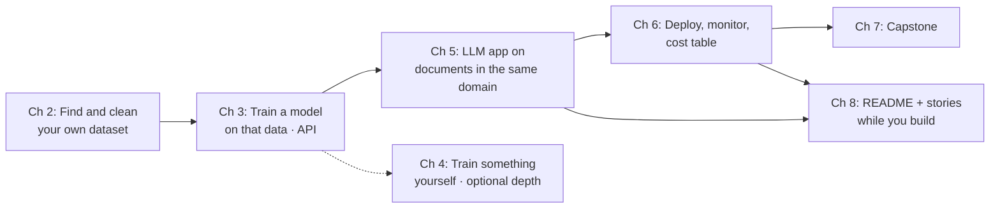
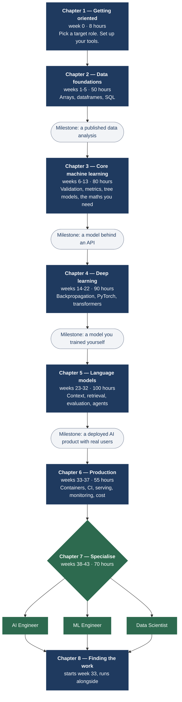
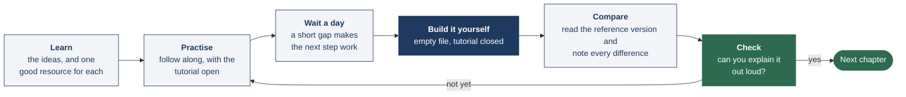

# Ground Truth

**A working developer's path into AI and machine learning.**

**The short version.** Eight chapters, one ordered path: from shipping software to shipping AI
systems in about 450 hours. You build something real in every chapter on **one thread** — one dataset
becomes one model becomes one AI product. Each chapter has a week-by-week plan and a `resources`
folder for deeper reading.

---

## A note from the author

I have spent my career as a developer, moving between domains, and every move brought a new set
of challenges. Through all of them, one habit has helped me more than any tool: starting from a
roadmap. A good roadmap does two quiet things. It builds the foundation in the right order, and it
teaches you to think in systems — to see how the pieces connect before you start collecting them.

This book is that habit written down, for the move I think matters most right now: from software
engineering into AI and machine learning.

I want to be open about how it was made. I used AI models, including Fable 5, to help me research
and draft it. The plan, the judgements, and the final words are mine, but it felt right that a book
about working with these systems should be honest about being written with their help.

I am not only the author here. I follow these chapters myself, to refresh my own skills, because
in this industry the learning never stays done. If you find something that has aged, treat it the
way this book will teach you to treat every claim: check it, correct it, and keep moving.

— Santosh Shinde

---

## Contents

**The chapters**

1. [Getting oriented](01-getting-oriented/README.md) &nbsp;·&nbsp; [resources](01-getting-oriented/resources/README.md)
2. [Data foundations](02-data-foundations/README.md) &nbsp;·&nbsp; [resources](02-data-foundations/resources/README.md)
3. [Core machine learning](03-core-machine-learning/README.md) &nbsp;·&nbsp; [resources](03-core-machine-learning/resources/README.md)
4. [Deep learning](04-deep-learning/README.md) &nbsp;·&nbsp; [resources](04-deep-learning/resources/README.md)
5. [Language models and AI engineering](05-language-models/README.md) &nbsp;·&nbsp; [resources](05-language-models/resources/README.md)
6. [Running it in production](06-production/README.md) &nbsp;·&nbsp; [resources](06-production/resources/README.md)
7. [Choosing a specialisation](07-specialisation/README.md) &nbsp;·&nbsp; [resources](07-specialisation/resources/README.md)
8. [Finding the work](08-finding-the-work/README.md) &nbsp;·&nbsp; [resources](08-finding-the-work/resources/README.md)

**Before you start**

- [Who this book is for](#who)
- [How to read this book](#how-to-use)
- [Start here: your first week](#first-week)
- [One thread through the whole book](#one-thread)
- [Terms in plain English](#glossary)
- [The path at a glance](#path)
- [How much time it takes](#time)
- [How each chapter works](#chapters-work)
- [Using AI assistants while you learn](#assistants)

**Reference**

- [Projects, in order of difficulty](#projects)
- [Common pitfalls](#pitfalls)
- [Where thoughtful people disagree](#disagree)
- [Keeping this book current](#current)

---

## Who this book is for

This is written for someone who **already writes software**. You use Git, you call APIs, you have
deployed something, and you can read a stack trace without panic. What you want is a clear route
into machine learning and AI engineering, without spending six months on material that turns out
to be out of date.

If you are not yet programming, this book will be hard going. The realistic figure from a
standing start is closer to **1,000 to 1,500 hours**, and the first three hundred or so contain no
machine learning at all. [CS50P](https://cs50.harvard.edu/python/) is an excellent place to begin,
and this book will still be here afterwards. You will move through it much faster.

A word on what this can and cannot promise. It is a well-researched, carefully checked path, and
I think it is a good one. It is not the only good one, and it will not fit everyone. Where the
evidence is genuinely mixed, I have tried to say so rather than sound more certain than I am.

---

## How to read this book

**Follow it in order.** Everything optional is marked as optional. When you are unsure what to do
next, do the next thing on the list. Most roadmaps offer a branching menu, and that turns out to be
part of the problem: a long list of choices is easy to browse and hard to finish.

**Build something in every stage.** Reading and watching feel productive and, on their own, do not
transfer very well. In the largest review of study techniques I could find (Dunlosky and
colleagues, 2013), only two methods earned a high-utility rating: **practice testing** and
**spreading study out over time**. Re-reading, highlighting and summarising all scored low. A video
lecture is closer to re-reading than most of us would like to think.

**Try to build the key exercise from an empty file**, with the tutorial closed. It will feel slower
and less pleasant than following along. That feeling is well documented, and it is not a sign that
it is going badly. In the classic experiment on this (Roediger and Karpicke, 2006), re-studying beat
self-testing when people were tested five minutes later, and lost clearly at two days and one week.

**Keep a short log.** One file, one line per session: the date, the hours, what you built, and what
broke. It gives you a way to revise, and it is a genuinely good answer when someone asks how you
learned all this.

**Give yourself room.** The plan below assumes ten to twelve hours a week, not twenty. A slower plan
you finish is worth more than a faster one you abandon, and there is no prize for rushing.

**Find one place to ask questions.** You will get stuck, and a stuck hour with no one to ask is
how most self-study ends. Pick one community early and use it: the [fast.ai forums](https://forums.fast.ai/),
the [DataTalks.Club Slack](https://datatalks.club/slack.html), or the [Hugging Face forums](https://discuss.huggingface.co/)
are all free, active and kind to beginners. Ask with what you tried and what you saw; that habit is
itself a skill people hire for.

**When you feel lost, do this:** open the chapter you are on, find the week plan near the top, and
do only that week's row. Do not browse the resource list for something better. The list is for
lookup, not for choosing your next hour.

---

## Start here: your first week

If eight chapters and forty-three weeks feel like a lot, start smaller. **Week 0 is eight hours.**
You do not need to understand machine learning yet. You need a target role, a public repo, a log
file, and a notebook that runs. The day-by-day plan for that week is at the top of
[Chapter 1](01-getting-oriented/README.md).

**End of week 0:** you have a public repo, a log, a role, and Colab working. Open
[Chapter 2](02-data-foundations/README.md) and follow **Week 1** of its plan.

---

## One thread through the whole book

You are not collecting random projects. **One dataset becomes one model becomes one AI product.**
That is the end-to-end path interviewers can follow in five minutes.

| Chapter | What you add to the same thread | Concrete example |
|---|---|---|
| 2 | A dataset **you found**, cleaned, with a decision log | City parking tickets → "Which zones get the most disputes?" |
| 3 | A tabular model + FastAPI on that dataset | Predict dispute outcome; expose `/predict` |
| 4 | A model **you trained** (optional but strong) | Small classifier on your own photos, or a tiny LM |
| 5 | An LLM feature on **documents in the same world** | Extract fields from ticket appeal PDFs; eval suite first |
| 6 | That app in Docker, CI, monitoring, cost per 1k requests | Same app — now production-shaped |
| 7 | Go deep on **one** role; capstone extends the thread | AI Eng: public eval of your extractor; DS: experiment memo |
| 8 | Present three projects; job search runs from week 33 | README template + tracker from Chapter 8 |

If you change datasets every chapter, you will finish tired and with nothing coherent to show.
Pick a domain you care about in Chapter 2 and stay with it until Chapter 6 at minimum.

---

## Terms in plain English

Every term below is also explained in plain words where it first matters in a chapter. Come back
here whenever a word feels fuzzy.

| Term | Plain English |
|---|---|
| **Array / tensor** | A grid of numbers with a shape, such as 1,000 rows by 20 columns |
| **Broadcasting** | The rules by which NumPy stretches a small array to match a bigger one. Handy, and a source of silent bugs |
| **Dataframe** | A table in pandas: rows, and columns with names |
| **Point-in-time** | A query or feature that uses only what was known before the event. It is how you stop the future leaking in |
| **Model** | A program that learns patterns from data and makes predictions |
| **Training** | Showing the model examples so it adjusts its internal numbers |
| **Validation / test split** | Hold back some data the model never sees during training, so you know if it works on new cases |
| **Leakage** | Accidentally letting the model peek at the answer during training — makes scores look great and fail in production |
| **Metric** | The number you optimise — accuracy, precision, recall, etc. Pick one that matches real cost of being wrong |
| **Feature** | One input column or signal the model uses |
| **Pipeline** | sklearn wrapper that runs preprocessing and model together — prevents leakage |
| **API** | HTTP endpoint others call: send JSON in, get JSON out |
| **Embedding** | A list of numbers representing meaning of text — used for search |
| **Retrieval (RAG)** | Fetch relevant documents, put them in the prompt, then ask the model |
| **Prompt** | The instructions and data you send the model in one call |
| **Context window** | How much text fits in one model call — a budget, not unlimited memory |
| **Context engineering** | Choosing what goes into that window: system prompt, documents, history, tools |
| **Trace** | Saved record of one request: input, steps, output |
| **Evaluation (eval)** | Tests that check if the AI output is good — like unit tests for non-deterministic code |
| **Gold set** | Hand-written input and expected-output pairs you trust. Your ground truth |
| **Pass rate** | The share of gold-set examples your application gets right |
| **Judge** | Another model (or rules) that grades answers against criteria you wrote |
| **Fine-tuning** | Further training on your examples — for style/format, not for adding new facts |
| **Agent** | Model loop that picks tools and steps on its own — use only when a fixed workflow cannot |
| **Docker** | Package your app so it runs the same everywhere |
| **CI** | Tests that run on every git push — including eval tests for prompts |
| **Drift** | Inputs or outputs changing over time — often a broken data pipe, not a smarter world |

---

## The path at a glance

| # | Chapter | Weeks | Hours | By the end you can | Resources |
|---|---|---|---|---|---|
| 1 | **[Getting oriented](01-getting-oriented/README.md)** | Week 0 | 8 | Name the role you are aiming at, and set up a working environment | [list](01-getting-oriented/resources/README.md) |
| 2 | **[Data foundations](02-data-foundations/README.md)** | Weeks 1-5 | 50 | Take a messy real dataset to a published, reproducible analysis | [list](02-data-foundations/resources/README.md) |
| 3 | **[Core machine learning](03-core-machine-learning/README.md)** | Weeks 6-13 | 80 | Build a model with an honest validation scheme and a metric you can justify | [list](03-core-machine-learning/resources/README.md) |
| 4 | **[Deep learning](04-deep-learning/README.md)** | Weeks 14-22 | 90 | Write backpropagation from scratch, train a network, and debug one that is not learning | [list](04-deep-learning/resources/README.md) |
| 5 | **[Language models and AI engineering](05-language-models/README.md)** | Weeks 23-32 | 100 | Ship an LLM application with an evaluation suite you built before optimising it | [list](05-language-models/resources/README.md) |
| 6 | **[Running it in production](06-production/README.md)** | Weeks 33-37 | 55 | Deploy, monitor, roll back, and state your cost per thousand requests | [list](06-production/resources/README.md) |
| 7 | **[Choosing a specialisation](07-specialisation/README.md)** | Weeks 38-43 | 70 | Go deep on one role, with a capstone matched to its interviews | [list](07-specialisation/resources/README.md) |
| 8 | **[Finding the work](08-finding-the-work/README.md)** | Week 33 on | 3-4 a week | Present your work well and run a sensible job search | [list](08-finding-the-work/resources/README.md) |

---

## How much time it takes

```mermaid
gantt
    title Ten-month track, at ten to twelve hours a week
    dateFormat X
    axisFormat %s
    section Foundations
    Chapter 1 Getting oriented   :done, 0, 1
    Chapter 2 Data foundations   :active, 1, 5
    section Machine learning
    Chapter 3 Core machine learning :6, 13
    Chapter 4 Deep learning      :14, 22
    section AI engineering
    Chapter 5 Language models    :23, 32
    Chapter 6 Production         :33, 37
    section Specialise and apply
    Chapter 7 Specialisation     :38, 43
    Chapter 8 Finding the work   :crit, 33, 43
```

The x-axis is the week number. The job search deliberately overlaps the last two stages, because
in practice it takes several months and starting early tells you a lot. It adds three to four
hours a week on top of the chapter hours, so weeks 33 to 43 are the fullest in the book. If that
is too much, slow the chapters down rather than skipping the search.

| Pace | Hours per week | Duration | Suits |
|---|---|---|---|
| Part time | 10-12, as about 90 minutes on five weekdays plus one longer weekend session | 43 weeks, roughly 10 months | Someone with a job or a degree |
| Close to full time | About 25 | 18 weeks, roughly 4 months | Someone between roles or on a break |

**About the hour figures.** These are your hours on each chapter, assuming each resource is used as
described rather than completed end to end. Several of the courses listed are much longer than the
chapter that mentions them; where that matters, the chapter says which parts to do. The resource tables
give each item's full length, so those numbers are often larger. That is expected, not a
contradiction.

Then there is the job search itself. Audited bootcamp data, which is the best evidence available
though it covers software engineering rather than AI roles, has put the median in-field search at
**three to six months**. Recent hiring has been harder at the junior end, so **four to eight months**
seems a fairer figure to plan around. That part is my judgement rather than a measurement, and I
would rather say so.

---

## How each chapter works

Every chapter runs on the same loop.

The step people skip is **build it yourself**, and it is the one that does most of the work. If you
can finish a chapter by watching, something has gone wrong with the chapter.

Chapters 1 to 6 share one layout: **week plan** (what to do each week), **what you will be able
to do**, **what to learn**, **resources**, **what to build** and **before you move on**, usually
closing with **a few things worth knowing**. Chapters 1 and 5 add day-by-day plans where the work
needs finer scheduling, and Chapters 7 and 8 are organised around the three branches and the job
search instead.

---

## Using AI assistants while you learn

This is a genuinely open question, and I do not want to overstate my confidence.

What can be said is that the survey evidence is mixed. In the 2025 Stack Overflow developer survey,
84% of respondents used or planned to use AI tools, and 39.5% of people learning to code used them
daily. In the same survey, 46% said they actively distrusted the accuracy of the output against 33%
who trusted it, 45% said debugging AI-written code took longer than writing it themselves, and 20%
reported **reduced confidence in their own problem-solving**.

The concern for a learner is specific: an assistant removes the effort of recall, and that effort is
what makes something stick. A suggestion that works well is a simple two-mode rule.

| Assistant off | Assistant on |
|---|---|
| The build-it-yourself exercise in each chapter | Reviewing code you have already written |
| Your first attempt at anything | Explaining an error, after you have tried yourself |
| The "before you move on" questions | Unfamiliar library surfaces and documentation |
| | Debugging, and generating test data |

This is a reasonable compromise rather than a proven one. Adjust it if you find something that works
better for you.

One thing worth taking seriously either way: only put code in your portfolio that you could talk
through line by line. Interviewers increasingly ask.

---

## Projects, in order of difficulty

What each one proves, and separately what makes it stand out. Those are different questions. The
**Where you build it** column maps each project to the chapter whose build exercise covers it, or
notes when it is optional or spans several chapters.

| # | Project | Where you build it | Proves | What makes it stand out |
|---|---|---|---|---|
| 1 | Deploy any pretrained model and get a public URL (3 hours) | Ch 5 warm-up (before two-week plan) | You can go from model to link | Nothing. It is a warm-up whose job is to remove the fear of deploying. |
| 2 | Structured extraction from messy text you have, into validated JSON | Ch 5 (narrow task option) | Prompting, schema-constrained output, error handling | A 50-example gold set and field-level accuracy |
| 3 | A modelling competition entry with a deliberately designed validation scheme (optional) | Ch 3 optional; Ch 7 Kaggle | You understand leakage and metric choice | The write-up, not the rank. "My first scheme was optimistic by 0.04 and here is why." |
| 4 | Scrape or pull a dataset that does not exist in tidy form, and publish the analysis | Ch 2 | **You can source your own data** | Publishing the cleaned dataset so someone else can use it |
| 5 | A classical model served behind a real API, containerised and tested | Ch 3 build; Ch 6 hardening | The bridge from modelling to software | A load-test number, and a note on the accuracy-latency tradeoff you chose |
| 6 | Retrieval over a corpus that is genuinely hard: statutes, versioned API docs, a codebase | Ch 5 (days 5-6 of two-week plan) | The most requested skill on current job posts | A hand-labelled retrieval set with recall at k for two chunking strategies |
| 7 | An evaluation harness as the product itself | Ch 5 | Testing non-deterministic systems, which is rare | Publishing the failure taxonomy you found |
| 8 | A fine-tuned small model with a before-and-after table | Ch 5 optional | You know **when** fine-tuning is warranted | An honest four-way comparison, especially if the answer is "not worth it" |
| 9 | A workflow, not an agent, doing one real job for a real user | Ch 5 | Architectural judgement | A written justification for not using an agent, with numbers |
| 10 | Reproduce a paper or core algorithm, then verify it | Ch 4 or Ch 7 Branch B | You can turn a paper into working code | Documenting where your numbers diverge, and why |
| 11 | A merged pull request in a major ML repository | Ch 7 | Navigating an unfamiliar codebase, surviving review | Fixing a bug you personally hit while building something |
| 12 | A shipped product with real users who are not your friends | Ch 5 two-week plan + Ch 6 | Scoping, distribution, operating under cost constraints | A public metrics page. Any number beats any adjective. |
| 13 | An open-source tool or dataset others depend on | Ch 7 Branch A capstone | Taste, engineering and stewardship | External adoption, which a reviewer can verify without trusting you |
| 14 | A rigorous public evaluation of something not measured well | Ch 7 Branch A capstone | Experimental design and statistical honesty | It is how individuals become known. Have someone review the method first. |
| 15 | A sustained record of shipping and writing up | Ch 8 (ongoing) | Durability, and that the rest was not a one-off | Eighteen months of dated write-ups cannot be copied |

Three punch above their weight for the effort involved: the **deliberate leakage write-up** (project
3), the **published failure taxonomy** (project 7), and the **honest fine-tuning comparison whose
answer may be "not worth it"** (project 8). That last kind of negative result is weighted heavily by
experienced interviewers, because it cannot be produced by following a tutorial.

---

## Common pitfalls

Collected from practitioner writing and from resources that turned out to be dated when checked.
None of these are character flaws; most are design problems with the material available.

### About sequencing

| Pitfall | Why it costs so much |
|---|---|
| Doing the maths before any code | The most common way people stall. If you are reading a maths book and have never written a training loop, the order is probably backwards. |
| Preparing for several roles at once | Five titles, five curricula, and none finished |
| Finishing courses without building | Video is enjoyable and does not transfer well on its own |
| Building evaluation tooling before reading traces | You end up measuring categories someone else invented for a different product |
| Waiting until you feel ready | Six months of courses with nothing shipped is worth less than one shipped, imperfect thing plus three months of courses |

### Resources that are commonly recommended and now dated

| Resource | The issue | Better choice |
|---|---|---|
| `nanoGPT` | Marked "very old and deprecated" by its own author, whose README redirects readers | [nanochat](https://github.com/karpathy/nanochat) |
| The free *Python Data Science Handbook* | It is the 2016 first edition, written against Python 3.5 | [McKinney's *Python for Data Analysis*](https://wesmckinney.com/book/), free |
| The Goodfellow deep learning book, as a starting point | 2016, no transformer chapter, dated generative sections | [Prince's *Understanding Deep Learning*](https://udlbook.github.io/udlbook/), free |
| The 2016-17 CS231n video playlist | Predates transformers entirely | The recent recordings and the current notes |
| The original Octave machine learning course | Retired and replaced by the Python rebuild | The current specialisation |
| *Elements of Statistical Learning* as a first book | Graduate statistics; people stop at chapter three | [*Introduction to Statistical Learning*](https://www.statlearning.com/), free |
| MIT 18.06 as a first linear algebra course | Excellent, and a month of material you will not use here | 3Blue1Brown, then 18.065 |
| Pre-transformer NLP courses | Fine as history, unhelpful as a current education | Transformer-first material |
| MCP tutorials from 2025 | The 2026 specification moved to a stateless core | The specification and its changelog |

### Technical traps

| Trap | Why it matters |
|---|---|
| Data leakage | The most common technical mistake, and it never raises an error. It just improves your numbers. |
| Accuracy as the default metric | On a 1% positive dataset, "always no" scores 99% |
| ROC-AUC under heavy imbalance | It hides a flood of false positives. PR-AUC does not. |
| A 0.5 threshold | A convention, not a decision |
| Reporting one number with no interval | Most beginner improvements are inside the noise |
| Trusting default feature importance | It misleads under correlated features, systematically |
| Changing three things at once | The result then teaches you nothing |
| Skipping the overfit-ten-samples check | Thirty seconds against several hours |
| Reading the transformer paper first | It describes a 2017 translation model; current designs share about half of it |
| Reaching for a framework before writing the loop | You never learn the loop, and cannot debug it |
| An agent where a workflow would do | Non-deterministic, harder to evaluate, and more expensive |
| Fine-tuning to add facts | Facts belong in retrieval, where they can be updated and cited |
| Kubernetes as a study project | Months of detour with little portfolio payoff at this point |
| "The customers table" as a data version | It changed yesterday |

### About money and portfolios

- **Certificates** mostly signal enrolment. Audit courses free and spend the money on compute.
- **Expensive cohort courses** are often excellent, and their authors frequently publish most of the
  same material free. Read the free version first.
- **Buying a GPU** before exhausting free tiers is usually procrastination in physical form.
- **Ten shallow projects** read worse than three deep ones.
- **Code you cannot explain** is a real risk now that reviewers ask about repositories in detail.
- **Building in public** works better in the quiet version: ship small things and write up what
  broke. The high-profile examples usually had a large audience already.

---

## Where thoughtful people disagree

This book takes positions throughout. These are the places where competent, experienced people
genuinely disagree, and where stating both sides is more impressive than picking one.

| Question | One side | The other | Where this book lands |
|---|---|---|---|
| **Top-down or bottom-up for deep learning?** | Train something working first; motivation collapses without early wins | Start from first principles, or you cannot debug a model that silently is not learning | Bottom-up first, top-down alongside, with the inversion offered for people who need the early win. It is a sequencing question, not a values one. |
| **Does a beginner still need classical ML?** | The jobs are in language models; you can be productive with an API | Interviews front-load it, and evaluating a generative system is the same discipline | Eight weeks, framed as the floor rather than the frontier |
| **Frameworks or raw SDKs?** | Stateful agents need durable execution and observability you would otherwise rebuild | Provider APIs converged, so the abstraction hides less than it costs | Both sides agree on the learning order: raw first |
| **Is retrieval being replaced by long context?** | Very large context windows plus agentic search make pipelines unnecessary | At real corpus size retrieval is far cheaper, and long context degrades in the middle | Routing by query complexity. The boundary keeps moving, so confident claims either way are over-claiming. |
| **Agents or workflows?** | Models improved enough that agentic loops now win on open-ended tasks | Most systems need clear steps and measurable outcomes | Workflow-first is safer for a portfolio, but be ready to defend it |
| **Can you trust a model-based judge?** | Ready-made metric suites let you start measuring immediately | Judges are useful only after error analysis has told you what to measure, and must be checked against human labels | Derive criteria from your own failures, then validate the judge |
| **Have tabular foundation models replaced boosted trees?** | They now win convincingly on smaller datasets | Cost, memory, deployment maturity, interpretability and licensing all still favour trees at scale | Describe the regime, not the slogan. This is moving quickly. |
| **Should learners use AI assistants?** | Refusing trains you for a job that no longer exists | The assistant removes the recall effort that produces durable learning | The two-mode rule above, offered as a reasonable compromise rather than a proven one |
| **Did AI cause the junior hiring squeeze?** | Postings in AI-exposed roles led the decline and are leading the recovery, which looks cyclical | Employment for the youngest developers fell sharply, and most of the growth in postings was senior | Seniority-biased change: the door is open and narrower than it was. Either way the response is the same. |
| **Is Kubernetes required?** | Job descriptions ask for it constantly | Serverless platforms let you ship real systems without it, and the hours are better spent elsewhere | Docker deeply, Kubernetes on the job. That is a side, and worth knowing you are taking it. |

---

## Keeping this book current

Three kinds of information in this book age fastest: prices and free tiers, model names and
capabilities, and salary figures. Treat any specific number as a snapshot, and check the source
before you rely on it.

Two studies shaped how the book asks you to work, and both are easiest to reach through a library:
Dunlosky and colleagues (2013), on which study techniques actually hold up, and Roediger and
Karpicke (2006), on why self-testing feels worse in the moment and works better in the end.

A few places deserve extra scepticism, and I would rather point them out myself. The causal and
experimentation resources in [Chapter 7](07-specialisation/resources/README.md) sit outside the
rest of the book's heaviest curation, so vet them with particular care. The two-mode rule for AI
assistants is a reasonable compromise, not a proven method. And the four-to-eight-month job-search
estimate is judgement layered on older data.

If something here has drifted out of date, that is the field doing what it does. Check it against
the source, adjust, and keep going. If you find a broken link or a claim that no longer holds, an
issue or a pull request on this repository is very welcome; corrections from readers are how a book
like this stays useful.
