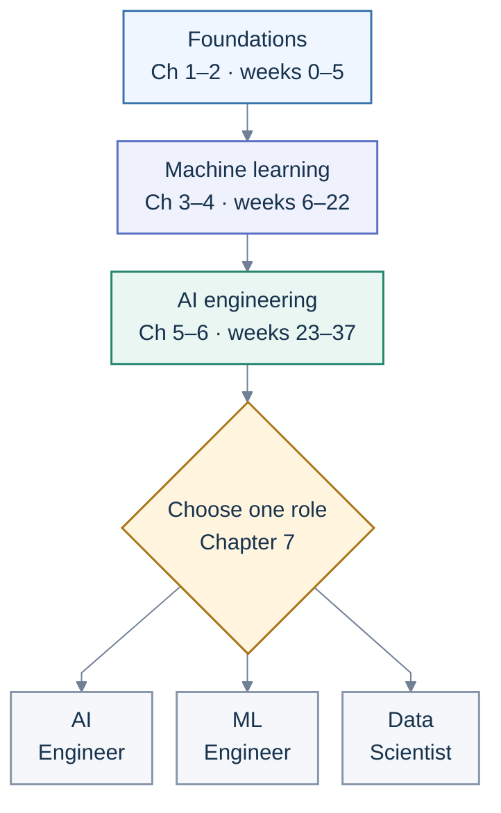
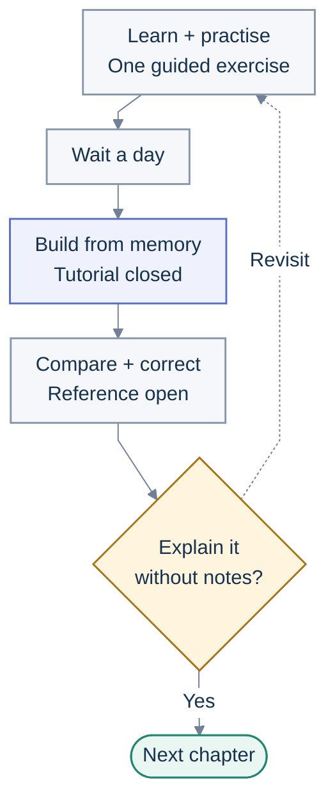

# Ground Truth

**A working developer's path into AI and machine learning.**

**The short version.** Eight core chapters take you from shipping software to shipping AI systems in
about 450 hours. A ninth applied chapter covers **offer recommendation, price recommendation and
churn**, with model choices and a full business decision workflow. You build on **one thread** — one
dataset becomes one model becomes one AI product. Each chapter has a practical plan and a
`resources` folder for deeper reading.

---

## Contents

**The chapters**

1. [Getting oriented](01-getting-oriented/README.md) &nbsp;·&nbsp;
   [resources](01-getting-oriented/resources/README.md)
2. [Data foundations](02-data-foundations/README.md) &nbsp;·&nbsp;
   [resources](02-data-foundations/resources/README.md)
3. [Core machine learning](03-core-machine-learning/README.md) &nbsp;·&nbsp;
   [resources](03-core-machine-learning/resources/README.md)
4. [Deep learning](04-deep-learning/README.md) &nbsp;·&nbsp;
   [resources](04-deep-learning/resources/README.md)
5. [Language models and AI engineering](05-language-models/README.md) &nbsp;·&nbsp;
   [resources](05-language-models/resources/README.md)
6. [Running it in production](06-production/README.md) &nbsp;·&nbsp;
   [resources](06-production/resources/README.md)
7. [Choosing a specialisation](07-specialisation/README.md) &nbsp;·&nbsp;
   [resources](07-specialisation/resources/README.md)
8. [Finding the work](08-finding-the-work/README.md) &nbsp;·&nbsp;
   [resources](08-finding-the-work/resources/README.md)
9. [Business machine learning: offers, prices and churn](09-business-machine-learning/README.md)
   &nbsp;·&nbsp; [resources](09-business-machine-learning/resources/README.md)

**Applied guides**

- [Model-selection decision trees](09-business-machine-learning/README.md#choose-your-ml-approach)
- [Offer recommendation](09-business-machine-learning/offer-recommendation.md)
- [Price recommendation](09-business-machine-learning/price-recommendation.md)
- [Churn prediction and retention](09-business-machine-learning/churn.md)
- [Shared delivery plan and completion gates](09-business-machine-learning/delivery-plan.md)

**Before you start**

- [Who this book is for](#who)
- [How to read this book](#how-to-use)
- [Start here: your first week](#first-week)
- [The path at a glance](#path)
- [One thread through the whole book](#one-thread)
- [How much time it takes](#time)
- [How each chapter works](#chapters-work)
- [Using AI assistants while you learn](#assistants)

**Reference**

- [Terms in plain English](#glossary)
- [Projects, in order of difficulty](#projects)
- [Common pitfalls](#pitfalls)
- [Where thoughtful people disagree](#disagree)
- [Keeping this book current](#current)
- [A note from the author](#a-note-from-the-author)

---

## Who this book is for

This is written for someone who **already writes software**. You use Git, you call APIs, you have
deployed something, and you can read a stack trace without panic. What you want is a clear route
into machine learning and AI engineering, without spending six months on material that turns out to
be out of date.

If you are not yet programming, this book will be hard going. From a standing start, allow a
substantial programming-foundations stage before these chapter budgets. A planning allowance of
**1,000 to 1,500 total hours** is an estimate, not a measured completion time or employment
guarantee. [CS50P](https://cs50.harvard.edu/python/) is an excellent place to begin, and this book
will still be here afterwards. You will move through it much faster.

A word on what this can and cannot promise. It is a well-researched, carefully checked path, and I
think it is a good one. It is not the only good one, and it will not fit everyone. Where the
evidence is genuinely mixed, I have tried to say so rather than sound more certain than I am.

---

## How to read this book

**Follow the core chapters in order.** Chapter 9 is an applied track after Chapters 3 and 6; use one
guide as your Chapter 7 capstone, or work through all three afterwards. Everything optional is
marked as optional. When you are unsure what to do next, do the next thing on the list. Most
roadmaps offer a branching menu, and that turns out to be part of the problem: a long list of
choices is easy to browse and hard to finish.

**Build something in every stage.**
[Dunlosky and colleagues' 2013 review](https://doi.org/10.1177/1529100612453266) rated practice
testing and distributed practice highly across the learning conditions it examined; re-reading and
highlighting had lower general utility.
[Roediger and Karpicke's 2006 experiments](https://doi.org/10.1111/j.1467-9280.2006.01693.x) found
delayed retention benefits from recalling studied prose instead of repeatedly studying it. These
studies do not directly validate a software curriculum. This book applies their principles through
explanation from memory, spaced sessions and building the key exercise with the tutorial closed. Use
references again when checking and correcting the result.

**Keep a short log.** One file, one line per session: the date, the hours, what you built, and what
broke. It gives you a way to revise, and it is a genuinely good answer when someone asks how you
learned all this.

**Give yourself room.** The plan below assumes ten to twelve hours a week, not twenty. A slower plan
you finish is worth more than a faster one you abandon, and there is no prize for rushing.

**Find one place to ask questions.** You will get stuck, and a stuck hour with no one to ask is how
most self-study ends. Pick one community early and use it: the
[fast.ai forums](https://forums.fast.ai/), the
[DataTalks.Club Slack](https://datatalks.club/slack.html), or the
[Hugging Face forums](https://discuss.huggingface.co/) are all free, active and kind to beginners.
Ask with what you tried and what you saw; that habit is itself a skill people hire for.

**When you feel lost, do this:** open the chapter you are on, find the week plan near the top, and
do only that week's row. Do not browse the resource list for something better. The list is for
lookup, not for choosing your next hour.

---

## Start here: your first week

If eight chapters and forty-four weeks feel like a lot, start smaller. **Week 0 is eight hours.**
You do not need to understand machine learning yet. You need a target role, a public repo, a log
file, and a notebook that runs. The day-by-day plan for that week is at the top of
[Chapter 1](01-getting-oriented/README.md).

**End of week 0:** you have a public repo, a log, a role, and Colab working. Open
[Chapter 2](02-data-foundations/README.md) and follow **Week 1** of its plan.

---

## The path at a glance

The diagram shows the sequence; the table gives each chapter’s time budget and completion outcome.
Start [Chapter 8](08-finding-the-work/README.md) alongside Chapter 6 in **week 33**. Chapter 9 is an
applied extension after Chapters 3 and 6, and can supply your Chapter 7 capstone.

```mermaid
%%{init: {"theme":"base","themeVariables":{"fontFamily":"Arial, sans-serif","fontSize":"16px","textColor":"#17324D","primaryColor":"#F5F7FA","primaryTextColor":"#17324D","primaryBorderColor":"#8796A8","lineColor":"#718096","secondaryColor":"#EFF6FF","tertiaryColor":"#E9F6F2","clusterBkg":"#F8FAFC","clusterBorder":"#D6DEE8","edgeLabelBackground":"#FFFFFF"},"flowchart":{"htmlLabels":true,"nodeSpacing":18,"rankSpacing":28,"curve":"linear","padding":10,"subGraphTitleMargin":{"top":8,"bottom":12}}}}%%
flowchart TB
    accTitle: The core learning path
    accDescr: Complete foundations, machine learning and AI engineering in order, then choose one specialisation. Job search begins alongside production in week 33.
    F["Foundations<br/>Ch 1–2 · weeks 0–5"]
    M["Machine learning<br/>Ch 3–4 · weeks 6–22"]
    E["AI engineering<br/>Ch 5–6 · weeks 23–37"]
    S{"Choose one role<br/>Chapter 7"}
    A["AI<br/>Engineer"]
    B["ML<br/>Engineer"]
    C["Data<br/>Scientist"]
    F --> M --> E --> S
    S --> A
    S --> B
    S --> C
    classDef data fill:#EFF6FF,stroke:#3973AC,color:#17324D,stroke-width:1.5px
    classDef model fill:#EFF2FD,stroke:#596FC2,color:#17324D,stroke-width:1.5px
    classDef decision fill:#FFF5DF,stroke:#A8751A,color:#17324D,stroke-width:1.5px
    classDef action fill:#E9F6F2,stroke:#23866E,color:#17324D,stroke-width:1.5px
    classDef neutral fill:#F5F7FA,stroke:#8796A8,color:#17324D,stroke-width:1.5px
    class F data
    class M model
    class E action
    class S decision
    class A,B,C neutral
```

| #   | Chapter                                                                 | Weeks                        | Hours                        | By the end you can                                                                             | Resources                                                |
| --- | ----------------------------------------------------------------------- | ---------------------------- | ---------------------------- | ---------------------------------------------------------------------------------------------- | -------------------------------------------------------- |
| 1   | **[Getting oriented](01-getting-oriented/README.md)**                   | Week 0                       | 8                            | Name the role you are aiming at, and set up a working environment                              | [list](01-getting-oriented/resources/README.md)          |
| 2   | **[Data foundations](02-data-foundations/README.md)**                   | Weeks 1–5                    | 50                           | Take a messy real dataset to a published, reproducible analysis                                | [list](02-data-foundations/resources/README.md)          |
| 3   | **[Core machine learning](03-core-machine-learning/README.md)**         | Weeks 6–13                   | 80                           | Build a model with an honest validation scheme and a metric you can justify                    | [list](03-core-machine-learning/resources/README.md)     |
| 4   | **[Deep learning](04-deep-learning/README.md)**                         | Weeks 14–22                  | 90                           | Write backpropagation from scratch, train a network, and debug one that is not learning        | [list](04-deep-learning/resources/README.md)             |
| 5   | **[Language models and AI engineering](05-language-models/README.md)**  | Weeks 23–32                  | 100                          | Ship an LLM application with an evaluation suite you built before optimising it                | [list](05-language-models/resources/README.md)           |
| 6   | **[Running it in production](06-production/README.md)**                 | Weeks 33–37                  | 55                           | Deploy, monitor, roll back, and state your cost per thousand requests                          | [list](06-production/resources/README.md)                |
| 7   | **[Choosing a specialisation](07-specialisation/README.md)**            | Weeks 38–43                  | 70                           | Go deep on one role, with a capstone matched to its interviews                                 | [list](07-specialisation/resources/README.md)            |
| 8   | **[Finding the work](08-finding-the-work/README.md)**                   | Week 33 on                   | 3–4 a week                   | Present your work well and run a sensible job search                                           | [list](08-finding-the-work/resources/README.md)          |
| 9   | **[Business machine learning](09-business-machine-learning/README.md)** | Applied track after Ch 3 + 6 | 40 for one case / 90 for all | Select models and actions for offers, prices and churn; validate and operate the feedback loop | [list](09-business-machine-learning/resources/README.md) |

---

## One thread through the whole book

You are not collecting random projects. **One dataset becomes one model becomes one AI product.**
That is the end-to-end path interviewers can follow in five minutes.

```mermaid
%%{init: {"theme":"base","themeVariables":{"fontFamily":"Arial, sans-serif","fontSize":"16px","textColor":"#17324D","primaryColor":"#F5F7FA","primaryTextColor":"#17324D","primaryBorderColor":"#8796A8","lineColor":"#718096","secondaryColor":"#EFF6FF","tertiaryColor":"#E9F6F2","clusterBkg":"#F8FAFC","clusterBorder":"#D6DEE8","edgeLabelBackground":"#FFFFFF"},"flowchart":{"htmlLabels":true,"nodeSpacing":18,"rankSpacing":28,"curve":"linear","padding":10,"subGraphTitleMargin":{"top":8,"bottom":12}}}}%%
flowchart LR
    accTitle: One project, developed across the book
    accDescr: Your Chapter 2 data becomes a model in Chapters 3 and 4, then an AI product in Chapters 5 and 6.
    D["Data<br/>Ch 2"] --> M["Model<br/>Ch 3–4"] --> P["AI product<br/>Ch 5–6"]
    classDef data fill:#EFF6FF,stroke:#3973AC,color:#17324D,stroke-width:1.5px
    classDef model fill:#EFF2FD,stroke:#596FC2,color:#17324D,stroke-width:1.5px
    classDef decision fill:#FFF5DF,stroke:#A8751A,color:#17324D,stroke-width:1.5px
    classDef action fill:#E9F6F2,stroke:#23866E,color:#17324D,stroke-width:1.5px
    classDef neutral fill:#F5F7FA,stroke:#8796A8,color:#17324D,stroke-width:1.5px
    class D data
    class M model
    class P action
```

_The same project grows in capability. The table shows what each chapter contributes._

| Chapter | What you add to the same thread                                    | Concrete example                                                            |
| ------- | ------------------------------------------------------------------ | --------------------------------------------------------------------------- |
| 2       | A dataset **you found**, cleaned, with a decision log              | City parking tickets → "Which zones get the most disputes?"                 |
| 3       | A tabular model + FastAPI on that dataset                          | Predict dispute outcome; expose `/predict`                                  |
| 4       | Autograd and a model **you trained**, with reproducible evaluation | Small classifier or tiny LM; stay in the same domain where feasible         |
| 5       | An LLM feature on **documents in the same world**                  | Extract fields from ticket appeal PDFs; eval suite first                    |
| 6       | That app in Docker, CI, monitoring, cost per 1k requests           | Same app — now production-shaped                                            |
| 7       | Go deep on **one** role; capstone extends the thread               | AI Eng: public eval of your extractor; DS: experiment memo                  |
| 8       | Present three projects; job search runs from week 33               | README template + tracker from Chapter 8                                    |
| 9       | Turn models into constrained decisions and close the outcome loop  | Retail/subscription: offer uplift, demand-based prices, churn and retention |

For the business cases, a connected retail/subscription thread can start with transaction and
customer snapshots, continue into demand or churn prediction, add a document feature over product or
support policies, and finish with an offer/price/retention policy and measured feedback. Choose that
domain early if Chapter 9 is your destination. Public transactions usually need clearly labelled
synthetic exposure and assignment data for intervention exercises; do not invent evidence that real
discounts or prices caused the observed purchases.

If you change datasets every chapter, you will finish tired and with nothing coherent to show. Pick
a domain you care about in Chapter 2 and stay with it until Chapter 6 at minimum.

---

## How much time it takes

The week ranges in the roadmap are planning windows. The job search overlaps Chapters 6 and 7,
because it takes several months and starting early tells you a lot. It adds three to four hours a
week on top of the chapter hours, so weeks 33 to 43 are the fullest in the book. If that is too
much, slow the chapters down rather than skipping the search.

| Pace               | Hours per week                                                              | Duration                    | Suits                               |
| ------------------ | --------------------------------------------------------------------------- | --------------------------- | ----------------------------------- |
| Part time          | 10–12, as about 90 minutes on five weekdays plus one longer weekend session | 44 weeks, roughly 10 months | Someone with a job or a degree      |
| Close to full time | About 25                                                                    | 18 weeks, roughly 4 months  | Someone between roles or on a break |

**About the hour figures.** These are your hours on each chapter, assuming each resource is used as
described rather than completed end to end. Several of the courses listed are much longer than the
chapter that mentions them; where that matters, the chapter says which parts to do. The resource
tables give each item's full length, so those numbers are often larger. That is expected, not a
contradiction.

**The applied extension has its own budget.** Chapter 9 adds about 40 hours for one case or 90 for
all three, including shared data and delivery work. The original core estimates sum to 453 hours
before the parallel job search. The core schedule spans 44 calendar weeks: orientation week 0 plus
weeks 1–43. Doing all of Chapter 9 afterwards makes the workload 543 hours; allow roughly eight to
nine additional weeks at 10–12 hours per week. If one case supplies Chapter 7's 30-hour capstone,
count those hours once. The practice budgets do not include waiting for real churn labels or a
powered live experiment to mature.

Allow additional calendar time for the job search. **Four to eight months** is a planning buffer,
not an estimated median or a forecast for you. Location, experience, work authorization, target
level and hiring conditions can change it substantially. [Chapter 8](08-finding-the-work/README.md)
shows how to use current postings and your own application funnel to adjust the plan; bootcamp
cohort reports do not establish a general AI/ML search duration.

---

## How each chapter works

Every chapter runs on the same loop.

```mermaid
%%{init: {"theme":"base","themeVariables":{"fontFamily":"Arial, sans-serif","fontSize":"16px","textColor":"#17324D","primaryColor":"#F5F7FA","primaryTextColor":"#17324D","primaryBorderColor":"#8796A8","lineColor":"#718096","secondaryColor":"#EFF6FF","tertiaryColor":"#E9F6F2","clusterBkg":"#F8FAFC","clusterBorder":"#D6DEE8","edgeLabelBackground":"#FFFFFF"},"flowchart":{"htmlLabels":true,"nodeSpacing":18,"rankSpacing":28,"curve":"linear","padding":10,"subGraphTitleMargin":{"top":8,"bottom":12}}}}%%
flowchart TB
    accTitle: The learning loop used in each chapter
    accDescr: Learn and practise with a reference, wait a day, build with the tutorial closed, compare and correct, then explain from memory. Revisit the exercise if you cannot explain it.
    L["Learn + practise<br/>One guided exercise"]
    W["Wait a day"]
    B["Build from memory<br/>Tutorial closed"]
    R["Compare + correct<br/>Reference open"]
    C{"Explain it<br/>without notes?"}
    N(["Next chapter"])
    L --> W --> B --> R --> C
    C -->|Yes| N
    C -.->|Revisit| L
    classDef data fill:#EFF6FF,stroke:#3973AC,color:#17324D,stroke-width:1.5px
    classDef model fill:#EFF2FD,stroke:#596FC2,color:#17324D,stroke-width:1.5px
    classDef decision fill:#FFF5DF,stroke:#A8751A,color:#17324D,stroke-width:1.5px
    classDef action fill:#E9F6F2,stroke:#23866E,color:#17324D,stroke-width:1.5px
    classDef neutral fill:#F5F7FA,stroke:#8796A8,color:#17324D,stroke-width:1.5px
    class L,W,R neutral
    class B model
    class C decision
    class N action
```

_Solid arrows show the normal sequence; the dashed arrow is the revision loop._

The step people skip is **build it yourself**, and it is the one that does most of the work. If you
can finish a chapter by watching, something has gone wrong with the chapter.

Chapters 1 to 6 share one layout: **week plan** (what to do each week), **what you will be able to
do**, **what to learn**, **resources**, **what to build** and **before you move on**, usually
closing with **a few things worth knowing**. Chapters 1 and 5 add day-by-day plans where the work
needs finer scheduling, and Chapters 7 and 8 are organised around the three branches and the job
search instead.

Chapter 9 has a shared decision/delivery plan and three case guides. Each guide covers the target,
data, baseline, candidate models, evaluation, constraints, experiments, operations and completion
evidence. It is an applied extension, not a prerequisite for starting the job search.

---

## Using AI assistants while you learn

How assistant use affects learning depends on the task and how you use it.

The
[2026 Stack Overflow survey, released on 6 October](https://stackoverflow.blog/2026/10/06/the-results-of-the-2026-developer-survey-are-here/),
shows widespread use: 73% of respondents who use AI coding assistants/agents report using them
daily. That denominator is **assistant users**, not all developers. This self-selected survey
describes reported practice and sentiment; it does not establish that using an assistant improves
learning or independently measured productivity.

There is now a small controlled experiment as well. In a randomised trial
[published by Anthropic](https://www.anthropic.com/research/AI-assistance-coding-skills) in January
2026, 52 developers, mostly junior, learned an unfamiliar Python library with or without an AI
assistant. The assistant group was not reliably faster and scored 50% versus 67% on an immediate
comprehension quiz. The result motivates protecting first-attempt learning; it does not show that
every form of AI help harms every learner.

Other designs give different results. A
[preprint revised on 4 October 2026](https://arxiv.org/abs/2607.08849v2) randomized AI access for
211 undergraduates studying unfamiliar topics and writing essays. It found higher unaided
knowledge-test scores, with a smaller gain a week later. This was not a coding task, and comparisons
between tutoring and delegation were descriptive rather than separately randomized. A
[2026 programming-classroom workshop paper](https://proceedings.mlr.press/v339/heickal26a.html)
reports associations between feedback and short-term completion; it does not establish delayed
independent mastery. Compare the intervention, population and unaided outcome before applying a
study's result to your learning.

An assistant can remove the effort of recall, so protect some unaided practice. The book's practical
rule has two modes: do first attempts yourself, and when you ask for help, ask for an explanation
rather than the fix.

| Assistant off                                                    | Assistant on, mostly to explain                                             |
| ---------------------------------------------------------------- | --------------------------------------------------------------------------- |
| The build-it-yourself exercise in each chapter                   | Reviewing code you have already written                                     |
| Your first attempt at anything, including a new library or a bug | Explaining an error or an unfamiliar library, after you have tried yourself |
| The "before you move on" questions                               | Documentation lookups and generating test data                              |

This is a reasonable compromise rather than a proven one. The coding trial measured immediate
understanding; other studies use different tasks and follow-up periods. Rebuild a small exercise
without assistance at the next session and again a week later, then compare mistakes. Assisted
completion and confidence alone do not show what you retained. Adjust how you ask for help using
that evidence.

One thing worth taking seriously either way: only put code in your portfolio that you could talk
through line by line. Be ready to explain the data, evaluation and code you present.

---

## Terms in plain English

Every term below is also explained in plain words where it first matters in a chapter. Come back
here whenever a word feels fuzzy.

| Term                                     | Plain English                                                                                                                                |
| ---------------------------------------- | -------------------------------------------------------------------------------------------------------------------------------------------- |
| **Array / tensor**                       | A grid of numbers with a shape, such as 1,000 rows by 20 columns                                                                             |
| **Broadcasting**                         | The rules by which NumPy stretches a small array to match a bigger one. Handy, and a source of silent bugs                                   |
| **Dataframe**                            | A table in pandas: rows, and columns with names                                                                                              |
| **Point-in-time**                        | A feature query using only information available at the decision time; check both event and availability timestamps                          |
| **Model**                                | A program that learns patterns from data and makes predictions                                                                               |
| **Training**                             | Showing the model examples so it adjusts its internal numbers                                                                                |
| **Validation / test split**              | Validation guides tuning; an untouched test estimates how the frozen pipeline performs on new cases                                          |
| **Leakage**                              | Accidentally letting the model peek at the answer during training — makes scores look great and fail in production                           |
| **Metric**                               | A number that measures quality, cost or constraints; choose measures that reflect the decision and its errors                                |
| **Feature**                              | One input column or signal the model uses                                                                                                    |
| **Pipeline**                             | sklearn wrapper that fits preprocessing and model together inside training; it helps prevent leakage but cannot repair future-derived inputs |
| **API**                                  | HTTP endpoint others call: send JSON in, get JSON out                                                                                        |
| **Embedding**                            | A list of numbers representing meaning of text — used for search                                                                             |
| **Retrieval-augmented generation (RAG)** | Retrieve relevant, permitted sources and use them to ground a generated answer                                                               |
| **Prompt**                               | The instructions and data you send the model in one call                                                                                     |
| **Context window**                       | How much text fits in one model call — a budget, not unlimited memory                                                                        |
| **Context engineering**                  | Choosing what goes into that window: system prompt, documents, history, tools                                                                |
| **Trace**                                | A redacted record of a request's inputs, steps and outputs, with access and retention controls                                               |
| **Evaluation (eval)**                    | Tests that check if the AI output is good — like unit tests for non-deterministic code                                                       |
| **Gold set**                             | Hand-written input and expected-output pairs you trust. Your ground truth                                                                    |
| **Pass rate**                            | The share of evaluated examples that pass your defined checks; its meaning depends on those checks                                           |
| **Judge**                                | Another model (or rules) that grades answers against criteria you wrote                                                                      |
| **Fine-tuning**                          | Further training to adapt a model’s behavior; changing or permissioned facts still need a reliable source and access controls                |
| **Agent**                                | A model-driven loop that chooses tools and steps; use when evaluation justifies its added complexity                                         |
| **Docker**                               | Package your app so it runs the same everywhere                                                                                              |
| **CI**                                   | Tests that run on every git push — including eval tests for prompts                                                                          |
| **Drift**                                | Changes in inputs, outcomes or their relationships over time; inspect the data pipeline and deployment population                            |
| **Calibration**                          | When predicted 20% risks correspond to roughly 20% observed events in comparable cases                                                       |
| **Uplift / treatment effect**            | The change in an outcome caused by taking an action rather than its comparator                                                               |
| **Propensity**                           | The probability that the logging/assignment policy selects an action in a given context                                                      |
| **Censoring**                            | Follow-up ends before you know the event time; the outcome is partly observed                                                                |
| **Elasticity**                           | The proportional demand response to a proportional price change; a causal interpretation needs identification                                |
| **Policy**                               | A rule that selects actions from predictions, constraints and the available evidence                                                         |
| **Overlap / positivity**                 | The data include a chance of each action you want to compare, in the contexts where you would choose it                                      |
| **Off-policy evaluation**                | Estimating a new action policy's value from an older policy's logs; this needs suitable support, probabilities and assumptions               |
| **Contribution**                         | Revenue left after the costs defined for the decision, such as fulfilment, incentives and returns                                            |

---

## Projects, in order of difficulty

What each one proves, and separately what makes it stand out. Those are different questions. The
**Where you build it** column maps each project to the chapter whose build exercise covers it, or
notes when it is optional or spans several chapters.

| #   | Project                                                                                 | Where you build it                  | Proves                                                        | What makes it stand out                                                               |
| --- | --------------------------------------------------------------------------------------- | ----------------------------------- | ------------------------------------------------------------- | ------------------------------------------------------------------------------------- |
| 1   | Deploy any pretrained model and get a public URL (3 hours)                              | Ch 5 warm-up (before two-week plan) | You can go from model to link                                 | Nothing. It is a warm-up whose job is to remove the fear of deploying.                |
| 2   | Structured extraction from messy text you have, into validated JSON                     | Ch 5 (narrow task option)           | Prompting, schema-constrained output, error handling          | A 50-example gold set and field-level accuracy                                        |
| 3   | A modelling competition entry with a deliberately designed validation scheme (optional) | Ch 3 optional; Ch 7 Kaggle          | You understand leakage and metric choice                      | The write-up, not the rank. "My first scheme was optimistic by 0.04 and here is why." |
| 4   | Scrape or pull a dataset that does not exist in tidy form, and publish the analysis     | Ch 2                                | **You can source your own data**                              | Publishing the cleaned dataset so someone else can use it                             |
| 5   | A classical model served behind a real API, containerised and tested                    | Ch 3 build; Ch 6 hardening          | The bridge from modelling to software                         | A load-test number, and a note on the accuracy-latency tradeoff you chose             |
| 6   | Retrieval over a difficult corpus: statutes, versioned API docs, a codebase             | Ch 5 (days 5–6 of two-week plan)    | Retrieval quality, corpus design and evaluation               | A hand-labelled retrieval set with recall at k for two chunking strategies            |
| 7   | An evaluation harness as the product itself                                             | Ch 5                                | Testing non-deterministic systems, which is rare              | Publishing the failure taxonomy you found                                             |
| 8   | A fine-tuned small model with a before-and-after table                                  | Ch 5 optional                       | You know **when** fine-tuning is warranted                    | An honest four-way comparison, especially if the answer is "not worth it"             |
| 9   | A workflow, not an agent, doing one real job for a real user                            | Ch 5                                | Architectural judgement                                       | A written justification for not using an agent, with numbers                          |
| 10  | Reproduce a paper or core algorithm, then verify it                                     | Ch 4 or Ch 7 Branch B               | You can turn a paper into working code                        | Documenting where your numbers diverge, and why                                       |
| 11  | A merged pull request in a major ML repository                                          | Ch 7                                | Navigating an unfamiliar codebase, surviving review           | Fixing a bug you personally hit while building something                              |
| 12  | A shipped product with real users who are not your friends                              | Ch 5 two-week plan + Ch 6           | Scoping, distribution, operating under cost constraints       | Baseline-relative quality with uncertainty, latency and operating cost                |
| 13  | An open-source tool or dataset others depend on                                         | Ch 7 Branch A capstone              | Taste, engineering and stewardship                            | External adoption, which a reviewer can verify without trusting you                   |
| 14  | A rigorous public evaluation of something not measured well                             | Ch 7 Branch A capstone              | Experimental design and statistical honesty                   | It is how individuals become known. Have someone review the method first.             |
| 15  | A sustained record of shipping and writing up                                           | Ch 8 (ongoing)                      | Durability, and that the rest was not a one-off               | Eighteen months of dated write-ups cannot be copied                                   |
| 16  | Offer, price or retention decision system with a reproducible evaluation                | Ch 9; can supply Ch 7 capstone      | Connecting prediction, intervention, constraints and feedback | An honest evidence report, no-action baseline and measured experiment when available  |

Three punch above their weight for the effort involved: the **deliberate leakage write-up** (project
3), the **published failure taxonomy** (project 7), and the **honest fine-tuning comparison whose
answer may be "not worth it"** (project 8). That last kind of negative result demonstrates a tested
hypothesis and an honest decision. Explain the comparison, uncertainty and operating costs so a
reviewer can assess it.

---

## Common pitfalls

Collected from practitioner writing and from resources that turned out to be dated when checked.
None of these are character flaws; most are design problems with the material available.

### About sequencing

| Pitfall                                           | Why it costs so much                                                                                                                       |
| ------------------------------------------------- | ------------------------------------------------------------------------------------------------------------------------------------------ |
| Doing the maths before any code                   | The most common way people stall. If you are reading a maths book and have never written a training loop, the order is probably backwards. |
| Preparing for several roles at once               | Five titles, five curricula, and none finished                                                                                             |
| Finishing courses without building                | Video is enjoyable and does not transfer well on its own                                                                                   |
| Building evaluation tooling before reading traces | You end up measuring categories someone else invented for a different product                                                              |
| Waiting until you feel ready                      | Six months of courses with nothing shipped is worth less than one shipped, imperfect thing plus three months of courses                    |

### Resources that are commonly recommended and now dated

| Resource                                               | The issue                                                                                                     | Better choice                                                                       |
| ------------------------------------------------------ | ------------------------------------------------------------------------------------------------------------- | ----------------------------------------------------------------------------------- |
| `nanoGPT`                                              | Marked "very old and deprecated" by its own author, whose README redirects readers                            | [nanochat](https://github.com/karpathy/nanochat)                                    |
| The free _Python Data Science Handbook_                | It is the 2016 first edition, written against Python 3.5                                                      | [McKinney's _Python for Data Analysis_](https://wesmckinney.com/book/), free        |
| The Goodfellow deep learning book, as a starting point | 2016, no transformer chapter, dated generative sections                                                       | [Prince's _Understanding Deep Learning_](https://udlbook.github.io/udlbook/), free  |
| The 2016-17 CS231n video playlist                      | Predates transformers entirely                                                                                | The recent recordings and the current notes                                         |
| The original Octave machine learning course            | Retired and replaced by the Python rebuild                                                                    | The current specialisation                                                          |
| _Elements of Statistical Learning_ as a first book     | Graduate statistics; people stop at chapter three                                                             | [_Introduction to Statistical Learning_](https://www.statlearning.com/), free       |
| MIT 18.06 as a first linear algebra course             | Excellent, and a month of material you will not use here                                                      | 3Blue1Brown, then 18.065                                                            |
| Pre-transformer NLP courses                            | Fine as history, unhelpful as a current education                                                             | Transformer-first material                                                          |
| MCP tutorials from 2025                                | Protocol revisions can change lifecycle and transport assumptions; older deployed versions may still be valid | Match the server/client version to the current specification and migration guidance |

### Technical traps

| Trap                                               | Why it matters                                                                                                                                                                                                                                                                                                                                                                                                               |
| -------------------------------------------------- | ---------------------------------------------------------------------------------------------------------------------------------------------------------------------------------------------------------------------------------------------------------------------------------------------------------------------------------------------------------------------------------------------------------------------------- |
| Data leakage                                       | The most common technical mistake, and it never raises an error. It just improves your numbers.                                                                                                                                                                                                                                                                                                                              |
| Accuracy as the default metric                     | On a 1% positive dataset, "always no" scores 99%                                                                                                                                                                                                                                                                                                                                                                             |
| ROC-AUC alone under heavy imbalance                | Good ranking can coexist with poor precision. Add PR metrics, prevalence and performance at actual capacity.                                                                                                                                                                                                                                                                                                                 |
| A 0.5 threshold                                    | A convention, not a decision                                                                                                                                                                                                                                                                                                                                                                                                 |
| Reporting one number with no interval              | Most beginner improvements are inside the noise                                                                                                                                                                                                                                                                                                                                                                              |
| Trusting default feature importance                | It misleads under correlated features, systematically                                                                                                                                                                                                                                                                                                                                                                        |
| Changing three things at once                      | The result then teaches you nothing                                                                                                                                                                                                                                                                                                                                                                                          |
| Skipping the overfit-ten-samples check             | Thirty seconds against several hours                                                                                                                                                                                                                                                                                                                                                                                         |
| Reading the transformer paper first                | It introduces a 2017 encoder–decoder translation architecture. Learn attention with a small implementation first, then compare the paper with the architecture you use.                                                                                                                                                                                                                                                      |
| Reaching for a framework before writing the loop   | You never learn the loop, and cannot debug it                                                                                                                                                                                                                                                                                                                                                                                |
| An agent where a workflow would do                 | Non-deterministic, harder to evaluate, and more expensive                                                                                                                                                                                                                                                                                                                                                                    |
| Fine-tuning as a source-update mechanism           | Start with retrieval for changing, attributable or private facts; training does not enforce document permissions or source freshness                                                                                                                                                                                                                                                                                         |
| Choosing a model by its leaderboard score          | Benchmark construction and contamination can distort scores. [OpenAI’s February 2026 audit](https://openai.com/index/why-we-no-longer-evaluate-swe-bench-verified/) cited both when dropping SWE-bench Verified; its [July update](https://openai.com/index/separating-signal-from-noise-coding-evaluations/) also withdrew its earlier SWE-Bench Pro recommendation. Compare on your deployment task and protected holdout. |
| Kubernetes as a study project                      | Months of detour with little portfolio payoff at this point                                                                                                                                                                                                                                                                                                                                                                  |
| "The customers table" as a data version            | It changed yesterday                                                                                                                                                                                                                                                                                                                                                                                                         |
| Response or churn risk treated as campaign benefit | Predicting an outcome does not identify how an intervention changes it                                                                                                                                                                                                                                                                                                                                                       |
| Predicting yesterday's selling price               | It does not tell you which price improves profit                                                                                                                                                                                                                                                                                                                                                                             |
| Unfinished labels treated as negatives             | Delayed conversions, returns and churn corrupt the comparison                                                                                                                                                                                                                                                                                                                                                                |
| Optimizing offers and prices independently         | Combined discounts, contact fatigue and shared budgets can invalidate each policy's economics                                                                                                                                                                                                                                                                                                                                |

### About money and portfolios

- **Certificates** mostly signal enrolment. Audit courses free and spend the money on compute.
- **Expensive cohort courses** are often excellent, and their authors frequently publish most of the
  same material free. Read the free version first.
- **Buying a GPU** before exhausting free tiers is usually procrastination in physical form.
- **Ten shallow projects** read worse than three deep ones.
- **Code you cannot explain** is a real risk now that reviewers ask about repositories in detail.
- **Building in public** works better in the quiet version: ship small things and write up what
  broke. The high-profile examples usually had a large audience already.

---

## Where thoughtful people disagree

This book takes positions throughout. These are the places where competent, experienced people
genuinely disagree, and where stating both sides is more impressive than picking one.

| Question                                                   | One side                                                                             | The other                                                                                                          | Where this book lands                                                                                                                                        |
| ---------------------------------------------------------- | ------------------------------------------------------------------------------------ | ------------------------------------------------------------------------------------------------------------------ | ------------------------------------------------------------------------------------------------------------------------------------------------------------ |
| **Top-down or bottom-up for deep learning?**               | Train something working first; motivation collapses without early wins               | Start from first principles, or you cannot debug a model that silently is not learning                             | Bottom-up first, top-down alongside, with the inversion offered for people who need the early win. It is a sequencing question, not a values one.            |
| **Does a beginner still need classical ML?**               | The jobs are in language models; you can be productive with an API                   | Interviews front-load it, and evaluating a generative system is the same discipline                                | Eight weeks, framed as the floor rather than the frontier                                                                                                    |
| **Frameworks or raw SDKs?**                                | Stateful agents need durable execution and observability you would otherwise rebuild | Provider APIs converged, so the abstraction hides less than it costs                                               | Both sides agree on the learning order: raw first                                                                                                            |
| **Retrieval or long context?**                             | Long context can preserve relationships lost during chunking                         | Retrieval can reduce irrelevant context, enforce document access and control repeated input cost                   | Compare both and a hybrid on your corpus, tasks, permissions, latency and cost; there is no universal context-length cutoff.                                 |
| **Agents or workflows?**                                   | Models improved enough that agentic loops now win on open-ended tasks                | Most systems need clear steps and measurable outcomes                                                              | Workflow-first is safer for a portfolio, but be ready to defend it                                                                                           |
| **Can you trust a model-based judge?**                     | Ready-made metric suites let you start measuring immediately                         | Judges are useful only after error analysis has told you what to measure, and must be checked against human labels | Derive criteria from your own failures, then validate the judge                                                                                              |
| **Have tabular foundation models replaced boosted trees?** | Recent versions report strong aggregate benchmark results                            | Rankings change with model version, tuning and temporal/grouped deployment protocols                               | Compare trees, a suitable pretrained model and an MLP where warranted; see the version-specific evidence in [Chapter 3](03-core-machine-learning/README.md). |
| **Should learners use AI assistants?**                     | They can explain unfamiliar code and support realistic engineering practice          | Delegating a first attempt can bypass the understanding you meant to acquire                                       | Protect independent attempts, then use assistance deliberately; measure what you can still explain and build yourself.                                       |
| **Did AI cause changes in junior hiring?**                 | AI could alter which entry-level tasks employers need                                | Macroeconomics, employer mix and changing seniority requirements also affect observed postings                     | Observational job-ad associations do not settle causation; use current local requirements and your own funnel to plan.                                       |
| **Is Kubernetes required?**                                | Job descriptions ask for it constantly                                               | Serverless platforms let you ship real systems without it, and the hours are better spent elsewhere                | Docker deeply, Kubernetes on the job. That is a side, and worth knowing you are taking it.                                                                   |

---

## Keeping this book current

Three kinds of information in this book age fastest: prices and free tiers, model names and
capabilities, and salary figures. Treat any specific number as a snapshot, and check the source
before you rely on it.

Two studies shaped how the book asks you to work: Dunlosky and colleagues (2013), on which study
techniques actually hold up, and Roediger and Karpicke (2006), on why self-testing feels worse in
the moment and works better in the end.

A few places deserve extra scepticism, and I would rather point them out myself. Causal and
experimentation methods require assumptions about assignment, confounding and interference;
[Chapter 9](09-business-machine-learning/README.md) now makes those assumptions explicit for the
business cases and adds primary sources. The two-mode rule for AI assistants is a reasonable
compromise, not a proven method. And the four-to-eight-month job-search allowance is a planning
judgement, not an outcome estimate.

If something here has drifted out of date, that is the field doing what it does. Check it against
the source, adjust, and keep going. If you find a broken link or a claim that no longer holds, an
issue or a pull request on this repository is very welcome; corrections from readers are how a book
like this stays useful.

### What changed in the October 2026 research revision

- **Business cases.** Added Chapter 9 with detailed offer, pricing and churn guides, conditional
  model recommendations, worked economics, practice data and production delivery gates.
- **End-to-end coverage.** Added feature availability, label maturity and outcome-observation
  contracts; calibration and test discipline; regression/forecasting; optional segmentation/anomaly
  methods; experiment protocols; model lifecycle; and delayed-outcome feedback. The business guides
  distinguish competing events, selected-policy uncertainty and joint or adaptive assignment.
- **Current evidence.** Reviewed 2026 tabular, causal, survival, recommendation, pricing and agent
  research. Recent preprints appear as conditional challengers with reproduction and promotion
  criteria rather than universal winners.
- **Corrections.** Updated library compatibility, course editions, contribution policies and hiring
  evidence; qualified benchmark model variants and sampling protocols; strengthened leakage,
  uncertainty, permissions, release evaluation and rollback guidance.
- **Sources.** Primary papers and official documentation are linked where the chapters use them,
  with assumptions and practical limits alongside model recommendations.

### What changed in the September 2026 revision

For readers already partway through, these are the changes worth knowing:

- **Setup.** Python 3.14 in the setup commands, and a note on uv's new default project layout
  ([Chapter 1](01-getting-oriented/README.md)).
- **AI assistants.** A 2026 randomised trial on learning with an assistant, and a two-mode rule
  adjusted to fit it ([above](#assistants)).
- **Short new sections.** Reasoning-effort costs and agent skills
  ([Chapter 5](05-language-models/README.md)), regulation as part of production
  ([Chapter 6](06-production/README.md)), and a security reference for the AI Engineer branch
  ([Chapter 7](07-specialisation/README.md)).
- **Tabular models.** A more careful picture of tabular foundation models against boosted trees
  ([Chapter 3](03-core-machine-learning/README.md)).
- **The job search.** Newer hiring and pay data, and interviews that now include an AI assistant
  ([Chapter 8](08-finding-the-work/README.md)).
- **Resources.** Chapter 5 now points to Anthropic's free Claude Academy course, one course website
  no longer loads, and many notes were refreshed for new versions, prices and owners.

---

## A note from the author

I have spent my career as a developer, moving between domains, and every move brought a new set of
challenges. Through all of them, one habit has helped me more than any tool: starting from a
roadmap. A good roadmap does two quiet things. It builds the foundation in the right order, and it
teaches you to think in systems — to see how the pieces connect before you start collecting them.

This book is that habit written down, for the move I think matters most right now: from software
engineering into AI and machine learning.

I want to be open about how it was made. I used AI models, including Fable 5, to help me research
and draft it. The plan, the judgements, and the final words are mine, but it felt right that a book
about working with these systems should be honest about being written with their help.

I am not only the author here. I follow these chapters myself, to refresh my own skills, because in
this industry the learning never stays done. If you find something that has aged, treat it the way
this book will teach you to treat every claim: check it, correct it, and keep moving.

— Santosh Shinde
